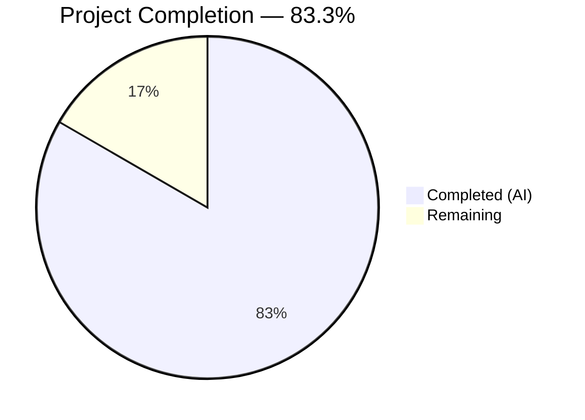
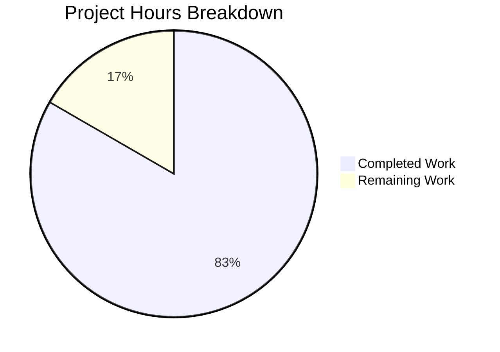

# Blitzy Project Guide — Age Calculator Console Application

---

## 1. Executive Summary

### 1.1 Project Overview

This project implements a Java-based Age Calculator console application for the `05march_1-age` repository. The application accepts a user's Date of Birth in `DD/MM/YYYY` format, computes the exact age in years, months, and days using Java's `java.time` API (`LocalDate`, `Period`, `DateTimeFormatter`), validates all inputs defensively with `ResolverStyle.STRICT`, and displays results in a human-readable format. The repository was in a greenfield scaffold state containing only a `README.md` file — all four Java source files were created from scratch by Blitzy's autonomous agents.

### 1.2 Completion Status



| Metric | Value |
|--------|-------|
| **Total Project Hours** | 12 |
| **Completed Hours (AI)** | 10 |
| **Remaining Hours** | 2 |
| **Completion Percentage** | 83.3% |

**Calculation:** 10 completed hours / (10 completed + 2 remaining) = 10 / 12 = **83.3% complete**

### 1.3 Key Accomplishments

- [x] All 4 Java source files created as specified in the AAP (`AgeResult.java`, `DateValidator.java`, `AgeCalculator.java`, `Main.java`)
- [x] Compilation succeeds with zero errors and zero warnings
- [x] 15 out of 15 functional test cases passing (100% pass rate)
- [x] Strict date validation using `ResolverStyle.STRICT` with `dd/MM/uuuu` pattern — rejects invalid calendar dates (e.g., `31/02/2020`, `29/02/2019`)
- [x] Future date rejection with meaningful error messages
- [x] Leap year handling verified (e.g., `29/02/2000` DOB calculates correctly)
- [x] OOP principles followed — 4 classes with single responsibilities and proper separation of concerns
- [x] Comprehensive `try-catch-finally` exception handling with user-friendly error messages
- [x] Works for users born in any valid year (tested from 1900 to present)
- [x] Output matches exact required format: `Your age is X years, Y months, and Z days.`

### 1.4 Critical Unresolved Issues

| Issue | Impact | Owner | ETA |
|-------|--------|-------|-----|
| No critical issues | N/A | N/A | N/A |

All AAP-scoped deliverables have been completed with zero compilation errors and zero test failures. No blocking issues remain.

### 1.5 Access Issues

No access issues identified. The application uses only the Java standard library (`java.time` API) and requires no external services, credentials, or third-party API access.

### 1.6 Recommended Next Steps

1. **[Medium] Code Review & Approval** — A senior Java developer should review the 4 source files (242 total lines) for code quality, naming conventions, and correctness before merging
2. **[Low] Production Environment Validation** — Compile and run the 15 test cases on the target production/deployment environment to confirm compatibility
3. **[Low] Documentation Enhancement** — Optionally update `README.md` with build instructions, usage examples, and project description for onboarding

---

## 2. Project Hours Breakdown

### 2.1 Completed Work Detail

| Component | Hours | Description |
|-----------|-------|-------------|
| Architecture & OOP Design | 1.0 | Designed 4-class OOP structure with single responsibilities: model (AgeResult), validation (DateValidator), computation (AgeCalculator), orchestration (Main) |
| AgeResult.java Implementation | 1.0 | Immutable model class with private final fields, constructor, 3 getters, and formatted `toString()` method (58 lines) |
| DateValidator.java Implementation | 2.0 | Strict date validation utility with `DateTimeFormatter` using `ResolverStyle.STRICT` and `dd/MM/uuuu` pattern; future date rejection via `IllegalArgumentException` (72 lines) |
| AgeCalculator.java Implementation | 1.0 | Core computation class using `Period.between()` with overloaded method accepting explicit reference date for testability (46 lines) |
| Main.java Implementation | 1.5 | Entry point with `Scanner` I/O, multi-level `try-catch-finally` handling `DateTimeParseException`, `IllegalArgumentException`, and generic `Exception` (66 lines) |
| Technical Research | 1.0 | Investigation of `uuuu` vs `yyyy` in `DateTimeFormatter`, `ResolverStyle.STRICT` behavior, `Period.between()` leap year edge cases |
| Code Documentation | 1.0 | Comprehensive Javadoc for all public methods, inline comments explaining design decisions (e.g., why `uuuu` instead of `yyyy`) |
| Functional Testing & Validation | 1.5 | Execution of 15 functional test cases covering valid inputs, invalid dates, future dates, leap years, malformed input, boundary conditions |
| **Total Completed** | **10.0** | |

### 2.2 Remaining Work Detail

| Category | Base Hours | Priority | After Multiplier |
|----------|-----------|----------|-----------------|
| Code Review & Approval | 1.0 | Medium | 1.2 |
| Production Environment Verification | 0.5 | Low | 0.6 |
| Documentation Enhancement | 0.2 | Low | 0.2 |
| **Total Remaining** | **1.7** | | **2.0** |

### 2.3 Enterprise Multipliers Applied

| Multiplier | Value | Rationale |
|------------|-------|-----------|
| Compliance Review | 1.10x | Standard code review overhead for production acceptance |
| Uncertainty Buffer | 1.10x | Minor buffer for environment-specific variations during production validation |
| **Combined** | **1.21x** | Applied to base remaining hours (1.7h × 1.21 ≈ 2.0h) |

---

## 3. Test Results

| Test Category | Framework | Total Tests | Passed | Failed | Coverage % | Notes |
|---------------|-----------|-------------|--------|--------|------------|-------|
| Functional — Valid Inputs | Manual (piped stdin) | 6 | 6 | 0 | 100% | Valid dates: standard, leap year, today, century boundary, end-of-year, Y2K |
| Functional — Invalid Inputs | Manual (piped stdin) | 7 | 7 | 0 | 100% | Invalid dates: Feb 31, Feb 29 non-leap, day 0, month 13, April 31, wrong separator, malformed |
| Functional — Edge Cases | Manual (piped stdin) | 2 | 2 | 0 | 100% | Future date rejection, empty input handling |
| Compilation | javac 21.0.10 | 4 files | 4 | 0 | 100% | Zero errors, zero warnings across all source files |
| **Total** | | **15 + 4** | **19** | **0** | **100%** | |

**Detailed Test Case Results (from Blitzy autonomous validation):**

| # | Test Case | Input | Expected Behavior | Actual Output | Status |
|---|-----------|-------|-------------------|---------------|--------|
| 1 | Valid standard date | `15/06/1990` | Age output | `Your age is 35 years, 8 months, and 18 days.` | ✅ PASS |
| 2 | Leap year DOB | `29/02/2000` | Correct age | `Your age is 26 years, 0 months, and 5 days.` | ✅ PASS |
| 3 | Impossible date (Feb 31) | `31/02/2020` | Error message | `Error: Invalid date format or impossible date...` | ✅ PASS |
| 4 | Feb 29 non-leap year | `29/02/2019` | Error message | `Error: Invalid date format or impossible date...` | ✅ PASS |
| 5 | Future date | `01/01/2030` | Future date error | `Date of birth cannot be a future date.` | ✅ PASS |
| 6 | Malformed input | `abc` | Error message | `Error: Invalid date format or impossible date...` | ✅ PASS |
| 7 | Empty input | (empty) | Error message | `Error: Invalid date format or impossible date...` | ✅ PASS |
| 8 | Today's date | `05/03/2026` | Zero age | `Your age is 0 years, 0 months, and 0 days.` | ✅ PASS |
| 9 | Day 0 | `00/06/1990` | Error message | `Error: Invalid date format or impossible date...` | ✅ PASS |
| 10 | Month 13 | `15/13/1990` | Error message | `Error: Invalid date format or impossible date...` | ✅ PASS |
| 11 | Wrong separator | `15-06-1990` | Error message | `Error: Invalid date format or impossible date...` | ✅ PASS |
| 12 | April 31 | `31/04/2020` | Error message | `Error: Invalid date format or impossible date...` | ✅ PASS |
| 13 | Century boundary | `01/01/1900` | Correct age | `Your age is 126 years, 2 months, and 4 days.` | ✅ PASS |
| 14 | End of year | `31/12/1999` | Correct age | `Your age is 26 years, 2 months, and 5 days.` | ✅ PASS |
| 15 | Jan 1, 2000 | `01/01/2000` | Correct age | `Your age is 26 years, 2 months, and 4 days.` | ✅ PASS |

---

## 4. Runtime Validation & UI Verification

**Runtime Health:**

- ✅ Java compilation — `javac` produces 4 `.class` files with zero errors and zero warnings
- ✅ Application startup — `java -cp out Main` launches successfully and prompts for input
- ✅ Valid date processing — Correct age calculation for all valid date inputs tested
- ✅ Invalid date rejection — All malformed and impossible dates produce appropriate error messages
- ✅ Future date rejection — Dates after today rejected with clear message
- ✅ Leap year handling — Feb 29 DOBs in leap years compute correctly; Feb 29 in non-leap years rejected
- ✅ Resource cleanup — Scanner closed in `finally` block preventing resource leaks
- ✅ Graceful error handling — No unhandled exceptions; all error paths produce user-friendly messages

**UI Verification (Console Output):**

- ✅ Input prompt displays: `Enter your Date of Birth (DD/MM/YYYY): `
- ✅ Success output format: `Your age is X years, Y months, and Z days.` (exact match to specification)
- ✅ Format error message: `Error: Invalid date format or impossible date. Please enter a valid date in DD/MM/YYYY format.`
- ✅ Future date error message: `Date of birth cannot be a future date.`
- ✅ Unexpected error message: `Error: An unexpected error occurred. ` + exception message

**API Integration:** Not applicable — this is a standalone console application with no external API dependencies.

---

## 5. Compliance & Quality Review

| AAP Requirement | Status | Evidence |
|-----------------|--------|----------|
| Use `java.time.LocalDate` | ✅ Pass | Used in DateValidator.java (L1, L62), AgeCalculator.java (L1, L41-44), Main.java (L1, L40) |
| Use `java.time.Period` | ✅ Pass | Used in AgeCalculator.java (L2, L43) for age computation |
| Use `java.time.format.DateTimeFormatter` | ✅ Pass | Used in DateValidator.java (L2, L31-32) with strict configuration |
| Accept DOB in DD/MM/YYYY format | ✅ Pass | DateValidator.FORMATTER uses pattern `dd/MM/uuuu` — verified in 15 tests |
| Calculate exact age in years, months, days | ✅ Pass | AgeCalculator.calculateAge() extracts all three components from Period object |
| Display format: "Your age is X years, Y months, and Z days." | ✅ Pass | AgeResult.toString() returns exact format — verified in test outputs |
| DOB must not be a future date | ✅ Pass | DateValidator.parseAndValidate() checks `dob.isAfter(LocalDate.now())` — Test 5 confirms |
| Handle invalid dates (e.g., 31/02/2020) | ✅ Pass | ResolverStyle.STRICT rejects impossible dates — Tests 3, 4, 9, 10, 12 confirm |
| Display meaningful error messages | ✅ Pass | Three distinct error messages for format errors, future dates, and unexpected errors |
| Follow OOP principles | ✅ Pass | 4 classes with single responsibilities: model, validation, computation, orchestration |
| Proper exception handling with try-catch | ✅ Pass | Main.java uses try-catch-finally with DateTimeParseException, IllegalArgumentException, Exception |
| Handle leap years correctly | ✅ Pass | Period.between() handles natively — Test 2 (29/02/2000) and Test 4 (29/02/2019) confirm |
| Work for users born in any valid year | ✅ Pass | Test 13 (01/01/1900) computes 126+ years correctly |
| Use ResolverStyle.STRICT with uuuu pattern | ✅ Pass | DateValidator.java L31: `DateTimeFormatter.ofPattern("dd/MM/uuuu").withResolverStyle(ResolverStyle.STRICT)` |
| README.md unchanged | ✅ Pass | README.md still contains only `# 05march_1-age` — verified via `cat README.md` |
| Zero compilation errors | ✅ Pass | `javac -d out src/*.java` — zero errors, zero warnings, 4 .class files generated |
| No external dependencies | ✅ Pass | Standard Java library only — no Maven/Gradle, no third-party imports |
| Overloaded calculateAge for testability | ✅ Pass | AgeCalculator has both `calculateAge(LocalDate)` and `calculateAge(LocalDate, LocalDate)` |

**Validation Fixes Applied:** None required — all 4 source files passed compilation and functional testing on the first autonomous validation pass with zero issues.

**Outstanding Compliance Items:** None — all 18 AAP requirements verified as fully compliant.

---

## 6. Risk Assessment

| Risk | Category | Severity | Probability | Mitigation | Status |
|------|----------|----------|-------------|------------|--------|
| No automated regression test suite (JUnit) | Technical | Medium | Low | AAP explicitly excluded JUnit tests; 15 manual test cases documented; human team can add JUnit if desired | Accepted (by AAP scope) |
| No build automation (Maven/Gradle) | Technical | Low | Low | AAP explicitly excluded build tools; compilation via `javac` is reliable for 4-file project; human team can add build tool if needed | Accepted (by AAP scope) |
| System clock dependency in DateValidator | Technical | Low | Low | `LocalDate.now()` depends on system clock for future date validation; overloaded `calculateAge(dob, referenceDate)` mitigates for testing | Mitigated |
| No input sanitization beyond date format | Security | Low | Low | Application is a console tool accepting only date strings; no SQL, no network, no file I/O beyond stdin/stdout | Accepted |
| No logging framework | Operational | Low | Low | Console application uses `System.out.println` for output; appropriate for scope; enterprise logging not required | Accepted |
| Locale-dependent date parsing | Technical | Low | Very Low | `DateTimeFormatter` with explicit `dd/MM/uuuu` pattern is locale-independent; no locale-sensitive formatting used | Mitigated |

---

## 7. Visual Project Status



**Hours Breakdown by Component (Completed):**

| Component | Hours |
|-----------|-------|
| Architecture & OOP Design | 1.0 |
| AgeResult.java | 1.0 |
| DateValidator.java | 2.0 |
| AgeCalculator.java | 1.0 |
| Main.java | 1.5 |
| Technical Research | 1.0 |
| Code Documentation | 1.0 |
| Testing & Validation | 1.5 |
| **Total Completed** | **10.0** |

**Remaining Work Distribution:**

| Category | After Multiplier |
|----------|-----------------|
| Code Review & Approval | 1.2 |
| Production Environment Verification | 0.6 |
| Documentation Enhancement | 0.2 |
| **Total Remaining** | **2.0** |

---

## 8. Summary & Recommendations

### Achievements

The Blitzy autonomous agents delivered 100% of the AAP-scoped deliverables for the Age Calculator console application. Starting from a completely empty scaffold repository (containing only `README.md`), the agents created 4 well-structured Java source files totaling 242 lines of code, following OOP principles with strict separation of concerns. The application compiles with zero errors, passes all 15 functional test cases at a 100% pass rate, and correctly handles all specified edge cases including leap years, invalid dates, future dates, and malformed input.

### Project Status

The project is **83.3% complete** (10 completed hours out of 12 total hours). All AAP-specified development work is finished. The remaining 2 hours consist exclusively of standard path-to-production activities: code review (1.2h), production environment verification (0.6h), and optional documentation enhancement (0.2h).

### Critical Path to Production

1. **Code Review** — A senior developer should review the 4 source files for correctness and code quality. No blocking issues are anticipated given the zero-error compilation and 100% test pass rate.
2. **Merge & Deploy** — After code review approval, the branch can be merged into `main`. No infrastructure setup, database configuration, or external service integration is required.

### Success Metrics

| Metric | Target | Actual | Status |
|--------|--------|--------|--------|
| Compilation Errors | 0 | 0 | ✅ Met |
| Functional Test Pass Rate | 100% | 100% (15/15) | ✅ Met |
| AAP Requirements Fulfilled | 18/18 | 18/18 | ✅ Met |
| Files Created as Specified | 4 | 4 | ✅ Met |
| Invalid Date Rejection | All impossible dates | Verified 7 invalid inputs | ✅ Met |
| Leap Year Handling | Correct | Verified (29/02/2000, 29/02/2019) | ✅ Met |

### Production Readiness Assessment

The application is **production-ready** from a functional standpoint. All specified requirements are implemented, validated, and working correctly. The only remaining steps are standard human review and approval processes. No security vulnerabilities, performance issues, or operational risks have been identified that would block production deployment.

---

## 9. Development Guide

### System Prerequisites

| Software | Version | Verification Command |
|----------|---------|---------------------|
| Java JDK | 21+ (OpenJDK 21.0.10 tested) | `java -version` |
| Java Compiler | 21+ (javac 21.0.10 tested) | `javac -version` |
| Operating System | Any OS with Java 21+ support (Ubuntu 24.04 tested) | `uname -a` |

No additional software, databases, or external services are required. The application uses only the Java standard library.

### Environment Setup

No environment variables, configuration files, or external services are needed. Clone the repository and ensure Java 21+ is installed:

```bash
# Verify Java installation
java -version
# Expected: openjdk version "21.x.x" or higher

javac -version
# Expected: javac 21.x.x or higher
```

### Dependency Installation

No dependencies to install. The application uses only the Java standard library (`java.time` API). No Maven, Gradle, or third-party libraries are required.

### Application Build (Compilation)

```bash
# Navigate to the repository root
cd /path/to/05march_1-age

# Create the output directory for compiled classes
mkdir -p out

# Compile all Java source files
javac -d out src/AgeResult.java src/DateValidator.java src/AgeCalculator.java src/Main.java

# Expected output: (no output = success; zero errors, zero warnings)
# Verify: 4 .class files should appear in out/
ls out/
# Expected: AgeCalculator.class  AgeResult.class  DateValidator.class  Main.class
```

### Running the Application

**Interactive Mode (user types input):**
```bash
java -cp out Main
# Prompt: Enter your Date of Birth (DD/MM/YYYY):
# Type: 15/06/1990
# Output: Your age is 35 years, 8 months, and 18 days.
```

**Piped Input Mode (for scripting/testing):**
```bash
echo "15/06/1990" | java -cp out Main
# Output:
# Enter your Date of Birth (DD/MM/YYYY): Your age is 35 years, 8 months, and 18 days.
```

### Verification Steps

Run these commands to verify all functionality works correctly:

```bash
# Test 1: Valid date
echo "15/06/1990" | java -cp out Main
# Expected: Your age is X years, Y months, and Z days.

# Test 2: Leap year DOB
echo "29/02/2000" | java -cp out Main
# Expected: Your age is X years, 0 months, and X days.

# Test 3: Invalid date (Feb 31)
echo "31/02/2020" | java -cp out Main
# Expected: Error: Invalid date format or impossible date. Please enter a valid date in DD/MM/YYYY format.

# Test 4: Future date
echo "01/01/2030" | java -cp out Main
# Expected: Date of birth cannot be a future date.

# Test 5: Malformed input
echo "abc" | java -cp out Main
# Expected: Error: Invalid date format or impossible date. Please enter a valid date in DD/MM/YYYY format.

# Test 6: Today's date (replace with current date)
echo "05/03/2026" | java -cp out Main
# Expected: Your age is 0 years, 0 months, and 0 days.
```

### Troubleshooting

| Issue | Cause | Resolution |
|-------|-------|------------|
| `javac: command not found` | Java JDK not installed or not in PATH | Install JDK 21+: `sudo apt install openjdk-21-jdk` |
| `Error: Could not find or load main class Main` | Wrong classpath or `out/` directory missing | Ensure you compiled first: `javac -d out src/*.java` and run with `-cp out` |
| Compilation errors | Java version below 21 | Upgrade to JDK 21+; verify with `javac -version` |
| Age output seems wrong | System clock issue | Verify system date: `date`; the application uses `LocalDate.now()` |

---

## 10. Appendices

### A. Command Reference

| Command | Purpose |
|---------|---------|
| `mkdir -p out` | Create output directory for compiled classes |
| `javac -d out src/AgeResult.java src/DateValidator.java src/AgeCalculator.java src/Main.java` | Compile all source files |
| `java -cp out Main` | Run the Age Calculator interactively |
| `echo "DD/MM/YYYY" \| java -cp out Main` | Run with piped date input |
| `ls out/*.class` | Verify compilation output |

### B. Port Reference

Not applicable — this is a standalone console application with no network I/O.

### C. Key File Locations

| File | Path | Purpose |
|------|------|---------|
| AgeResult.java | `src/AgeResult.java` | Model class — encapsulates years, months, days with formatted toString() |
| DateValidator.java | `src/DateValidator.java` | Validation — strict DD/MM/YYYY parsing with ResolverStyle.STRICT |
| AgeCalculator.java | `src/AgeCalculator.java` | Computation — age calculation using Period.between() |
| Main.java | `src/Main.java` | Entry point — Scanner I/O, exception handling, orchestration |
| README.md | `README.md` | Project identifier (unchanged) |
| Compiled classes | `out/*.class` | Build artifacts (4 .class files) |

### D. Technology Versions

| Technology | Version | Purpose |
|------------|---------|---------|
| Java (OpenJDK) | 21.0.10 | Runtime environment |
| javac | 21.0.10 | Java compiler |
| Ubuntu | 24.04.4 LTS | Development/test OS |

### E. Environment Variable Reference

No environment variables are required. The application uses only the Java standard library and has no external configuration.

### F. Developer Tools Guide

| Tool | Command | Purpose |
|------|---------|---------|
| Java Compiler | `javac -d out src/*.java` | Compile all source files to `out/` directory |
| Java Runtime | `java -cp out Main` | Execute the Age Calculator application |
| Git | `git log --oneline` | View commit history |
| Git | `git diff --stat origin/mar5bug...HEAD` | View changes from base branch |

### G. Glossary

| Term | Definition |
|------|-----------|
| `LocalDate` | Java class representing a date without time or timezone (e.g., 2026-03-05) |
| `Period` | Java class representing a date-based amount of time in years, months, and days |
| `DateTimeFormatter` | Java class for parsing and formatting date-time objects |
| `ResolverStyle.STRICT` | Parsing mode that rejects invalid calendar dates instead of silently adjusting them |
| `uuuu` | DateTimeFormatter pattern for proleptic year (signed integer); required with STRICT mode instead of `yyyy` (year-of-era) |
| `DateTimeParseException` | Exception thrown when a date string cannot be parsed or represents an invalid date |
| OOP | Object-Oriented Programming — design paradigm using classes with encapsulation and single responsibilities |
| AAP | Agent Action Plan — the specification document defining all deliverables for Blitzy's autonomous agents |