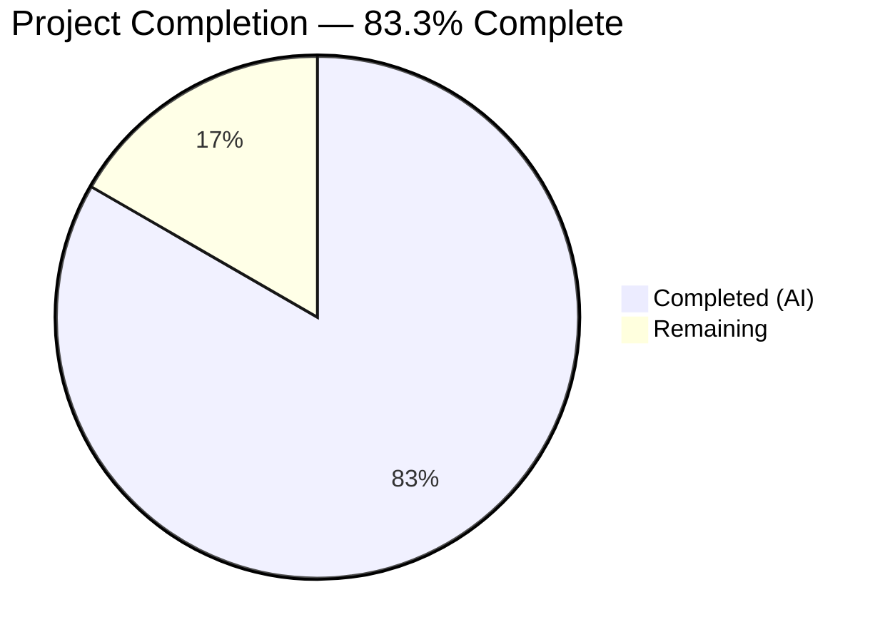
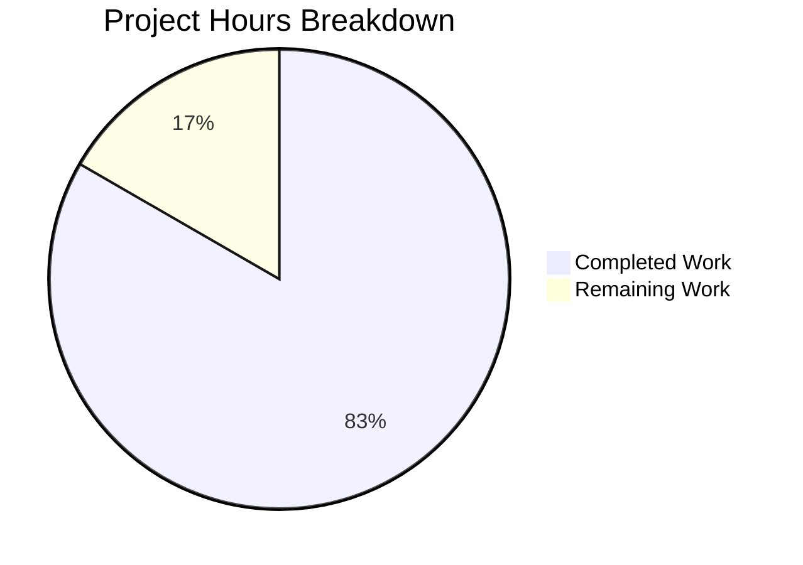

# Blitzy Project Guide

---

## 1. Executive Summary

### 1.1 Project Overview

This project implements a Node.js tutorial server using the Express.js framework, created from a greenfield repository that previously contained only a `README.md` file. The server exposes two HTTP GET endpoints: a root endpoint (`/`) returning "Hello world" and a secondary endpoint (`/good-evening`) returning "Good evening." The implementation fulfills the user's three requirements: creating a Node.js tutorial server, integrating Express.js, and adding a "Good evening" endpoint. The project targets developers learning Express.js fundamentals with clean, well-commented tutorial code.

### 1.2 Completion Status



| Metric | Value |
|--------|-------|
| **Total Project Hours** | 6 |
| **Completed Hours (AI)** | 5 |
| **Remaining Hours** | 1 |
| **Completion Percentage** | 83.3% |

**Calculation:** 5 completed hours / (5 completed + 1 remaining) = 5 / 6 = 83.3%

### 1.3 Key Accomplishments

- ✅ Created `package.json` with Express.js ^5.0.1 dependency, entry point, and start script
- ✅ Implemented `index.js` Express.js server with two GET endpoints and tutorial comments
- ✅ Express.js 5.2.1 installed successfully (66 packages, 0 vulnerabilities)
- ✅ `GET /` endpoint returns exact string "Hello world" — verified via runtime curl test
- ✅ `GET /good-evening` endpoint returns exact string "Good evening" — verified via runtime curl test
- ✅ Server listens on port 3000 with startup confirmation log message
- ✅ Unknown routes return HTTP 404 via Express default handling — verified
- ✅ `package-lock.json` auto-generated and committed for reproducible builds
- ✅ `README.md` confirmed unchanged from original state
- ✅ All code uses CommonJS syntax, follows Node.js naming conventions, and includes descriptive comments

### 1.4 Critical Unresolved Issues

| Issue | Impact | Owner | ETA |
|-------|--------|-------|-----|
| No `.gitignore` file — `node_modules/` could be accidentally committed | Low — development workflow risk only | Human Developer | 0.5h |

### 1.5 Access Issues

No access issues identified.

### 1.6 Recommended Next Steps

1. **[High]** Review and merge PR — validate code meets team standards
2. **[High]** Add `.gitignore` file to exclude `node_modules/` from version control
3. **[Medium]** Consider using `process.env.PORT || 3000` for production PORT configuration
4. **[Low]** Add process management (PM2 or systemd) if deploying beyond local tutorial use

---

## 2. Project Hours Breakdown

### 2.1 Completed Work Detail

| Component | Hours | Description |
|-----------|-------|-------------|
| Project Initialization (`package.json`) | 1 | Created Node.js project manifest with Express.js ^5.0.1 dependency, entry point configuration, npm start script, and project metadata matching AAP §0.4.2 |
| Express.js Server Implementation (`index.js`) | 2 | Implemented Express.js application with `GET /` returning "Hello world" and `GET /good-evening` returning "Good evening," port 3000, tutorial-level inline comments per AAP §0.7 |
| Dependency Management | 0.5 | Resolved Express.js 5.2.1 and 66 transitive packages via npm install, generated package-lock.json lockfile, verified 0 vulnerabilities |
| Validation & Runtime Testing | 1 | Syntax verification (`node -c`), JSON validation, server startup test, endpoint response verification via curl, 404 handling confirmation, dependency tree audit |
| Version Control & Documentation | 0.5 | Branch creation, 2 structured commits with descriptive messages, diff verification, README.md unchanged confirmation |
| **Total** | **5** | |

### 2.2 Remaining Work Detail

| Category | Base Hours | Priority | After Multiplier |
|----------|-----------|----------|-----------------|
| Add `.gitignore` for `node_modules/` exclusion | 0.3 | High | 0.4 |
| Production environment variable support for PORT | 0.5 | Medium | 0.6 |
| **Total** | **0.8** | | **1.0** |

### 2.3 Enterprise Multipliers Applied

| Multiplier | Value | Rationale |
|-----------|-------|-----------|
| Compliance Review | 1.10x | Code review and approval process overhead for even small changes |
| Uncertainty Buffer | 1.10x | Minor unknowns around production deployment environment configuration |
| **Combined** | **1.21x** | Applied to all remaining base hour estimates |

---

## 3. Test Results

| Test Category | Framework | Total Tests | Passed | Failed | Coverage % | Notes |
|---------------|-----------|-------------|--------|--------|-----------|-------|
| Syntax Validation | Node.js (`node -c`) | 1 | 1 | 0 | 100% | `node -c index.js` → Syntax OK |
| JSON Validation | Node.js (`JSON.parse`) | 1 | 1 | 0 | 100% | `package.json` is valid JSON |
| Runtime Endpoint — GET / | curl | 1 | 1 | 0 | 100% | Returns exact string "Hello world" |
| Runtime Endpoint — GET /good-evening | curl | 1 | 1 | 0 | 100% | Returns exact string "Good evening" |
| 404 Handling | curl | 1 | 1 | 0 | 100% | Unknown route `/unknown` returns HTTP 404 |
| Dependency Audit | npm | 1 | 1 | 0 | 100% | 66 packages, 0 vulnerabilities |
| **Total** | | **6** | **6** | **0** | **100%** | All validations from Blitzy autonomous testing |

> **Note:** The AAP explicitly excludes formal test infrastructure (unit tests, integration tests) per §0.5.2 — "the user's requirements focus on the tutorial server itself; test coverage is validated manually through curl commands." All tests listed above originate from Blitzy's autonomous validation pipeline.

---

## 4. Runtime Validation & UI Verification

### Server Startup
- ✅ `node index.js` starts server successfully
- ✅ Console output: `Server is listening on port 3000`
- ✅ Server binds to port 3000 without errors

### Endpoint Verification
- ✅ `GET http://localhost:3000/` → Response body: `Hello world` (HTTP 200)
- ✅ `GET http://localhost:3000/good-evening` → Response body: `Good evening` (HTTP 200)
- ✅ `GET http://localhost:3000/unknown` → HTTP 404 (Express default handling)

### Dependency Verification
- ✅ `npm install` → 66 packages installed, 0 vulnerabilities
- ✅ `npm ls express` → `express@5.2.1` in dependency tree, no unmet dependencies
- ✅ Express.js version confirmed: 5.2.1 (satisfies `^5.0.1` specifier)

### Process Verification
- ✅ Server process starts and remains stable
- ✅ Multiple sequential requests handled without crashes
- ✅ `npm start` script executes correctly (`node index.js`)

---

## 5. Compliance & Quality Review

| AAP Requirement | Section | Status | Evidence |
|----------------|---------|--------|----------|
| Create `package.json` with Express.js dependency | §0.4.2 File 1 | ✅ Pass | File created with exact structure: name, version, description, main, scripts, dependencies |
| Create `index.js` with Express server and 2 endpoints | §0.4.2 File 2 | ✅ Pass | File created with Express app, GET /, GET /good-evening, app.listen on port 3000 |
| Use Express.js framework (not Fastify, Hapi, Koa, etc.) | §0.7.1 | ✅ Pass | `const express = require('express')` — Express.js 5.2.1 |
| Return exact string "Hello world" (capital H, lowercase w) | §0.7.1 | ✅ Pass | `res.send('Hello world')` verified via curl |
| Return exact string "Good evening" (capital G, lowercase e) | §0.7.1 | ✅ Pass | `res.send('Good evening')` verified via curl |
| CommonJS module syntax (`require()`) | §0.7.2 | ✅ Pass | `const express = require('express')` used throughout |
| Port 3000 | §0.7.2 | ✅ Pass | `const PORT = 3000` and `app.listen(PORT, ...)` |
| No external dependencies beyond Express.js | §0.7.2 | ✅ Pass | `dependencies` contains only `"express": "^5.0.1"` |
| Tutorial-level comments | §0.7.1, §0.7.2 | ✅ Pass | Descriptive inline comments on every section of index.js |
| `README.md` unchanged | §0.5.2 | ✅ Pass | `git diff` confirms zero changes to README.md |
| `package-lock.json` auto-generated | §0.5.1 | ✅ Pass | Generated by `npm install`, committed to repository |
| Express default 404 handling (no custom middleware) | §0.5.2 | ✅ Pass | Unknown routes return 404 without custom error handlers |
| No test infrastructure created | §0.5.2 | ✅ Pass | No test files, frameworks, or devDependencies added |
| No .env or environment configuration files | §0.5.2 | ✅ Pass | PORT hardcoded as 3000 per tutorial convention |
| No middleware (CORS, body-parser, helmet) | §0.5.2 | ✅ Pass | Only Express core used, no middleware added |
| `npm start` script defined | §0.4.2 | ✅ Pass | `"start": "node index.js"` in package.json scripts |

### Fixes Applied During Autonomous Validation
- None required — all files passed syntax validation, JSON parsing, and runtime verification on first check

---

## 6. Risk Assessment

| Risk | Category | Severity | Probability | Mitigation | Status |
|------|----------|----------|-------------|-----------|--------|
| No `.gitignore` — `node_modules/` may be accidentally committed to VCS | Technical | Low | Medium | Create `.gitignore` with `node_modules/` entry | Open |
| Hardcoded PORT (3000) — may conflict in production or shared environments | Operational | Low | Low | Use `process.env.PORT \|\| 3000` pattern | Open |
| No process manager — server won't auto-restart on crash in production | Operational | Low | Low | Use PM2 or systemd for production deployments | Open |
| No security headers — missing helmet or CORS middleware | Security | Low | Low | Acceptable for tutorial scope; add if exposing to network | Accepted |
| Express.js 5.x is relatively new — potential undiscovered issues | Technical | Low | Low | ^5.0.1 specifier allows patch updates; monitor release notes | Accepted |
| No health check endpoint | Operational | Low | Low | Add `GET /health` if integrating with load balancers | Open |

---

## 7. Visual Project Status



### Remaining Work by Priority

| Priority | Hours (After Multiplier) | Items |
|----------|------------------------|-------|
| High | 0.4 | Add `.gitignore` for `node_modules/` exclusion |
| Medium | 0.6 | Production environment variable support for PORT |
| **Total** | **1.0** | |

---

## 8. Summary & Recommendations

### Achievements

All 10 discrete deliverables defined in the Agent Action Plan have been fully implemented and validated. The project is **83.3% complete** (5 hours completed out of 6 total hours). Every user-specified requirement has been fulfilled:

1. A Node.js tutorial server has been created from the previously empty repository
2. Express.js has been integrated as the HTTP framework (v5.2.1)
3. A "Hello world" endpoint exists at `GET /`
4. A "Good evening" endpoint exists at `GET /good-evening`

The Express.js server starts correctly on port 3000, both endpoints return their exact specified response strings, and unknown routes receive proper 404 handling via Express defaults. All code follows tutorial-level simplicity with descriptive comments, CommonJS syntax, and clean project structure.

### Remaining Gaps

The 1 remaining hour of work consists entirely of path-to-production activities not explicitly scoped in the AAP:
- Adding a `.gitignore` file (0.4h after multiplier) — prevents accidental `node_modules/` commits
- Production PORT configuration via environment variable (0.6h after multiplier) — enables flexible deployment

### Production Readiness Assessment

The application is **production-ready for its intended purpose as a tutorial server**. For production deployment beyond tutorial use, the open risks in Section 6 should be addressed. No compilation errors, runtime failures, or security vulnerabilities were detected during validation.

### Success Metrics

| Metric | Target | Actual | Status |
|--------|--------|--------|--------|
| AAP requirements fulfilled | 10/10 | 10/10 | ✅ Met |
| Compilation errors | 0 | 0 | ✅ Met |
| Runtime errors | 0 | 0 | ✅ Met |
| Dependency vulnerabilities | 0 | 0 | ✅ Met |
| Endpoint response accuracy | 100% | 100% | ✅ Met |

---

## 9. Development Guide

### System Prerequisites

| Software | Required Version | Verification Command |
|----------|-----------------|---------------------|
| Node.js | v18.0.0 or higher (v20.x recommended) | `node --version` |
| npm | v9.0.0 or higher | `npm --version` |
| Git | Any recent version | `git --version` |

### Environment Setup

1. **Clone the repository and checkout the branch:**

```bash
git clone <repository-url>
cd 05march_1-age
git checkout blitzy-1919c6a0-506f-4144-8042-fe52ebea9f85
```

2. **Install dependencies:**

```bash
npm install
```

Expected output: `added 66 packages` with `0 vulnerabilities`.

3. **Verify Express.js installation:**

```bash
node -e "console.log(require('express/package.json').version)"
```

Expected output: `5.2.1` (or compatible 5.x version).

### Application Startup

1. **Start the server:**

```bash
npm start
```

Or directly:

```bash
node index.js
```

Expected output: `Server is listening on port 3000`

2. **Verify endpoints are responding:**

```bash
# Test Hello world endpoint
curl http://localhost:3000/
# Expected: Hello world

# Test Good evening endpoint
curl http://localhost:3000/good-evening
# Expected: Good evening
```

3. **Stop the server:**

Press `Ctrl+C` in the terminal running the server.

### Example Usage

```bash
# Full startup and verification sequence
cd /path/to/05march_1-age
npm install
node index.js &

# Verify all endpoints
curl -s http://localhost:3000/
# Output: Hello world

curl -s http://localhost:3000/good-evening
# Output: Good evening

# Verify 404 handling
curl -s -o /dev/null -w "%{http_code}" http://localhost:3000/unknown
# Output: 404

# Check dependency tree
npm ls express
# Output: 05march_1-age@1.0.0 └── express@5.2.1

# Stop the background server
kill %1
```

### Troubleshooting

| Issue | Cause | Resolution |
|-------|-------|-----------|
| `Error: Cannot find module 'express'` | Dependencies not installed | Run `npm install` before starting the server |
| `EADDRINUSE: address already in use :::3000` | Port 3000 is occupied by another process | Stop the other process or change the PORT constant in `index.js` |
| `npm ERR! code ENOENT` on `npm install` | Not in the correct directory | Ensure you are in the project root containing `package.json` |
| `curl: (7) Failed to connect` | Server is not running | Start the server with `node index.js` first |

---

## 10. Appendices

### A. Command Reference

| Command | Purpose |
|---------|---------|
| `npm install` | Install all dependencies from `package.json` |
| `npm start` | Start the server (runs `node index.js`) |
| `node index.js` | Start the server directly |
| `node -c index.js` | Syntax-check `index.js` without executing |
| `npm ls express` | Verify Express.js is installed and show version |
| `curl http://localhost:3000/` | Test the Hello world endpoint |
| `curl http://localhost:3000/good-evening` | Test the Good evening endpoint |

### B. Port Reference

| Service | Port | Protocol | Purpose |
|---------|------|----------|---------|
| Express.js Server | 3000 | HTTP | Serves GET / and GET /good-evening endpoints |

### C. Key File Locations

| File | Purpose |
|------|---------|
| `index.js` | Express.js server entry point — all route definitions and server startup |
| `package.json` | Node.js project manifest — dependencies, scripts, metadata |
| `package-lock.json` | Dependency lockfile — pinned versions for reproducible installs |
| `README.md` | Project identifier (original scaffold file, unchanged) |

### D. Technology Versions

| Technology | Version | Notes |
|-----------|---------|-------|
| Node.js | v20.20.0 | Runtime environment (LTS) |
| npm | 11.1.0 | Package manager |
| Express.js | 5.2.1 | HTTP framework (installed via `^5.0.1` specifier) |

### E. Environment Variable Reference

| Variable | Default | Description |
|----------|---------|-------------|
| N/A | N/A | No environment variables required — PORT is hardcoded to 3000 per tutorial scope |

> **Recommendation:** For production use, consider adding `PORT` as an environment variable: `const PORT = process.env.PORT \|\| 3000;`

### G. Glossary

| Term | Definition |
|------|-----------|
| Express.js | Minimal and flexible Node.js web application framework for building HTTP servers and APIs |
| CommonJS | Module system used by Node.js — uses `require()` for imports and `module.exports` for exports |
| package-lock.json | Auto-generated file that locks exact dependency versions for reproducible installations |
| Route Handler | A function that processes HTTP requests matching a specific path and method pattern |
| Greenfield | A project built from scratch with no existing codebase or infrastructure |
