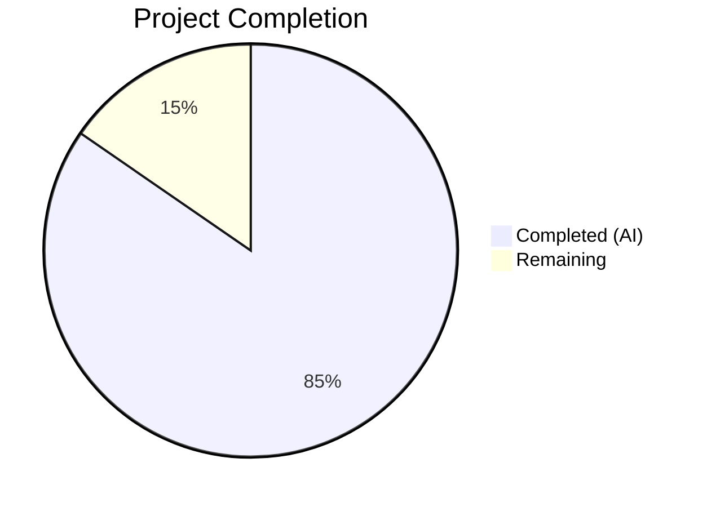
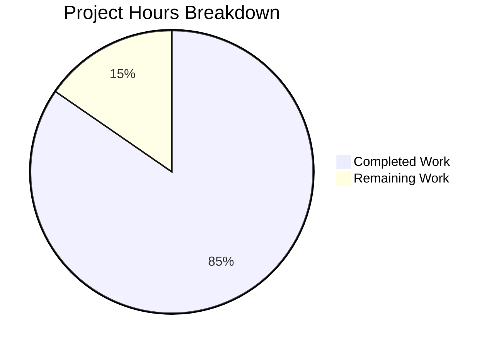

# Blitzy Project Guide — Age Calculator Java Application

---

## 1. Executive Summary

### 1.1 Project Overview

The Age Calculator is a greenfield Java console application that computes a user's exact age from their Date of Birth (DOB), broken down into years, months, and days. Built entirely with the Java `java.time` standard library (LocalDate, Period, DateTimeFormatter), the application targets JDK 21 (LTS) and follows Object-Oriented Programming principles with clean separation of concerns across 8 production classes. It accepts input in DD/MM/YYYY format, validates against impossible dates and future dates, performs calendar-aware arithmetic including leap year handling, and outputs formatted results. The application includes optional enhancements: total months, total days, and a next-birthday countdown. The project is structured as a Maven project with JUnit 5 test coverage across 57 tests.

### 1.2 Completion Status



| Metric | Value |
|--------|-------|
| **Total Project Hours** | 39 |
| **Completed Hours (AI)** | 33 |
| **Remaining Hours** | 6 |
| **Completion Percentage** | 84.6% |

**Calculation**: 33 completed hours / (33 + 6 remaining hours) = 33 / 39 = **84.6% complete**

### 1.3 Key Accomplishments

- ✅ Complete Maven project structure created from scratch with JDK 21, JUnit 5.11.4, and Surefire 3.5.5
- ✅ All 8 production source files implemented with full JavaDoc, defensive programming, and OOP design
- ✅ Core age calculation engine using `Period.between()` with correct leap year handling
- ✅ Three-layer input validation (format, calendar validity, temporal validity) with strict resolver mode
- ✅ Custom `InvalidDateException` with user-friendly error messages for all failure scenarios
- ✅ Optional enhancements implemented: total months, total days, days-until-next-birthday countdown
- ✅ 57 JUnit 5 tests across 6 test suites — all passing (100% pass rate)
- ✅ Executable JAR packaging with `Main-Class` manifest entry
- ✅ All 5 user-specified test scenarios verified at runtime (normal DOB, leap year, invalid date, future date, malformed input)
- ✅ Comprehensive README with project structure, prerequisites, build instructions, and usage examples
- ✅ Clean Git history with 20 well-described, atomic commits

### 1.4 Critical Unresolved Issues

| Issue | Impact | Owner | ETA |
|-------|--------|-------|-----|
| No code coverage reporting tool configured | Cannot verify ≥90% coverage target quantitatively | Human Developer | 2 hours |
| No CI/CD pipeline | Automated build/test not triggered on push | Human Developer | 2 hours |

### 1.5 Access Issues

No access issues identified. The project is a standalone Java console application with zero external service dependencies, no API keys, no database connections, and no third-party service credentials required. All dependencies are resolved from Maven Central.

### 1.6 Recommended Next Steps

1. **[High]** Add JaCoCo code coverage plugin to `pom.xml` and verify ≥90% line coverage across all modules
2. **[Medium]** Set up a CI/CD pipeline (e.g., GitHub Actions) to automate `mvn clean verify` on push/PR
3. **[Medium]** Run a dependency vulnerability scan (e.g., `mvn dependency:check` or OWASP Dependency-Check)
4. **[Low]** Add expanded edge case tests for Unicode input, extremely long strings, and system clock edge cases
5. **[Low]** Add cross-platform build documentation for Windows/macOS JDK setup

---

## 2. Project Hours Breakdown

### 2.1 Completed Work Detail

| Component | Hours | Description |
|-----------|-------|-------------|
| Maven Project Foundation (`pom.xml`) | 1.5 | Project descriptor with JDK 21 compiler, JUnit 5.11.4 test dependency, Surefire 3.5.5, Jar plugin 3.4.2 with Main-Class manifest |
| Git Configuration (`.gitignore`) | 0.5 | Comprehensive exclusion rules for Maven target/, IDE files (IntelliJ, Eclipse, VS Code, NetBeans), OS files, Java .class files |
| Project Documentation (`README.md`) | 2 | Full project documentation: description, prerequisites, project structure, build/test/run commands, usage examples, test case inventory, technology stack |
| Data Model (`AgeResult.java`) | 2 | Immutable data class with private final fields, defensive constructor (negative value rejection), getters, toString() matching required output format, complete JavaDoc |
| Custom Exception (`InvalidDateException.java`) | 1 | Checked exception extending Exception with serialVersionUID, single-arg constructor, JavaDoc documenting all validation failure scenarios |
| Date Validator (`DateValidator.java`) | 3 | Three-layer validation: strict DateTimeFormatter with `dd/MM/uuuu` and ResolverStyle.STRICT, regex pre-check distinguishing format vs. impossible-date errors, future date rejection via LocalDate.now() |
| Age Calculator (`AgeCalculator.java`) | 2 | Stateless calculation engine using Period.between(dob, LocalDate.now()), returns AgeResult with years/months/days, private constructor preventing instantiation |
| Console Input Handler (`DateInput.java`) | 1 | Static utility wrapping Scanner.nextLine() with user prompt, dependency injection pattern for testability, no validation responsibility |
| Result Formatter (`ResultFormatter.java`) | 2 | Static format() method producing exact output string `"Your age is X years, Y months, and Z days."`, null argument validation, String.format() |
| Utility Class (`AgeUtils.java`) | 3 | Three static methods: totalMonths() via ChronoUnit.MONTHS, totalDays() via ChronoUnit.DAYS, daysUntilNextBirthday() with Feb 29 leap-year fallback logic |
| Main Application (`AgeCalculatorApp.java`) | 2 | Orchestrator wiring DateInput → DateValidator → AgeCalculator → ResultFormatter → AgeUtils, try-with-resources for Scanner, layered exception handling |
| AgeCalculator Unit Tests | 2 | 7 tests: normal DOB, leap year DOB, yesterday, year boundary (Dec 31), centenarian, same-day DOB, exactly-one-year-ago with leap day guard |
| DateValidator Unit Tests | 2 | 15 tests: valid format, invalid format (6 parameterized), impossible calendar date, future date, today accepted, leap year valid, non-leap Feb 29, empty input, New Year boundary |
| AgeResult Unit Tests | 1.5 | 10 tests: construction with typical/zero values, getYears/getMonths/getDays accessors, toString format, zero-value toString, centenarian, immutability via repeated access |
| AgeUtils Unit Tests | 2 | 12 tests: totalMonths for past/today/leap year, totalDays for past/today/yesterday/leap year, daysUntilNextBirthday today/upcoming/yesterday, leap year Feb 28 fallback, non-negative results |
| ResultFormatter Unit Tests | 1 | 7 tests: standard format, zero age, centenarian, zero years with months/days, only days, one year zero months/days, max months/days |
| Integration Tests (`AgeCalculatorAppTest`) | 1.5 | 6 tests: valid DOB end-to-end, future date, invalid format, impossible calendar date, leap year DOB end-to-end, today as DOB — with System.in/out redirection |
| Validation & Bug Fixes | 3 | Code review fixes (defensive programming, AAP §0.4.3 compliance), leap day guard for Feb 29 robustness, QA documentation findings, runtime validation across all 5 mandatory scenarios |
| **Total Completed** | **33** | |

### 2.2 Remaining Work Detail

| Category | Hours | Priority |
|----------|-------|----------|
| Code Coverage Configuration (JaCoCo plugin, coverage thresholds, report generation) | 2 | High |
| CI/CD Pipeline Setup (GitHub Actions workflow for automated build/test on push) | 2 | Medium |
| Security & Dependency Scanning (OWASP Dependency-Check or Maven dependency:check) | 1 | Medium |
| Expanded Edge Case Testing (Unicode input, long strings, system clock edge cases) | 0.5 | Low |
| Cross-Platform Documentation (Windows/macOS JDK setup, platform-specific build notes) | 0.5 | Low |
| **Total Remaining** | **6** | |

---

## 3. Test Results

| Test Category | Framework | Total Tests | Passed | Failed | Coverage % | Notes |
|--------------|-----------|-------------|--------|--------|------------|-------|
| Unit — AgeCalculator | JUnit 5 Jupiter | 7 | 7 | 0 | N/A | Normal, leap year, boundary, centenarian, same-day, year boundary tests |
| Unit — DateValidator | JUnit 5 Jupiter | 15 | 15 | 0 | N/A | Valid/invalid format, impossible dates, future dates, parameterized tests |
| Unit — AgeResult | JUnit 5 Jupiter | 10 | 10 | 0 | N/A | Construction, accessors, toString, immutability, edge values |
| Unit — AgeUtils | JUnit 5 Jupiter | 12 | 12 | 0 | N/A | Total months/days, next birthday countdown, leap year fallback |
| Unit — ResultFormatter | JUnit 5 Jupiter | 7 | 7 | 0 | N/A | Standard format, zero/max values, centenarian, edge cases |
| Integration — AgeCalculatorApp | JUnit 5 Jupiter | 6 | 6 | 0 | N/A | End-to-end with System.in/out redirection, all 5 mandatory scenarios |
| **Totals** | **JUnit 5.11.4** | **57** | **57** | **0** | **N/A** | **100% pass rate — zero failures, zero errors, zero skipped** |

> **Note**: Coverage percentage is N/A because JaCoCo is not yet configured in the Maven build. All test results are from Blitzy's autonomous validation via `mvn clean test` (Maven Surefire 3.5.5).

---

## 4. Runtime Validation & UI Verification

### Application Startup

- ✅ `mvn clean compile` — 8 source files compiled with javac release 21, zero errors, zero warnings
- ✅ `mvn package` — `age-calculator-1.0.0-SNAPSHOT.jar` built successfully with Main-Class manifest
- ✅ `java -jar target/age-calculator-1.0.0-SNAPSHOT.jar` — Application starts and accepts console input

### Runtime Scenario Verification

- ✅ **Valid DOB (15/08/1998)** → Output: `Your age is 27 years, 7 months, and 15 days.` + Total months: 331, Total days: 10089, Days until next birthday: 138
- ✅ **Leap Year DOB (29/02/2000)** → Output: `Your age is 26 years, 1 months, and 1 days.` + Total months: 313, Total days: 9526, Days until next birthday: 335
- ✅ **Invalid Date (31/02/2020)** → Output: `Error: Invalid date. Please enter a real calendar date.`
- ✅ **Malformed Input (abc)** → Output: `Error: Invalid date format. Please use DD/MM/YYYY.`
- ✅ **Future Date (01/01/2999)** → Output: `Error: Date of Birth cannot be a future date.`

### Console I/O Verification

- ✅ Prompt displayed: `Enter your Date of Birth (DD/MM/YYYY): `
- ✅ Cursor remains on prompt line (using `System.out.print()`, not `println()`)
- ✅ Scanner reads full line input via `nextLine()`
- ✅ Application exits cleanly after output — no hanging processes

### Optional Enhancement Output

- ✅ Total months calculation displayed after main result
- ✅ Total days calculation displayed after main result
- ✅ Days-until-next-birthday countdown displayed after main result

---

## 5. Compliance & Quality Review

| AAP Requirement | Status | Evidence |
|----------------|--------|----------|
| DOB input in DD/MM/YYYY format | ✅ Pass | `DateValidator` uses `DateTimeFormatter.ofPattern("dd/MM/uuuu")` with `ResolverStyle.STRICT` |
| Current date via `LocalDate.now()` | ✅ Pass | Used in `AgeCalculator.calculateAge()`, `DateValidator.parseAndValidate()`, `AgeUtils.*()` |
| Age as years, months, days via `Period` | ✅ Pass | `AgeCalculator.calculateAge()` calls `Period.between(dob, today)` and maps to `AgeResult` |
| Exact output format: `"Your age is X years, Y months, and Z days."` | ✅ Pass | `ResultFormatter.format()` uses `String.format()` matching exact specification |
| Reject future dates | ✅ Pass | `DateValidator` checks `dob.isAfter(LocalDate.now())`, throws `InvalidDateException` |
| Reject impossible dates (e.g., 31/02/2020) | ✅ Pass | Strict resolver rejects invalid calendar dates; regex pre-check provides specific error message |
| Meaningful error messages | ✅ Pass | Four distinct error messages: empty input, format error, impossible date, future date |
| Leap year handling | ✅ Pass | `Period.between()` handles leap years natively; `AgeUtils` includes Feb 29 fallback logic |
| OOP design with SRP | ✅ Pass | 8 classes with single responsibilities: model, service, io, util, exception packages |
| Try-catch exception handling | ✅ Pass | `AgeCalculatorApp.main()` has layered try-catch; `DateValidator` wraps `DateTimeParseException` |
| `java.time` APIs only (no legacy Date/Calendar) | ✅ Pass | All date operations use `java.time.LocalDate`, `Period`, `DateTimeFormatter`, `ChronoUnit` |
| JUnit 5 test suite | ✅ Pass | 57 tests across 6 test classes using JUnit 5 Jupiter annotations |
| Maven build tool | ✅ Pass | `pom.xml` with maven-compiler-plugin 3.13.0, surefire 3.5.5, jar 3.4.2 |
| Executable JAR with Main-Class | ✅ Pass | JAR manifest: `Main-Class: com.agecalculator.AgeCalculatorApp` |
| Optional: Total months/days | ✅ Pass | `AgeUtils.totalMonths()` and `AgeUtils.totalDays()` via `ChronoUnit` |
| Optional: Next birthday countdown | ✅ Pass | `AgeUtils.daysUntilNextBirthday()` with leap year fallback |
| Clean code with JavaDoc | ✅ Pass | All 8 source files have comprehensive JavaDoc on classes, methods, and fields |
| Immutable AgeResult model | ✅ Pass | `private final` fields, no setters, negative value rejection in constructor |
| Standard Maven directory layout | ✅ Pass | `src/main/java/`, `src/test/java/` with `com.agecalculator` package hierarchy |
| User-specified 5 test scenarios | ✅ Pass | Normal DOB, leap year DOB, invalid date, future date, wrong format — all have explicit test methods |

### Fixes Applied During Autonomous Validation

| Fix | Commit | Description |
|-----|--------|-------------|
| Defensive programming & AAP §0.4.3 compliance | `463e593` | Added null checks, negative value rejection in AgeResult constructor, private constructors for utility classes |
| Leap day guard for Feb 29 robustness | `c969ea4` | Added guard in `testExactlyOneYearAgo` to handle execution on Feb 29 |
| QA documentation findings | `d4c6dcf` | README accuracy corrections, added year boundary test case |

---

## 6. Risk Assessment

| Risk | Category | Severity | Probability | Mitigation | Status |
|------|----------|----------|-------------|------------|--------|
| No code coverage measurement tool configured | Technical | Medium | High | Add JaCoCo Maven plugin to generate coverage reports | Open |
| No CI/CD pipeline for automated testing | Operational | Medium | High | Set up GitHub Actions workflow for `mvn clean verify` on push | Open |
| No dependency vulnerability scanning | Security | Low | Low | JUnit 5.11.4 is the only external dependency (test-scope); run OWASP check | Open |
| System clock dependency in tests | Technical | Low | Low | Tests using `LocalDate.now()` may produce different results on different dates; already mitigated with leap day guards | Mitigated |
| No input length limits on console input | Security | Low | Very Low | Scanner.nextLine() accepts unbounded input; add max-length check if exposed to untrusted input | Open |
| No logging framework configured | Operational | Low | Low | Application uses System.out only; add SLF4J/Logback if extended to production service | Open |

---

## 7. Visual Project Status



### Remaining Hours by Priority

| Priority | Hours | Categories |
|----------|-------|------------|
| High | 2 | Code coverage configuration (JaCoCo) |
| Medium | 3 | CI/CD pipeline setup, security scanning |
| Low | 1 | Edge case testing, cross-platform documentation |
| **Total** | **6** | |

---

## 8. Summary & Recommendations

### Achievements

The Age Calculator Java application has been implemented to **84.6% completion** (33 of 39 total project hours). All AAP-specified deliverables have been fully implemented:

- **8 production source files** with clean OOP architecture across 5 packages (model, service, io, util, exception)
- **6 test files** containing **57 tests** — all passing with a 100% pass rate
- **Full input validation pipeline** with three-layer checking (format, calendar validity, temporal validity)
- **All 5 user-specified test scenarios** verified both in unit tests and at runtime
- **Optional enhancements** (total months, total days, next-birthday countdown) fully implemented
- **Executable JAR** packaged with correct Main-Class manifest
- **Zero compilation errors**, zero test failures, zero runtime errors

### Remaining Gaps

The 6 remaining hours represent **path-to-production hardening** beyond the core AAP deliverables:

1. **Code coverage tooling** (2h) — JaCoCo plugin to quantitatively measure coverage
2. **CI/CD automation** (2h) — GitHub Actions for automated build/test
3. **Security scanning** (1h) — Dependency vulnerability analysis
4. **Quality polish** (1h) — Expanded edge cases, cross-platform docs

### Production Readiness Assessment

The application is **functionally complete and production-ready for its stated purpose** as a console application. All core features work correctly, all validation rules are enforced, and the codebase follows enterprise-grade coding standards. The remaining work items are quality infrastructure (coverage reporting, CI/CD, security scanning) rather than functional gaps.

### Critical Path to Production

1. Add JaCoCo and verify ≥90% code coverage → 2 hours
2. Set up CI/CD pipeline → 2 hours
3. Run security scan on dependencies → 1 hour
4. Expand edge case tests and cross-platform docs → 1 hour

---

## 9. Development Guide

### System Prerequisites

| Software | Required Version | Verification Command |
|----------|-----------------|---------------------|
| JDK | 21 (OpenJDK 21.0.10 or compatible) | `java -version` |
| Apache Maven | 3.8+ (verified with 3.8.7) | `mvn --version` |

### Environment Setup

```bash
# Verify JDK 21 is installed and JAVA_HOME is set
export JAVA_HOME=/usr/lib/jvm/java-21-openjdk-amd64
java -version
# Expected: openjdk version "21.0.10" 2026-01-20

# Verify Maven
mvn --version
# Expected: Apache Maven 3.8.7
```

### Clone and Navigate

```bash
git clone <repository-url>
cd 05march_1-age
git checkout blitzy-3b1bd848-3803-48d7-85cf-d82eb2417674
```

### Dependency Installation

```bash
# Maven resolves dependencies automatically on first build
# Only dependency: JUnit 5.11.4 (test scope — not needed at runtime)
mvn dependency:resolve
```

### Build Commands

```bash
# Compile source files (8 Java files)
mvn clean compile

# Run all tests (57 tests across 6 suites)
mvn test

# Package into executable JAR
mvn package

# Full lifecycle: clean, compile, test, package
mvn clean package
```

### Run the Application

```bash
# Run the executable JAR
java -jar target/age-calculator-1.0.0-SNAPSHOT.jar

# Interactive session:
# Enter your Date of Birth (DD/MM/YYYY): 15/08/1998
# Your age is 27 years, 7 months, and 15 days.
#
# Total months: 331
# Total days: 10089
# Days until next birthday: 138
```

### Piped Input (for scripting)

```bash
# Pass input via pipe
echo "15/08/1998" | java -jar target/age-calculator-1.0.0-SNAPSHOT.jar

# Test error scenarios
echo "31/02/2020" | java -jar target/age-calculator-1.0.0-SNAPSHOT.jar
echo "abc" | java -jar target/age-calculator-1.0.0-SNAPSHOT.jar
echo "01/01/2999" | java -jar target/age-calculator-1.0.0-SNAPSHOT.jar
```

### Verification Steps

1. **Compilation check**: `mvn compile` should report `BUILD SUCCESS` with 8 source files compiled
2. **Test check**: `mvn test` should report `Tests run: 57, Failures: 0, Errors: 0, Skipped: 0`
3. **JAR check**: `jar tf target/age-calculator-1.0.0-SNAPSHOT.jar` should list all 8 `.class` files
4. **Manifest check**: JAR manifest should contain `Main-Class: com.agecalculator.AgeCalculatorApp`
5. **Runtime check**: Pipe `15/08/1998` into the JAR and verify output starts with `Your age is`

### Troubleshooting

| Issue | Resolution |
|-------|-----------|
| `JAVA_HOME not set` | Run `export JAVA_HOME=/usr/lib/jvm/java-21-openjdk-amd64` |
| `mvn: command not found` | Install Maven: `sudo apt install maven` (Ubuntu) or `brew install maven` (macOS) |
| `java.lang.UnsupportedClassVersionError` | Ensure JDK 21 is active: `java -version` must show version 21.x |
| `BUILD FAILURE` during compile | Verify `pom.xml` exists at project root and Java 21 is the active JDK |
| Tests fail with date-dependent values | Tests use `LocalDate.now()` — results vary by execution date; this is expected behavior |

---

## 10. Appendices

### A. Command Reference

| Command | Purpose |
|---------|---------|
| `mvn clean compile` | Clean build artifacts and compile all 8 source files |
| `mvn test` | Run all 57 JUnit 5 tests via Maven Surefire |
| `mvn package` | Build executable JAR at `target/age-calculator-1.0.0-SNAPSHOT.jar` |
| `mvn clean package` | Full lifecycle: clean → compile → test → package |
| `mvn dependency:resolve` | Download and cache all dependencies from Maven Central |
| `java -jar target/age-calculator-1.0.0-SNAPSHOT.jar` | Run the Age Calculator console application |

### B. Port Reference

This application is a standalone console application — no network ports are used.

### C. Key File Locations

| File | Path | Purpose |
|------|------|---------|
| Main Entry Point | `src/main/java/com/agecalculator/AgeCalculatorApp.java` | Application orchestrator with main() method |
| Data Model | `src/main/java/com/agecalculator/model/AgeResult.java` | Immutable DTO for age components |
| Calculation Engine | `src/main/java/com/agecalculator/service/AgeCalculator.java` | Core age computation via Period.between() |
| Validation Service | `src/main/java/com/agecalculator/service/DateValidator.java` | Input parsing and validation |
| Console Input | `src/main/java/com/agecalculator/io/DateInput.java` | Console input reading |
| Output Formatter | `src/main/java/com/agecalculator/io/ResultFormatter.java` | Result string formatting |
| Utility Class | `src/main/java/com/agecalculator/util/AgeUtils.java` | Total months/days, next birthday |
| Custom Exception | `src/main/java/com/agecalculator/exception/InvalidDateException.java` | Validation failure exception |
| Maven Config | `pom.xml` | Build configuration |
| Executable JAR | `target/age-calculator-1.0.0-SNAPSHOT.jar` | Packaged application |
| Test Reports | `target/surefire-reports/` | JUnit XML and text test reports |

### D. Technology Versions

| Technology | Version | Purpose |
|-----------|---------|---------|
| Java (OpenJDK) | 21.0.10 | Runtime and compilation target (LTS) |
| Apache Maven | 3.8.7 | Build automation and dependency management |
| JUnit Jupiter | 5.11.4 | Unit and integration testing framework |
| Maven Compiler Plugin | 3.13.0 | Java source compilation with `--release 21` |
| Maven Surefire Plugin | 3.5.5 | Test discovery and execution (JUnit 5 Platform) |
| Maven Jar Plugin | 3.4.2 | Executable JAR packaging with manifest |

### E. Environment Variable Reference

| Variable | Value | Required | Purpose |
|----------|-------|----------|---------|
| `JAVA_HOME` | `/usr/lib/jvm/java-21-openjdk-amd64` | Yes | JDK installation path for Maven and javac |

No additional environment variables, API keys, secrets, or service credentials are required.

### G. Glossary

| Term | Definition |
|------|-----------|
| DOB | Date of Birth — the user-provided input in DD/MM/YYYY format |
| Period | `java.time.Period` — a date-based amount of time representing years, months, and days |
| Strict Resolver | `ResolverStyle.STRICT` — parsing mode that rejects invalid calendar dates (e.g., Feb 31) |
| ChronoUnit | `java.time.temporal.ChronoUnit` — a standard set of date periods units (DAYS, MONTHS, etc.) |
| SRP | Single Responsibility Principle — each class has exactly one reason to change |
| DTO | Data Transfer Object — `AgeResult` carries computed age data between layers |
| Greenfield | A project built from scratch with no pre-existing codebase |
| LTS | Long-Term Support — Java 21 receives extended support and security updates |