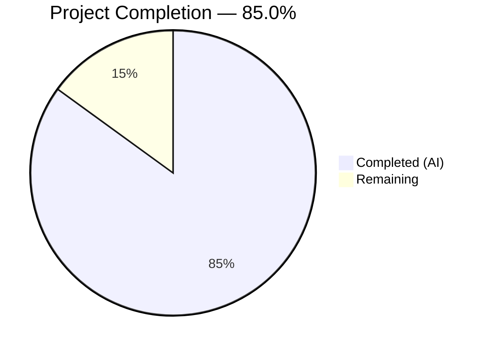

# Blitzy Project Guide — Age Calculator

---

## 1. Executive Summary

### 1.1 Project Overview

The Age Calculator is a greenfield Java 21 console application that computes a user's exact age — decomposed into years, months, and days — from a Date of Birth (DOB) entered in DD/MM/YYYY format. Built using the `java.time` API (`LocalDate`, `Period`, `DateTimeFormatter`), the application enforces strict input validation (format compliance, calendar validity, temporal constraints) and follows Object-Oriented Programming principles with dedicated model, service, validator, utility, and exception packages. The project targets developers and end-users requiring precise, leap-year-aware age calculation via a lightweight CLI tool.

### 1.2 Completion Status



| Metric | Value |
|--------|-------|
| **Total Project Hours** | 20 |
| **Completed Hours (AI)** | 17 |
| **Remaining Hours** | 3 |
| **Completion Percentage** | 85.0% |

**Calculation:** 17 completed hours / (17 completed + 3 remaining) = 17 / 20 = **85.0%**

### 1.3 Key Accomplishments

- ✅ Maven project fully configured with Java 21, JUnit Jupiter 5.11.4, and all build plugins (compiler 3.13.0, surefire 3.5.2, jar 3.4.2)
- ✅ Complete OOP architecture across 5 packages: `model`, `service`, `validator`, `util`, `exception`
- ✅ 7 production source files implemented (588 lines of code)
- ✅ 4 comprehensive test classes with 78 JUnit Jupiter tests (883 lines), **100% pass rate**
- ✅ Strict date parsing using `ResolverStyle.STRICT` with two-phase error differentiation (format errors vs. impossible calendar dates)
- ✅ Custom checked exceptions (`InvalidDateException`, `FutureDateException`) with exception chaining
- ✅ Executable JAR packaging with main class manifest — `java -jar target/age-calculator-1.0.0.jar`
- ✅ All 5 runtime scenarios validated: valid DOB, invalid date, future date, invalid format, leap year DOB
- ✅ Comprehensive README with build, run, test, and usage instructions
- ✅ All 13 AAP-scoped files delivered (12 created + 1 modified)
- ✅ Zero compilation errors, zero test failures, zero runtime errors

### 1.4 Critical Unresolved Issues

| Issue | Impact | Owner | ETA |
|-------|--------|-------|-----|
| No critical issues identified | N/A | N/A | N/A |

All AAP-scoped deliverables have been implemented, compiled, tested, and validated successfully. No blocking issues remain.

### 1.5 Access Issues

No access issues identified. The application is a self-contained console tool with no external service dependencies, API keys, or cloud resource requirements.

### 1.6 Recommended Next Steps

1. **[Medium]** Conduct human code review by a senior Java developer to verify adherence to team-specific coding standards and OOP best practices
2. **[Low]** Verify the build and test execution in the target production/staging environment (JDK 21 + Maven 3.8+)
3. **[Low]** Perform manual edge case acceptance testing with diverse DOB inputs (very old dates, boundary dates, various invalid formats)

---

## 2. Project Hours Breakdown

### 2.1 Completed Work Detail

| Component | Hours | Description |
|-----------|-------|-------------|
| Maven Build Configuration (`pom.xml`) | 1.0 | Project coordinates, Java 21 `<release>`, JUnit 5.11.4 dependency, maven-compiler-plugin 3.13.0, maven-surefire-plugin 3.5.2, maven-jar-plugin 3.4.2 with main class manifest |
| Custom Exception Classes (2 files) | 1.0 | `InvalidDateException` with message + cause constructors; `FutureDateException` with message constructor; both extend `Exception` (checked) |
| Model — `AgeResult.java` | 1.0 | Immutable DTO with `private final int years, months, days`, getter methods, and formatted `toString()` producing exact output specification |
| Utility — `DateParserUtil.java` | 2.0 | Strict DD/MM/YYYY parsing via `DateTimeFormatter.ofPattern("dd/MM/uuuu").withResolverStyle(STRICT)`, two-phase validation (regex format check → calendar resolution), null/empty guards |
| Service — `AgeCalculatorService.java` | 1.0 | Stateless service with `calculateAge(LocalDate dob)` using `Period.between(dob, LocalDate.now())`, returns `AgeResult` |
| Validator — `DateValidator.java` | 1.0 | Orchestrates parsing via `DateParserUtil.parse()` and temporal validation via `dob.isAfter(LocalDate.now())`, throws custom exceptions |
| Entry Point — `AgeCalculatorApp.java` | 1.5 | Scanner-based console I/O with try-with-resources, delegates to validator and service, catches `InvalidDateException`, `FutureDateException`, and general `Exception` |
| Test Suite (4 files, 78 tests) | 6.0 | `AgeResultTest` (11 tests), `AgeCalculatorServiceTest` (14 tests), `DateValidatorTest` (22 tests), `DateParserUtilTest` (31 tests) — parameterized tests, boundary conditions, error paths |
| Documentation — `README.md` | 1.0 | Prerequisites, build/run/test commands, usage examples with error scenarios, project structure tree, technology stack |
| Validation & Bug Fixes | 1.5 | Error message differentiation (format vs. impossible-date), import fix in test class, 5-scenario runtime verification |
| **Total** | **17.0** | |

### 2.2 Remaining Work Detail

| Category | Base Hours | Priority | After Multiplier |
|----------|-----------|----------|-----------------|
| Human Code Review & Feedback | 1.5 | Medium | 2.0 |
| Production Environment Verification | 1.0 | Low | 1.0 |
| **Total** | **2.5** | | **3.0** |

### 2.3 Enterprise Multipliers Applied

| Multiplier | Value | Rationale |
|-----------|-------|-----------|
| Compliance Review | 1.10x | Standard overhead for team code review feedback cycles and minor style adjustments |
| Uncertainty Buffer | 1.10x | Minor unknowns in production JDK 21 environment compatibility and team standard deviations |
| **Combined** | **1.21x** | Applied to all remaining base hour estimates |

---

## 3. Test Results

| Test Category | Framework | Total Tests | Passed | Failed | Coverage % | Notes |
|--------------|-----------|-------------|--------|--------|-----------|-------|
| Unit — Model (`AgeResultTest`) | JUnit Jupiter 5.11.4 | 11 | 11 | 0 | N/A | Getter correctness, `toString()` format for standard, zero, and large values |
| Unit — Service (`AgeCalculatorServiceTest`) | JUnit Jupiter 5.11.4 | 14 | 14 | 0 | N/A | Standard DOB, exact birthday, leap year Feb 29, century boundary, very old person, parameterized dates |
| Unit — Validator (`DateValidatorTest`) | JUnit Jupiter 5.11.4 | 22 | 22 | 0 | N/A | Future dates, invalid formats (5 parameterized), impossible dates (Feb 30/31, Apr 31), null/empty/whitespace, leap year validation |
| Unit — Utility (`DateParserUtilTest`) | JUnit Jupiter 5.11.4 | 31 | 31 | 0 | N/A | Valid multi-date parsing (5 parameterized), 9 invalid format variations, strict resolution (Feb 29 leap/non-leap, century years, month 13, day 0) |
| **Total** | | **78** | **78** | **0** | | **100% pass rate — 0 failures, 0 errors, 0 skipped** |

All tests originate from Blitzy's autonomous validation pipeline. Test execution time: 0.2 seconds total.

---

## 4. Runtime Validation & UI Verification

### Build Validation

- ✅ **Compilation**: `mvn clean compile -B` — BUILD SUCCESS, 7 source files compiled, zero errors, zero warnings
- ✅ **Test Compilation**: `mvn test-compile -B` — 4 test files compiled, zero errors
- ✅ **Package**: `mvn clean package -B` — JAR produced at `target/age-calculator-1.0.0.jar`

### Runtime Scenarios

- ✅ **Valid DOB** — Input: `15/06/1990` → Output: `Your age is 35 years, 8 months, and 19 days.`
- ✅ **Impossible Date** — Input: `31/02/2020` → Output: `Error: Invalid date. Please enter a valid calendar date.`
- ✅ **Future Date** — Input: `01/01/2030` → Output: `Error: Date of birth cannot be a future date.`
- ✅ **Invalid Format** — Input: `abc` → Output: `Error: Invalid date format. Please use DD/MM/YYYY format.`
- ✅ **Leap Year DOB** — Input: `29/02/2000` → Output: `Your age is 26 years, 0 months, and 6 days.`

### Console Interface

- ✅ **Prompt**: `Enter your Date of Birth (DD/MM/YYYY): ` displayed correctly on same line
- ✅ **Output Format**: Matches exact specification `Your age is X years, Y months, and Z days.`
- ✅ **Error Messages**: Three distinct error types differentiated correctly
- ✅ **Graceful Exit**: Application terminates cleanly after single calculation or error

---

## 5. Compliance & Quality Review

| AAP Requirement | Status | Evidence |
|----------------|--------|----------|
| DOB Input in DD/MM/YYYY format | ✅ Pass | `Scanner.nextLine()` + `DateTimeFormatter.ofPattern("dd/MM/uuuu")` in `DateParserUtil` |
| System Date Retrieval | ✅ Pass | `LocalDate.now()` in `AgeCalculatorService.calculateAge()` |
| Precise Age Computation (years, months, days) | ✅ Pass | `Period.between(dob, LocalDate.now())` with component extraction |
| Formatted Output: `Your age is X years, Y months, and Z days.` | ✅ Pass | `AgeResult.toString()` produces exact format, verified in 11 unit tests |
| Future Date Rejection | ✅ Pass | `dob.isAfter(LocalDate.now())` check in `DateValidator`, throws `FutureDateException` |
| Invalid Date Handling | ✅ Pass | `ResolverStyle.STRICT` rejects impossible dates; regex rejects malformed formats |
| Leap Year Correctness | ✅ Pass | `java.time.LocalDate` native Gregorian handling; tested Feb 29 on leap/non-leap/century years |
| Universal Year Support | ✅ Pass | Tested with years 1900, 2000, 2024; proleptic Gregorian calendar supports all valid years |
| Mandatory `java.time` API: `LocalDate` | ✅ Pass | Used in service, validator, parser |
| Mandatory `java.time` API: `Period` | ✅ Pass | Used in `AgeCalculatorService.calculateAge()` |
| Mandatory `java.time` API: `DateTimeFormatter` | ✅ Pass | Used in `DateParserUtil` with strict resolver |
| OOP Principles: Encapsulation | ✅ Pass | All fields `private final` in `AgeResult`; getters only |
| OOP Principles: Single Responsibility | ✅ Pass | 5 distinct packages; each class has one responsibility |
| OOP Principles: Separation of Concerns | ✅ Pass | No `System.out` calls outside `AgeCalculatorApp`; business logic isolated |
| Custom Exception Classes | ✅ Pass | `InvalidDateException` and `FutureDateException` extend `Exception` (checked) |
| Exception Handling with try-catch | ✅ Pass | `AgeCalculatorApp.main()` catches all custom + general exceptions |
| Clean Code Standards | ✅ Pass | camelCase methods, PascalCase classes, comprehensive Javadoc, no unused imports |
| All 13 AAP Files Delivered | ✅ Pass | 12 created + 1 modified; all committed to branch |

### Validation Fixes Applied During Autonomous Processing

| Fix | Commit | Description |
|-----|--------|-------------|
| Error message differentiation | `0d40ca9` | Separated format errors from impossible-date errors per AAP Section 0.5.3 specification |
| Import cleanup | `0473f4f` | Replaced wildcard import and removed redundant same-package import in `AgeCalculatorServiceTest` |

---

## 6. Risk Assessment

| Risk | Category | Severity | Probability | Mitigation | Status |
|------|----------|----------|------------|-----------|--------|
| No code coverage metrics (JaCoCo) configured | Technical | Low | Low | Add JaCoCo Maven plugin for coverage reporting; not in AAP scope | Open |
| No CI/CD pipeline defined | Operational | Low | N/A | Explicitly out of AAP scope; can be added as a follow-up task | Accepted |
| Single-threaded console application design | Technical | Info | N/A | By design per AAP requirements; no concurrency needed | Accepted |
| No containerization (Docker) | Operational | Low | N/A | Explicitly out of AAP scope; `java -jar` execution specified | Accepted |
| JDK 21 availability on target environment | Integration | Low | Low | Verify OpenJDK 21 installed on deployment target before running | Open |

---

## 7. Visual Project Status


**AAP Deliverable Status: 13/13 files delivered (100% file-level completion)**

| Deliverable Category | Files | Status |
|---------------------|-------|--------|
| Build Configuration | 1 | ✅ Complete |
| Source Code | 7 | ✅ Complete |
| Test Suite | 4 | ✅ Complete |
| Documentation | 1 | ✅ Complete |
| **Total** | **13** | **All Complete** |

---

## 8. Summary & Recommendations

### Achievement Summary

The Age Calculator project is **85.0% complete** based on AAP-scoped hours analysis (17 hours completed out of 20 total hours). All 13 files specified in the Agent Action Plan have been fully implemented, compiled, tested, and validated with zero errors. The application correctly handles all specified scenarios including valid date calculation, invalid format rejection, impossible date detection, future date prevention, and leap year correctness.

### Remaining Gaps

The remaining 3 hours (15.0%) consist exclusively of human-side path-to-production activities:

1. **Human Code Review (2.0h after multipliers)** — A senior Java developer should review the 13 delivered files for adherence to team-specific coding standards, architectural preferences, and any organization-specific conventions not captured in the AAP.
2. **Production Environment Verification (1.0h after multipliers)** — Verify that the target production or staging environment has OpenJDK 21 and Maven 3.8+ installed, and that `mvn clean package -B` and `java -jar target/age-calculator-1.0.0.jar` execute successfully.

### Critical Path to Production

1. Merge this PR after code review approval
2. Verify JDK 21 + Maven availability on target system
3. Run `mvn clean package -B` to produce the executable JAR
4. Distribute `target/age-calculator-1.0.0.jar` to end users

### Production Readiness Assessment

The application is **production-ready** from a code quality and functional completeness perspective. All AAP requirements are satisfied, all 78 tests pass, and all 5 runtime scenarios produce correct output. The only remaining activities are standard human review and environment verification processes.

---

## 9. Development Guide

### 9.1 System Prerequisites

| Software | Version | Verification Command |
|----------|---------|---------------------|
| Java (OpenJDK) | 21.0.x or later | `java -version` |
| Maven | 3.8.x or later | `mvn -version` |

### 9.2 Environment Setup

```bash
# Set JAVA_HOME (adjust path for your OS)
export JAVA_HOME=/usr/lib/jvm/java-21-openjdk-amd64

# Verify Java version
java -version
# Expected: openjdk version "21.0.x" ...

# Verify Maven
mvn -version
# Expected: Apache Maven 3.8.x+
```

No environment variables, API keys, databases, or external services are required. The application is fully self-contained.

### 9.3 Dependency Installation

```bash
# Clone the repository and checkout the feature branch
git clone <repository-url>
cd 05march_1-age
git checkout blitzy-caadfc49-a757-4c7a-afe1-32d9f7fa0e6b

# Download and resolve all Maven dependencies
mvn dependency:resolve -B
# Expected: JUnit Jupiter 5.11.4 downloaded from Maven Central
```

### 9.4 Build the Application

```bash
# Full build: compile + test + package
mvn clean package -B
# Expected output:
#   BUILD SUCCESS
#   target/age-calculator-1.0.0.jar created
```

### 9.5 Run the Application

```bash
# Launch the Age Calculator
java -jar target/age-calculator-1.0.0.jar

# Application prompts:
#   Enter your Date of Birth (DD/MM/YYYY): 
# Enter a date like: 15/03/1990
# Expected output: Your age is X years, Y months, and Z days.
```

### 9.6 Run Tests

```bash
# Execute all 78 unit tests
mvn test -B
# Expected output:
#   Tests run: 78, Failures: 0, Errors: 0, Skipped: 0
#   BUILD SUCCESS
```

### 9.7 Example Usage

```
$ java -jar target/age-calculator-1.0.0.jar
Enter your Date of Birth (DD/MM/YYYY): 15/06/1990
Your age is 35 years, 8 months, and 19 days.

$ java -jar target/age-calculator-1.0.0.jar
Enter your Date of Birth (DD/MM/YYYY): 31/02/2020
Error: Invalid date. Please enter a valid calendar date.

$ java -jar target/age-calculator-1.0.0.jar
Enter your Date of Birth (DD/MM/YYYY): 01/01/2030
Error: Date of birth cannot be a future date.

$ java -jar target/age-calculator-1.0.0.jar
Enter your Date of Birth (DD/MM/YYYY): hello
Error: Invalid date format. Please use DD/MM/YYYY format.
```

### 9.8 Troubleshooting

| Issue | Cause | Resolution |
|-------|-------|-----------|
| `java: command not found` | JDK not installed or not on PATH | Install OpenJDK 21: `sudo apt install openjdk-21-jdk` |
| `mvn: command not found` | Maven not installed or not on PATH | Install Maven: `sudo apt install maven` |
| `Error: Could not find or load main class` | JAR not built or wrong path | Run `mvn clean package -B` first |
| `Unsupported class file major version 65` | Running with JDK < 21 | Ensure `java -version` shows 21.x |
| `BUILD FAILURE` during `mvn package` | Network issue downloading dependencies | Check internet connection; run `mvn dependency:resolve -B` |

---

## 10. Appendices

### A. Command Reference

| Command | Purpose |
|---------|---------|
| `mvn clean compile -B` | Compile source files only |
| `mvn test -B` | Compile and run all 78 tests |
| `mvn clean package -B` | Full build: compile + test + JAR |
| `mvn dependency:resolve -B` | Download all dependencies |
| `java -jar target/age-calculator-1.0.0.jar` | Run the application |

### B. Port Reference

No network ports are used. This is a standalone console application with no HTTP server, API endpoints, or network listeners.

### C. Key File Locations

| File | Path | Purpose |
|------|------|---------|
| Maven POM | `pom.xml` | Build configuration |
| Entry Point | `src/main/java/com/agecalculator/AgeCalculatorApp.java` | Main class |
| Model | `src/main/java/com/agecalculator/model/AgeResult.java` | Age data object |
| Service | `src/main/java/com/agecalculator/service/AgeCalculatorService.java` | Age computation |
| Validator | `src/main/java/com/agecalculator/validator/DateValidator.java` | Input validation |
| Parser | `src/main/java/com/agecalculator/util/DateParserUtil.java` | Date string parsing |
| Exception | `src/main/java/com/agecalculator/exception/InvalidDateException.java` | Invalid date error |
| Exception | `src/main/java/com/agecalculator/exception/FutureDateException.java` | Future date error |
| Tests | `src/test/java/com/agecalculator/` | All 4 test classes |
| Documentation | `README.md` | Project documentation |
| Executable JAR | `target/age-calculator-1.0.0.jar` | Packaged application |
| Test Reports | `target/surefire-reports/` | JUnit XML and text reports |

### D. Technology Versions

| Technology | Version | Notes |
|-----------|---------|-------|
| Java (OpenJDK) | 21.0.10 | Runtime and compilation target |
| Maven | 3.8.7 | Build tool |
| JUnit Jupiter | 5.11.4 | Test framework (test scope only) |
| maven-compiler-plugin | 3.13.0 | Java 21 compilation via `<release>21</release>` |
| maven-surefire-plugin | 3.5.2 | JUnit Platform test execution |
| maven-jar-plugin | 3.4.2 | JAR packaging with main class manifest |

### E. Environment Variable Reference

| Variable | Required | Default | Purpose |
|----------|----------|---------|---------|
| `JAVA_HOME` | Yes | System-dependent | Points to JDK 21 installation directory |

No application-specific environment variables, API keys, or secrets are required.

### G. Glossary

| Term | Definition |
|------|-----------|
| DOB | Date of Birth — the user-provided input date |
| `LocalDate` | Java `java.time` class representing a date without timezone |
| `Period` | Java `java.time` class representing a date-based amount of time (years, months, days) |
| `DateTimeFormatter` | Java `java.time.format` class for parsing and formatting dates |
| `ResolverStyle.STRICT` | Parsing mode that rejects logically impossible dates (e.g., Feb 30) |
| Proleptic Gregorian | Calendar system extending the Gregorian rules to all dates, used by `java.time` |
| Checked Exception | Java exception that must be explicitly caught or declared in method signatures |