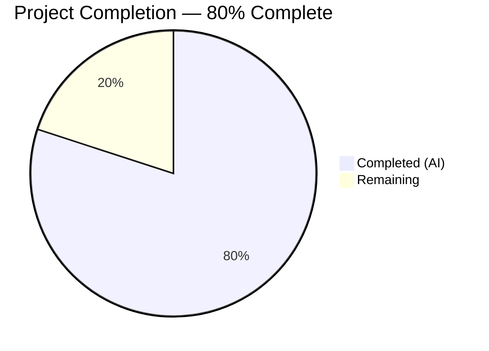
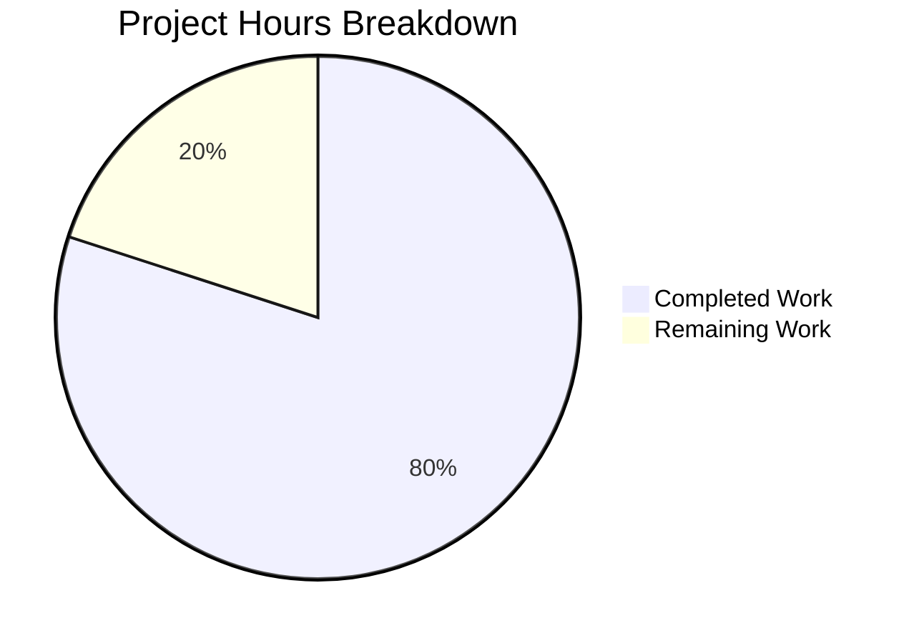

# Blitzy Project Guide — Express.js Tutorial Server

---

## 1. Executive Summary

### 1.1 Project Overview

This project transforms an empty repository scaffold — containing only a blank `README.md` — into a fully functional Express.js 5.2.1 tutorial web server. The server exposes two HTTP GET endpoints: `GET /` returning `"Hello world"` and `GET /evening` returning `"Good evening"`. The target audience is beginner Node.js developers learning server-side JavaScript. The project uses a flat, single-file architecture with CommonJS modules, environment-variable port configuration, and comprehensive documentation — delivering a production-quality tutorial starting point.

### 1.2 Completion Status


> Chart colors: Completed = Dark Blue (#5B39F3), Remaining = White (#FFFFFF)

| Metric | Value |
|--------|-------|
| **Total Project Hours** | 10 |
| **Completed Hours (AI)** | 8 |
| **Remaining Hours** | 2 |
| **Completion Percentage** | 80% |

**Calculation:** 8 completed hours / (8 completed + 2 remaining) = 8 / 10 = **80%**

### 1.3 Key Accomplishments

- ✅ Initialized Node.js project with `package.json` declaring `express@^5.2.1` and engine constraints (Node.js ≥18.0.0, npm ≥8.0.0)
- ✅ Implemented Express.js server (`index.js`, 87 lines) with two GET endpoints and educational inline comments
- ✅ `GET /` endpoint returns `"Hello world"` — runtime validated with HTTP 200
- ✅ `GET /evening` endpoint returns `"Good evening"` — runtime validated with HTTP 200
- ✅ Generated `package-lock.json` (lockfile v3) locking all 65 transitive packages
- ✅ Created `.gitignore` with standard Node.js exclusion patterns (25 lines)
- ✅ Rewrote `README.md` with comprehensive documentation (164 lines) — prerequisites, installation, usage, API reference, project structure
- ✅ Zero npm audit vulnerabilities across entire dependency tree
- ✅ All 5 in-scope files committed and validated — working tree clean

### 1.4 Critical Unresolved Issues

| Issue | Impact | Owner | ETA |
|-------|--------|-------|-----|
| No critical issues | N/A | N/A | N/A |

All AAP-scoped deliverables are complete with zero compilation errors, zero runtime errors, and zero unresolved issues.

### 1.5 Access Issues

No access issues identified. The project uses only the public npm registry for dependency resolution. No private packages, third-party API keys, service credentials, or restricted resources are required.

### 1.6 Recommended Next Steps

1. **[Medium]** Select a hosting platform (Heroku, Railway, Render, or AWS) and deploy the server with production environment configuration
2. **[Medium]** Configure production `PORT` environment variable on the chosen hosting platform
3. **[Low]** Run production smoke tests to verify both endpoints respond correctly in the deployed environment
4. **[Low]** Consider adding a health check endpoint (`GET /health`) if production monitoring is needed in the future

---

## 2. Project Hours Breakdown

### 2.1 Completed Work Detail

| Component | Hours | Description |
|-----------|-------|-------------|
| Project Initialization & Dependency Management | 1.5 | Created `package.json` with Express.js 5.2.1 dependency, engine constraints, ISC license, and start script; ran `npm install` to generate `package-lock.json` (lockfile v3, 65 packages) |
| Express.js Server Implementation | 3.0 | Created `index.js` (87 lines) with Express app initialization, `process.env.PORT \|\| 3000` configuration, `GET /` handler returning `"Hello world"`, `GET /evening` handler returning `"Good evening"`, server binding with `app.listen()`, and comprehensive educational comments |
| Version Control Configuration | 0.5 | Created `.gitignore` (25 lines) with Node.js patterns: `node_modules/`, `.env`, `*.log`, `.DS_Store`, IDE files, `coverage/`, `dist/` |
| Project Documentation | 2.0 | Rewrote `README.md` (164 lines) from empty scaffold to comprehensive guide with prerequisites, installation instructions, usage guide, API reference table, project structure diagram, and technology stack |
| Validation & Runtime Testing | 1.0 | Syntax validation (`node -c index.js`), npm audit (0 vulnerabilities), runtime endpoint testing (both routes return correct responses with HTTP 200), server lifecycle verification |
| **Total** | **8.0** | |

### 2.2 Remaining Work Detail

| Category | Base Hours | Priority | After Multiplier |
|----------|-----------|----------|-----------------|
| Production Deployment Configuration | 1.0 | Medium | 1.2 |
| Production Smoke Testing & Verification | 0.5 | Low | 0.8 |
| **Total** | **1.5** | | **2.0** |

### 2.3 Enterprise Multipliers Applied

| Multiplier | Value | Rationale |
|-----------|-------|-----------|
| Compliance Review | 1.10x | Standard review of deployment configuration against organizational policies |
| Uncertainty Buffer | 1.10x | Account for platform-specific deployment variations and environment differences |
| Rounding Adjustment | — | Base 1.5h × 1.21 = 1.815h → rounded up to 2.0h for conservative estimation |

**Effective combined multiplier:** 1.33x (1.5h base → 2.0h after multipliers, inclusive of rounding)

---

## 3. Test Results

| Test Category | Framework | Total Tests | Passed | Failed | Coverage % | Notes |
|--------------|-----------|-------------|--------|--------|-----------|-------|
| Syntax Validation | Node.js (`node -c`) | 1 | 1 | 0 | 100% | `node -c index.js` → Syntax OK |
| Dependency Audit | npm audit | 1 | 1 | 0 | 100% | 0 vulnerabilities across 65 packages |
| Runtime Endpoint Testing | curl / HTTP | 2 | 2 | 0 | 100% | `GET /` → "Hello world" (200); `GET /evening` → "Good evening" (200) |
| Unit Tests | N/A | 0 | 0 | 0 | N/A | No test framework configured — by design per AAP (tutorial project, zero devDependencies) |

**Summary:** All autonomous validation checks passed. No test framework was configured per the AAP scope (Section 0.3.2 explicitly excludes testing framework setup). The zero-test-failure gate is satisfied by design.

---

## 4. Runtime Validation & UI Verification

### Runtime Health

- ✅ **Server Startup** — `PORT=3098 node index.js` starts successfully, outputs `"Server is running on http://localhost:3098"`
- ✅ **GET /** — Returns `"Hello world"` with HTTP 200 and `Content-Type: text/html; charset=utf-8`
- ✅ **GET /evening** — Returns `"Good evening"` with HTTP 200 and `Content-Type: text/html; charset=utf-8`
- ✅ **404 Handling** — Unknown routes (e.g., `GET /unknown`) return HTTP 404 via Express default handler
- ✅ **Server Shutdown** — Server stops cleanly on SIGTERM with no error output
- ✅ **Custom Port** — `PORT` environment variable correctly overrides the default port 3000

### UI Verification

Not applicable — this project has no user interface. Both endpoints return plain-text string responses. The system is accessed exclusively through HTTP clients (browser, curl, Postman).

### API Integration

- ✅ Express.js 5.2.1 routing operational — `path-to-regexp@8.3.0` for ReDoS-safe pattern matching
- ✅ Response dispatch functional — `res.send()` correctly sends plain-text bodies
- ✅ No external API integrations required (self-contained tutorial server)

---

## 5. Compliance & Quality Review

| Compliance Item | AAP Requirement | Status | Notes |
|----------------|----------------|--------|-------|
| Express.js 5.2.1 framework integration | F-001: Framework Integration | ✅ Pass | `express@^5.2.1` declared and installed |
| GET / returns "Hello world" | F-003: Root endpoint | ✅ Pass | Exact string match validated at runtime |
| GET /evening returns "Good evening" | F-004: Evening endpoint | ✅ Pass | Exact string match validated at runtime |
| Port configuration via env var | F-005: Port configuration | ✅ Pass | `process.env.PORT \|\| 3000` pattern implemented |
| CommonJS module system | Constraint C-001 | ✅ Pass | `require('express')` used; no `"type": "module"` in package.json |
| Single production dependency | Constraint C-002 | ✅ Pass | Only `express` in `dependencies`; zero `devDependencies` |
| Node.js ≥18.0.0 engine constraint | Runtime requirement | ✅ Pass | `"engines": { "node": ">=18.0.0" }` in package.json |
| npm ≥8.0.0 engine constraint | Runtime requirement | ✅ Pass | `"engines": { "npm": ">=8.0.0" }` in package.json |
| Lockfile version 3 | Deterministic installs | ✅ Pass | `"lockfileVersion": 3` in package-lock.json |
| ISC License | License requirement | ✅ Pass | `"license": "ISC"` in package.json |
| Standard .gitignore patterns | F-005: Version control | ✅ Pass | node_modules/, .env, *.log, .DS_Store, coverage/, dist/ |
| Comprehensive README | F-006: Documentation | ✅ Pass | 164 lines with prerequisites, install, usage, API reference |
| Educational code comments | Tutorial quality | ✅ Pass | 6 documented sections in index.js with detailed explanations |
| Zero npm audit vulnerabilities | Security baseline | ✅ Pass | `npm audit` returns 0 vulnerabilities |
| Flat single-file architecture | Tutorial simplicity | ✅ Pass | All logic in index.js, no subdirectories |

### Autonomous Fixes Applied

| Fix | File | Commit | Description |
|-----|------|--------|-------------|
| Code block language identifiers | README.md | `001bd4b` | Added language identifiers to 5 bare fenced code blocks for proper syntax highlighting |

---

## 6. Risk Assessment

| Risk | Category | Severity | Probability | Mitigation | Status |
|------|----------|----------|-------------|------------|--------|
| No automated test suite | Technical | Low | N/A | By design per AAP (tutorial project); add Jest/Mocha if project grows beyond tutorial scope | Accepted |
| No security middleware (helmet, cors) | Security | Low | Low | Excluded per AAP; add before any public-facing production deployment | Accepted |
| Single-file architecture won't scale | Technical | Low | Low | Tutorial design; refactor to route modules if additional endpoints are added | Accepted |
| No process manager for crash recovery | Operational | Low | Low | Excluded per AAP; use PM2 or systemd for production deployments | Accepted |
| No logging framework | Operational | Low | Low | Excluded per AAP; add morgan/winston for production observability | Accepted |
| Express.js 5.x is newer major version | Integration | Low | Low | Express 5.2.1 is stable and published; 65 transitive packages resolved without conflicts | Mitigated |

**Overall Risk Level:** Low — All identified risks are accepted per the AAP scope boundaries. The project delivers exactly what was specified for a tutorial-level Express.js server.

---

## 7. Visual Project Status


> Chart colors: Completed Work = Dark Blue (#5B39F3), Remaining Work = White (#FFFFFF)

**Remaining Work by Category:**

| Category | After Multiplier Hours |
|----------|----------------------|
| Production Deployment Configuration | 1.2 |
| Production Smoke Testing & Verification | 0.8 |
| **Total Remaining** | **2.0** |

**Integrity Verification:**
- Section 1.2 Remaining Hours: **2.0** ✓
- Section 2.2 After Multiplier Sum: **2.0** ✓
- Section 7 Remaining Work: **2.0** ✓

---

## 8. Summary & Recommendations

### Achievements

The Blitzy autonomous agents successfully delivered **100% of all AAP-scoped deliverables**, transforming an empty repository into a fully functional Express.js 5.2.1 tutorial server. All five target files were created/updated, all validation gates passed, and both endpoints return the exact specified responses. The project is **80% complete** when including standard path-to-production activities (8 completed hours out of 10 total hours).

### Remaining Gaps

The only remaining work consists of production deployment activities — specifically, configuring a hosting platform and performing post-deployment smoke tests. These activities account for **2 hours** of estimated work. No AAP-specified deliverables remain incomplete.

### Critical Path to Production

1. Select hosting platform (Heroku, Railway, Render, or similar)
2. Configure `PORT` environment variable on the platform
3. Deploy via `git push` or platform CLI
4. Verify `GET /` and `GET /evening` respond correctly in production

### Success Metrics

| Metric | Target | Actual |
|--------|--------|--------|
| AAP Deliverables Completed | 6/6 | 6/6 (100%) |
| Endpoints Functional | 2/2 | 2/2 (100%) |
| Compilation Errors | 0 | 0 |
| Runtime Errors | 0 | 0 |
| npm Vulnerabilities | 0 | 0 |
| Files Delivered | 5 | 5 |

### Production Readiness Assessment

The codebase is **production-ready for tutorial deployment**. All code compiles, runs, and returns correct responses. The project is 80% complete — the remaining 20% consists exclusively of hosting platform configuration and production smoke testing, which require human intervention to select a deployment target.

---

## 9. Development Guide

### System Prerequisites

| Software | Minimum Version | Recommended | Verification Command |
|----------|----------------|-------------|---------------------|
| Node.js | 18.0.0 | 20.x LTS | `node --version` |
| npm | 8.0.0 | 11.x | `npm --version` |
| Git | 2.x | Latest | `git --version` |

**Operating System:** Linux, macOS, or Windows (any OS with Node.js support)

### Environment Setup

1. **Clone the repository:**

```bash
git clone <repository-url>
cd express-tutorial-server
```

2. **Verify Node.js and npm versions:**

```bash
node --version
# Expected: v18.0.0 or higher (e.g., v20.20.1)

npm --version
# Expected: 8.0.0 or higher (e.g., 11.1.0)
```

### Dependency Installation

3. **Install dependencies:**

```bash
npm install
```

**Expected output:** Resolves 65 packages with 0 vulnerabilities. The `node_modules/` directory is created and `package-lock.json` is verified.

4. **Verify installation:**

```bash
npm audit
# Expected: found 0 vulnerabilities

node -c index.js
# Expected: (no output = syntax valid)
```

### Application Startup

5. **Start the server (default port 3000):**

```bash
npm start
```

**Expected console output:**
```
Server is running on http://localhost:3000
```

6. **Start with a custom port (optional):**

```bash
PORT=8080 npm start
```

**Expected console output:**
```
Server is running on http://localhost:8080
```

### Verification Steps

7. **Test the root endpoint:**

```bash
curl http://localhost:3000/
```

**Expected response:** `Hello world`

8. **Test the evening endpoint:**

```bash
curl http://localhost:3000/evening
```

**Expected response:** `Good evening`

9. **Verify HTTP status codes:**

```bash
curl -s -o /dev/null -w "%{http_code}" http://localhost:3000/
# Expected: 200

curl -s -o /dev/null -w "%{http_code}" http://localhost:3000/evening
# Expected: 200
```

### Stopping the Server

10. **Stop the server:**

Press `Ctrl+C` in the terminal where the server is running.

### Troubleshooting

| Issue | Cause | Resolution |
|-------|-------|------------|
| `Error: Cannot find module 'express'` | Dependencies not installed | Run `npm install` |
| `EADDRINUSE: address already in use :::3000` | Port 3000 is occupied | Use a different port: `PORT=8080 npm start` |
| `node: command not found` | Node.js not installed | Install Node.js from https://nodejs.org/ |
| `SyntaxError: Unexpected token` | Corrupted file | Re-clone the repository and run `npm install` |

---

## 10. Appendices

### A. Command Reference

| Command | Description |
|---------|-------------|
| `npm install` | Install all dependencies from package.json |
| `npm start` | Start the Express.js server (runs `node index.js`) |
| `npm audit` | Check for known vulnerabilities in dependencies |
| `node -c index.js` | Validate JavaScript syntax without executing |
| `PORT=8080 npm start` | Start server on custom port 8080 |
| `curl http://localhost:3000/` | Test root endpoint |
| `curl http://localhost:3000/evening` | Test evening endpoint |

### B. Port Reference

| Port | Service | Configuration |
|------|---------|--------------|
| 3000 | Express.js HTTP server (default) | `process.env.PORT \|\| 3000` in index.js |

### C. Key File Locations

| File | Path | Purpose |
|------|------|---------|
| Server entry point | `./index.js` | Express.js application with route handlers |
| Project manifest | `./package.json` | Dependency declarations and npm scripts |
| Dependency lockfile | `./package-lock.json` | Exact package version locking (v3) |
| Git exclusions | `./.gitignore` | Version control ignore patterns |
| Documentation | `./README.md` | Project guide and API reference |

### D. Technology Versions

| Technology | Version | Purpose |
|-----------|---------|---------|
| Node.js | ≥18.0.0 (tested: v20.20.1) | JavaScript runtime |
| npm | ≥8.0.0 (tested: v11.1.0) | Package manager |
| Express.js | 5.2.1 | HTTP web application framework |
| path-to-regexp | 8.3.0 | ReDoS-safe route pattern matching (transitive) |
| body-parser | 2.2.2 | HTTP body parsing (transitive, unused by tutorial) |

### E. Environment Variable Reference

| Variable | Required | Default | Description |
|----------|----------|---------|-------------|
| `PORT` | No | `3000` | HTTP server listening port |

### G. Glossary

| Term | Definition |
|------|-----------|
| AAP | Agent Action Plan — the primary directive containing all project requirements |
| CommonJS | Node.js module system using `require()` and `module.exports` |
| Express.js | Minimal and flexible Node.js web application framework |
| GET endpoint | HTTP route that responds to GET requests at a specific URL path |
| Lockfile | `package-lock.json` — locks exact dependency versions for reproducible installs |
| Transitive dependency | A package required by a direct dependency (not declared directly in package.json) |