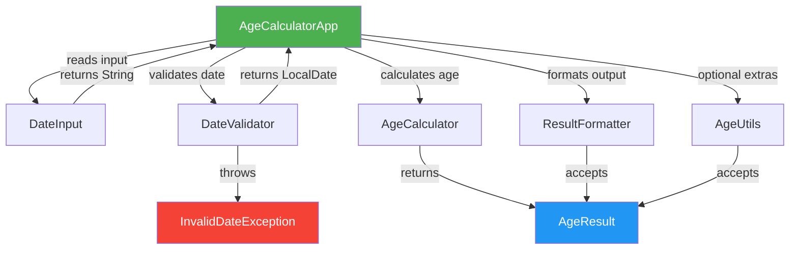

# Technical Specification

# 0. Agent Action Plan

## 0.1 Intent Clarification


### 0.1.1 Core Feature Objective

Based on the prompt, the Blitzy platform understands that the new feature requirement is to **build a complete Java application that calculates a user's exact age from their Date of Birth (DOB)**. The application is a greenfield implementation within the `05march_1-age` repository, which currently contains only a scaffold `README.md` file. The following requirements have been identified:

- **DOB Input Acceptance**: The application must accept a Date of Birth as user input in the exact format `DD/MM/YYYY` via standard console input
- **Current Date Resolution**: The application must automatically fetch the current system date using `java.time.LocalDate.now()` to serve as the reference date for age computation
- **Precise Age Calculation**: The application must compute the exact age broken down into three discrete components — years, months, and days — using `java.time.Period` for calendar-aware arithmetic
- **Formatted Output**: The application must display the result in the exact format: `Your age is X years, Y months, and Z days.`
- **Input Validation**: The application must validate user input with the following rules:
  - Reject future dates (DOB must not be after the current system date)
  - Reject logically impossible dates (e.g., `31/02/2020`, which represents February 31 — a non-existent date)
  - Display meaningful, user-friendly error messages for all invalid input scenarios
- **Leap Year Handling**: The calculation engine must correctly handle leap year edge cases, including users born on February 29
- **Universal Year Support**: The application must work for users born in any valid year representable by `java.time.LocalDate`

Additionally, the following implicit requirements have been surfaced:

- The application requires a `main` method entry point for standalone execution
- Console I/O must be managed through `java.util.Scanner` for input reading
- The project must be structured as a Maven project for build reproducibility and dependency management
- The Java source must compile and run on OpenJDK 21 (LTS), which is the installed runtime

### 0.1.2 Special Instructions and Constraints

The user has provided the following specific directives that must be honored throughout implementation:

- **Java Standard Library APIs**: The implementation must use exactly these three APIs from the `java.time` package:
  - `java.time.LocalDate` — for date representation and current-date resolution
  - `java.time.Period` — for computing the difference between two dates as years, months, and days
  - `java.time.format.DateTimeFormatter` — for parsing the `DD/MM/YYYY` input format
- **Object-Oriented Design**: The application must follow Object-Oriented Programming (OOP) principles — encapsulation of age calculation logic into dedicated classes, separation of concerns between input handling, validation, computation, and output formatting
- **Exception Handling**: The application must use proper `try-catch` blocks to handle all runtime exceptions, including `DateTimeParseException` for malformed input and custom validation exceptions for semantic errors (future dates, invalid dates)
- **Clean Code Standards**: The codebase must adhere to readable, well-structured coding conventions — meaningful variable names, proper indentation, JavaDoc comments, and single-responsibility methods

User Example — Input:
```plaintext
Enter your Date of Birth (DD/MM/YYYY): 15/08/1998
```

User Example — Output:
```plaintext
Your age is 27 years, 6 months, and 15 days.
```

**Optional Enhancements** documented by the user (lower priority, to be implemented if feasible):

- Show total age in months and total age in days
- Display countdown to next birthday
- Add a simple GUI using Java Swing or JavaFX
- Convert the calculation logic into a reusable utility class

**Architectural Note**: The existing technical specification (§3.1–§3.4) describes a Python 3.13 / Flask-based API microservice stack. The user's prompt explicitly overrides this with a **Java-based console application**. The Agent Action Plan honors the user's explicit instructions and plans the implementation entirely in Java, using the `java.time` standard library rather than `python-dateutil`.

### 0.1.3 Technical Interpretation

These feature requirements translate to the following technical implementation strategy:

- To **accept and parse DOB input**, we will create a `DateInput` class that wraps `java.util.Scanner` for console I/O and `java.time.format.DateTimeFormatter` configured with the pattern `dd/MM/yyyy` and `ResolverStyle.STRICT` to enforce calendar validity
- To **validate the parsed date**, we will create a `DateValidator` class that checks the parsed `LocalDate` against `LocalDate.now()` to reject future dates, with structured error messages for each failure type
- To **calculate the exact age**, we will create an `AgeCalculator` class that uses `java.time.Period.between(dob, currentDate)` to obtain a `Period` object and extracts the years, months, and days components
- To **format and display the result**, we will create a `ResultFormatter` class that constructs the output string in the user-specified format: `Your age is X years, Y months, and Z days.`
- To **handle optional enhancements**, we will create an `AgeUtils` utility class that provides static methods for total months, total days, and next-birthday countdown calculations
- To **orchestrate the workflow**, we will create an `AgeCalculatorApp` main class that wires together input → validation → calculation → output in a clean, OOP-driven flow
- To **ensure correctness**, we will create comprehensive JUnit 5 test classes covering normal dates, leap year dates, invalid dates, future dates, and malformed format inputs


## 0.2 Repository Scope Discovery


### 0.2.1 Comprehensive File Analysis

The `05march_1-age` repository is a **pure greenfield project**. Exploration of the repository root (`get_source_folder_contents` at path `""`) revealed a single file:

| File | Status | Content |
|------|--------|---------|
| `README.md` | UNCHANGED | Contains only the heading `# 05march_1-age` |

No source code, build files, dependency manifests, configuration files, CI/CD pipelines, Docker configurations, test files, or documentation beyond the README exist in the repository. There are no `.blitzyignore` files present.

**Existing Files to Modify:**

| File Path | Modification Required | Purpose |
|-----------|-----------------------|---------|
| `README.md` | MODIFY | Update with project description, build instructions, usage guide, and test case documentation |

**Integration Point Discovery:**

Since this is a greenfield repository with no existing codebase, there are no pre-existing API endpoints, database models, service classes, controllers, or middleware to modify. All components will be created from scratch. The integration analysis (§0.4) addresses how the newly created modules interconnect with each other.

### 0.2.2 Web Search Research Conducted

The following research was performed to inform the implementation plan:

- **JUnit 5 / JUnit Jupiter latest stable version**: Research confirmed that JUnit 5.14.2 is the latest stable release within the JUnit 5 line (released January 6, 2026). JUnit 6.0.3 is also available as of February 15, 2026, but JUnit 5.14.x remains widely adopted and fully compatible with Java 21. The project will use JUnit 5 Jupiter for maximum ecosystem compatibility with Maven Surefire.
- **Maven Surefire Plugin latest version**: Research confirmed that `maven-surefire-plugin` version 3.5.5 is the latest stable release (published February 18, 2026) and provides native JUnit 5 Platform support without requiring additional provider dependencies.
- **Java `java.time` API best practices**: The `java.time.LocalDate`, `java.time.Period`, and `java.time.format.DateTimeFormatter` APIs (part of the Java standard library since Java 8) are the recommended approach for date arithmetic. `ResolverStyle.STRICT` combined with `DateTimeFormatter.ofPattern("dd/MM/uuuu")` is the standard technique for rejecting invalid calendar dates such as February 31.
- **Maven project structure conventions**: Standard Maven directory layout (`src/main/java`, `src/test/java`, `src/main/resources`) is the expected structure for Java projects built with Maven.

### 0.2.3 New File Requirements

**New Source Files to Create:**

| File Path | Purpose |
|-----------|---------|
| `pom.xml` | Maven project descriptor — defines project coordinates, Java 21 compiler settings, JUnit 5 dependency, and Surefire plugin configuration |
| `src/main/java/com/agecalculator/AgeCalculatorApp.java` | Main application entry point — orchestrates the input → validation → calculation → output workflow |
| `src/main/java/com/agecalculator/model/AgeResult.java` | Data model — immutable record/class holding computed age components (years, months, days) |
| `src/main/java/com/agecalculator/service/AgeCalculator.java` | Core calculation engine — computes age using `Period.between()` with leap year correctness |
| `src/main/java/com/agecalculator/service/DateValidator.java` | Validation service — enforces format, logical, temporal, and range validation rules |
| `src/main/java/com/agecalculator/io/DateInput.java` | Console I/O handler — reads DOB string from user via `Scanner` and invokes parsing |
| `src/main/java/com/agecalculator/io/ResultFormatter.java` | Output formatter — constructs the display string in the required format |
| `src/main/java/com/agecalculator/util/AgeUtils.java` | Utility class — provides reusable static methods for total months, total days, next-birthday countdown |
| `src/main/java/com/agecalculator/exception/InvalidDateException.java` | Custom exception — thrown when DOB fails semantic validation (future date, invalid calendar date) |

**New Test Files to Create:**

| File Path | Purpose |
|-----------|---------|
| `src/test/java/com/agecalculator/service/AgeCalculatorTest.java` | Unit tests for age calculation engine — covers normal DOB, leap year DOB, boundary dates, same-day DOB |
| `src/test/java/com/agecalculator/service/DateValidatorTest.java` | Unit tests for validation service — covers invalid dates, future dates, boundary conditions |
| `src/test/java/com/agecalculator/model/AgeResultTest.java` | Unit tests for data model — covers construction, accessors, equality |
| `src/test/java/com/agecalculator/util/AgeUtilsTest.java` | Unit tests for utility methods — covers total months, total days, next-birthday countdown |
| `src/test/java/com/agecalculator/io/ResultFormatterTest.java` | Unit tests for output formatting — verifies exact output string format |
| `src/test/java/com/agecalculator/AgeCalculatorAppTest.java` | Integration test — verifies end-to-end workflow from input to output |

**New Configuration and Documentation Files:**

| File Path | Purpose |
|-----------|---------|
| `.gitignore` | Git ignore rules for Maven `target/` directory, IDE files (`.idea/`, `.vscode/`, `*.iml`), OS files |


## 0.3 Dependency Inventory


### 0.3.1 Private and Public Packages

The Age Calculator application is a Java console application that relies primarily on the Java Standard Library (`java.time.*`, `java.util.Scanner`). All external dependencies are limited to the testing and build infrastructure layers.

**Runtime Dependencies:**

| Registry | Package Name | Version | Purpose |
|----------|-------------|---------|---------|
| JDK Standard Library | `java.time.LocalDate` | JDK 21 built-in | Date representation and current-date resolution |
| JDK Standard Library | `java.time.Period` | JDK 21 built-in | Calendar-aware date difference computation (years, months, days) |
| JDK Standard Library | `java.time.format.DateTimeFormatter` | JDK 21 built-in | Parsing DOB input in `DD/MM/YYYY` format with strict validation |
| JDK Standard Library | `java.time.temporal.ChronoUnit` | JDK 21 built-in | Computing total days and total months for optional enhancements |
| JDK Standard Library | `java.util.Scanner` | JDK 21 built-in | Console input reading |

No external runtime dependencies (JARs from Maven Central) are required. The application is a pure Java Standard Library application.

**Test Dependencies:**

| Registry | Package Name | Version | Purpose |
|----------|-------------|---------|---------|
| Maven Central | `org.junit.jupiter:junit-jupiter` | 5.11.4 | JUnit 5 Jupiter aggregator — pulls in `junit-jupiter-api`, `junit-jupiter-engine`, and `junit-jupiter-params` for test authoring and execution |

**Build Plugins:**

| Registry | Plugin Name | Version | Purpose |
|----------|------------|---------|---------|
| Maven Central | `org.apache.maven.plugins:maven-compiler-plugin` | 3.13.0 | Compiles Java source with `--release 21` for JDK 21 bytecode targeting |
| Maven Central | `org.apache.maven.plugins:maven-surefire-plugin` | 3.5.5 | Discovers and executes JUnit 5 tests during `mvn test` phase |
| Maven Central | `org.apache.maven.plugins:maven-jar-plugin` | 3.4.2 | Packages compiled classes into an executable JAR with manifest entry point |

**Version Justification:**

- **JDK 21**: OpenJDK 21.0.10 is the installed and verified runtime. Java 21 is the current Long-Term Support (LTS) release, providing full `java.time` API support, record types, and sealed classes for clean OOP design.
- **JUnit Jupiter 5.11.4**: Selected as a stable, well-tested release within the JUnit 5 line that is fully compatible with Java 21 and Maven Surefire 3.5.5. While JUnit 5.14.2 and JUnit 6.0.3 exist, 5.11.4 offers proven stability and wide tooling support.
- **Maven Surefire 3.5.5**: The latest stable version confirmed via the Apache Maven Surefire documentation (published February 18, 2026), with native JUnit 5 Platform integration.

### 0.3.2 Dependency Updates

Since this is a greenfield project with no existing dependency manifests, there are no dependency updates, import transformations, or migration changes required. All dependencies are being introduced fresh.

**New Dependency Manifest — `pom.xml`:**

The project requires a new `pom.xml` file at the repository root with the following structure:

- `groupId`: `com.agecalculator`
- `artifactId`: `age-calculator`
- `version`: `1.0.0-SNAPSHOT`
- `packaging`: `jar`
- Java compiler source/target: `21`
- Test dependency: `org.junit.jupiter:junit-jupiter:5.11.4` (scope: `test`)
- Build plugins: `maven-compiler-plugin:3.13.0`, `maven-surefire-plugin:3.5.5`, `maven-jar-plugin:3.4.2`

**Import Requirements for Source Files:**

All source files will use imports exclusively from the Java Standard Library and the project's own packages:

- `java.time.LocalDate`, `java.time.Period`, `java.time.format.DateTimeFormatter`, `java.time.format.ResolverStyle`
- `java.time.temporal.ChronoUnit`
- `java.util.Scanner`
- `com.agecalculator.model.*`, `com.agecalculator.service.*`, `com.agecalculator.io.*`, `com.agecalculator.util.*`, `com.agecalculator.exception.*`

**Import Requirements for Test Files:**

- `org.junit.jupiter.api.Test`, `org.junit.jupiter.api.DisplayName`
- `org.junit.jupiter.api.Assertions.*` (static import)
- `org.junit.jupiter.params.ParameterizedTest`, `org.junit.jupiter.params.provider.ValueSource`
- All project source imports as above


## 0.4 Integration Analysis


### 0.4.1 Existing Code Touchpoints

Since the repository is greenfield (containing only `README.md`), there are no existing code touchpoints to modify. All integration is between the newly created modules. The single existing file modification is:

- **`README.md`**: Replace the scaffold heading with comprehensive project documentation including description, prerequisites, build instructions, usage examples, and test case descriptions

### 0.4.2 Inter-Module Integration Map

The following diagram describes how the newly created modules integrate with each other:



**Direct Integration Points:**

| Source Module | Target Module | Integration Mechanism | Purpose |
|--------------|--------------|----------------------|---------|
| `AgeCalculatorApp` | `DateInput` | Method call: `readDateOfBirth()` | Reads raw DOB string from console |
| `AgeCalculatorApp` | `DateValidator` | Method call: `parseAndValidate(String)` | Parses DD/MM/YYYY string into `LocalDate`, validates against rules |
| `AgeCalculatorApp` | `AgeCalculator` | Method call: `calculateAge(LocalDate)` | Computes age as `AgeResult` from validated DOB |
| `AgeCalculatorApp` | `ResultFormatter` | Method call: `format(AgeResult)` | Converts `AgeResult` into display string |
| `AgeCalculatorApp` | `AgeUtils` | Method call: `totalMonths()`, `totalDays()`, `daysUntilNextBirthday()` | Optional enhancement calculations |
| `DateValidator` | `InvalidDateException` | Throws exception | Signals validation failure with descriptive message |
| `AgeCalculator` | `AgeResult` | Returns instance | Wraps computed years, months, days into immutable data object |
| `ResultFormatter` | `AgeResult` | Reads properties | Accesses `getYears()`, `getMonths()`, `getDays()` for formatting |

**Data Flow:**

- **Input Stage**: `Scanner` → raw `String` (e.g., `"15/08/1998"`)
- **Validation Stage**: `String` → `DateTimeFormatter.parse()` → `LocalDate` (or `InvalidDateException`)
- **Calculation Stage**: `LocalDate` (DOB) + `LocalDate.now()` → `Period.between()` → `AgeResult`
- **Output Stage**: `AgeResult` → formatted `String` → `System.out.println()`

### 0.4.3 Exception Flow Integration

Exception handling follows a layered strategy where each module throws specific exceptions that propagate to the orchestrator:

| Exception Type | Thrown By | Caught By | User Message |
|---------------|-----------|-----------|--------------|
| `DateTimeParseException` | `DateTimeFormatter.parse()` inside `DateValidator` | `DateValidator` (re-thrown as `InvalidDateException`) | `"Invalid date format. Please use DD/MM/YYYY."` |
| `InvalidDateException` (future date) | `DateValidator.parseAndValidate()` | `AgeCalculatorApp` | `"Date of Birth cannot be a future date."` |
| `InvalidDateException` (impossible date) | `DateValidator.parseAndValidate()` | `AgeCalculatorApp` | `"Invalid date. Please enter a real calendar date."` |
| `Exception` (unexpected) | Any module | `AgeCalculatorApp` top-level catch | `"An unexpected error occurred. Please try again."` |

### 0.4.4 Build and Execution Integration

| Action | Command | Integration Details |
|--------|---------|-------------------|
| Compile | `mvn compile` | `maven-compiler-plugin` compiles `src/main/java/**/*.java` with `--release 21` |
| Test | `mvn test` | `maven-surefire-plugin` discovers `src/test/java/**/*Test.java` and executes via JUnit 5 Platform |
| Package | `mvn package` | `maven-jar-plugin` builds executable JAR with `Main-Class: com.agecalculator.AgeCalculatorApp` |
| Run | `java -jar target/age-calculator-1.0.0-SNAPSHOT.jar` | Launches the console application |


## 0.5 Technical Implementation


### 0.5.1 File-by-File Execution Plan

Every file listed below **must** be created or modified. Files are organized into execution groups reflecting logical dependency order.

**Group 1 — Project Foundation:**

| Action | File Path | Purpose |
|--------|-----------|---------|
| CREATE | `pom.xml` | Maven project descriptor — defines `com.agecalculator:age-calculator:1.0.0-SNAPSHOT`, Java 21 compiler, JUnit 5.11.4 test dependency, Surefire 3.5.5 plugin, Jar plugin with manifest |
| CREATE | `.gitignore` | Excludes `target/`, IDE files (`.idea/`, `*.iml`, `.vscode/`, `.classpath`, `.project`), OS files (`.DS_Store`, `Thumbs.db`) |
| MODIFY | `README.md` | Replace scaffold heading with full project documentation — description, prerequisites (JDK 21, Maven 3.8+), build/test/run commands, usage examples, test case inventory |

**Group 2 — Data Model and Exceptions:**

| Action | File Path | Purpose |
|--------|-----------|---------|
| CREATE | `src/main/java/com/agecalculator/model/AgeResult.java` | Immutable data class holding age components — `int years`, `int months`, `int days`. Provides `getYears()`, `getMonths()`, `getDays()` accessors and `toString()` override |
| CREATE | `src/main/java/com/agecalculator/exception/InvalidDateException.java` | Custom checked exception extending `Exception` — carries a descriptive error message for validation failures |

**Group 3 — Core Services:**

| Action | File Path | Purpose |
|--------|-----------|---------|
| CREATE | `src/main/java/com/agecalculator/service/DateValidator.java` | Validation service — `parseAndValidate(String dobString)` method that parses input using `DateTimeFormatter.ofPattern("dd/MM/uuuu").withResolverStyle(ResolverStyle.STRICT)`, rejects future dates via `LocalDate.now()` comparison, and throws `InvalidDateException` with context-specific messages |
| CREATE | `src/main/java/com/agecalculator/service/AgeCalculator.java` | Calculation engine — `calculateAge(LocalDate dob)` method that calls `Period.between(dob, LocalDate.now())` and returns an `AgeResult` with extracted years, months, and days. Pure function design — stateless, deterministic |

**Group 4 — I/O Layer:**

| Action | File Path | Purpose |
|--------|-----------|---------|
| CREATE | `src/main/java/com/agecalculator/io/DateInput.java` | Console input handler — `readDateOfBirth(Scanner scanner)` method that prompts user with `"Enter your Date of Birth (DD/MM/YYYY): "` and returns the raw string |
| CREATE | `src/main/java/com/agecalculator/io/ResultFormatter.java` | Output formatter — `format(AgeResult result)` method that produces the string `"Your age is X years, Y months, and Z days."` from an `AgeResult` instance |

**Group 5 — Utility and Enhancement Layer:**

| Action | File Path | Purpose |
|--------|-----------|---------|
| CREATE | `src/main/java/com/agecalculator/util/AgeUtils.java` | Static utility methods — `totalMonths(LocalDate dob)` using `ChronoUnit.MONTHS.between()`, `totalDays(LocalDate dob)` using `ChronoUnit.DAYS.between()`, `daysUntilNextBirthday(LocalDate dob)` computing the countdown to the next birthday occurrence |

**Group 6 — Application Entry Point:**

| Action | File Path | Purpose |
|--------|-----------|---------|
| CREATE | `src/main/java/com/agecalculator/AgeCalculatorApp.java` | Main class with `public static void main(String[] args)` — instantiates `Scanner`, calls `DateInput`, `DateValidator`, `AgeCalculator`, `ResultFormatter`, and optionally `AgeUtils`, wrapped in `try-catch` for `InvalidDateException` and general `Exception` handling |

**Group 7 — Test Suite:**

| Action | File Path | Purpose |
|--------|-----------|---------|
| CREATE | `src/test/java/com/agecalculator/service/AgeCalculatorTest.java` | Unit tests — normal DOB (`15/08/1998`), leap year DOB (`29/02/2000`), same-day DOB, newborn (today), centenarian edge case |
| CREATE | `src/test/java/com/agecalculator/service/DateValidatorTest.java` | Unit tests — valid format, invalid format (`"abc"`), impossible date (`31/02/2020`), future date, boundary date (today), empty input |
| CREATE | `src/test/java/com/agecalculator/model/AgeResultTest.java` | Unit tests — construction, accessor methods, `toString()` output verification |
| CREATE | `src/test/java/com/agecalculator/util/AgeUtilsTest.java` | Unit tests — total months computation, total days computation, days-until-next-birthday countdown, leap year birthday edge case |
| CREATE | `src/test/java/com/agecalculator/io/ResultFormatterTest.java` | Unit tests — standard format verification, zero-component edge cases (e.g., exactly 0 months) |
| CREATE | `src/test/java/com/agecalculator/AgeCalculatorAppTest.java` | Integration test — verifies end-to-end flow by simulating console input and capturing `System.out` output |

### 0.5.2 Implementation Approach per File

**Establish Feature Foundation:**

- **`AgeResult.java`**: Implement as an immutable class with `final` fields and a constructor accepting `(int years, int months, int days)`. Provide getter methods and a `toString()` override matching the required output format. This is the central data transfer object shared across all modules.
- **`InvalidDateException.java`**: Extend `Exception` with a single constructor accepting a `String message`. This enables the validation layer to communicate specific failure reasons up the call chain.

**Build Core Services:**

- **`DateValidator.java`**: Create a `DateTimeFormatter` using `DateTimeFormatter.ofPattern("dd/MM/uuuu")` with `ResolverStyle.STRICT` (note: `uuuu` instead of `yyyy` is required for strict mode). The `parseAndValidate()` method wraps `LocalDate.parse()` in a try-catch for `DateTimeParseException`, then checks `dob.isAfter(LocalDate.now())` for future date rejection.
- **`AgeCalculator.java`**: Implement `calculateAge(LocalDate dob)` as a pure function that calls `Period.between(dob, LocalDate.now())` and maps the result to a new `AgeResult`. No side effects, no state — fully testable in isolation.

**Wire I/O Layer:**

- **`DateInput.java`**: Use `Scanner.nextLine()` to read full input including spaces. Print the prompt to `System.out` before reading.
- **`ResultFormatter.java`**: Use `String.format("Your age is %d years, %d months, and %d days.", ...)` to produce the exact output string.

**Implement Enhancements:**

- **`AgeUtils.java`**: Static methods using `ChronoUnit.MONTHS.between()` and `ChronoUnit.DAYS.between()` for total age calculations. The `daysUntilNextBirthday()` method determines the next occurrence of the user's birth month/day (handling February 29 for non-leap-year current years by falling back to February 28) and computes the difference from `LocalDate.now()`.

**Orchestrate Application:**

- **`AgeCalculatorApp.java`**: The `main()` method follows a linear workflow: create `Scanner` → read input → validate → calculate → format → print. A top-level `try-catch(InvalidDateException)` handles validation failures and a `catch(Exception)` provides a safety net. The `Scanner` is closed in a `finally` block or via try-with-resources.

### 0.5.3 Test Strategy per File

The test suite maps directly to the user-specified test cases:

| User Test Case | Test File | Test Method(s) |
|---------------|-----------|----------------|
| ✅ Normal DOB (15/08/1998) | `AgeCalculatorTest.java` | `testNormalDateOfBirth()` — verifies non-zero years, months, days |
| ✅ Leap year DOB (29/02/2000) | `AgeCalculatorTest.java` | `testLeapYearDateOfBirth()` — verifies correct age for Feb 29 born users |
| ❌ Invalid date (31/02/2020) | `DateValidatorTest.java` | `testInvalidCalendarDate()` — expects `InvalidDateException` |
| ❌ Future date | `DateValidatorTest.java` | `testFutureDateRejected()` — expects `InvalidDateException` with message |
| ❌ Wrong format input | `DateValidatorTest.java` | `testMalformedInput()` — expects `InvalidDateException` for non-date strings |

Additional coverage targets:

- **Boundary cases**: DOB equals today (age is 0 years, 0 months, 0 days), DOB yesterday (0 years, 0 months, 1 day)
- **Year boundaries**: DOB on December 31 tested against January 1 of the next year
- **Centenarian**: DOB from 100+ years ago
- **Utility methods**: Total months and days verified against known arithmetic


## 0.6 Scope Boundaries


### 0.6.1 Exhaustively In Scope

The following files, patterns, and artifacts are exhaustively in scope for this feature addition. Trailing wildcards denote file group patterns.

**Source Files:**

- `src/main/java/com/agecalculator/**/*.java` — All production Java source files
  - `src/main/java/com/agecalculator/AgeCalculatorApp.java` — Main entry point
  - `src/main/java/com/agecalculator/model/AgeResult.java` — Data model
  - `src/main/java/com/agecalculator/service/AgeCalculator.java` — Calculation engine
  - `src/main/java/com/agecalculator/service/DateValidator.java` — Validation service
  - `src/main/java/com/agecalculator/io/DateInput.java` — Console input handler
  - `src/main/java/com/agecalculator/io/ResultFormatter.java` — Output formatter
  - `src/main/java/com/agecalculator/util/AgeUtils.java` — Utility class
  - `src/main/java/com/agecalculator/exception/InvalidDateException.java` — Custom exception

**Test Files:**

- `src/test/java/com/agecalculator/**/*Test.java` — All test files
  - `src/test/java/com/agecalculator/service/AgeCalculatorTest.java` — Calculation unit tests
  - `src/test/java/com/agecalculator/service/DateValidatorTest.java` — Validation unit tests
  - `src/test/java/com/agecalculator/model/AgeResultTest.java` — Model unit tests
  - `src/test/java/com/agecalculator/util/AgeUtilsTest.java` — Utility unit tests
  - `src/test/java/com/agecalculator/io/ResultFormatterTest.java` — Formatter unit tests
  - `src/test/java/com/agecalculator/AgeCalculatorAppTest.java` — Integration test

**Build and Configuration Files:**

- `pom.xml` — Maven project descriptor (project coordinates, dependencies, plugins)
- `.gitignore` — Git exclusion rules for build artifacts and IDE files

**Documentation:**

- `README.md` — Project documentation with build/test/run instructions and usage examples

### 0.6.2 Explicitly Out of Scope

The following items are explicitly excluded from this feature addition:

- **Web API / REST endpoints**: The tech spec (§1.2, §5.1) describes an API-only microservice architecture. The user's prompt specifies a console application. No HTTP endpoints, controllers, or API routes are in scope.
- **Database integration**: The tech spec references MongoDB (§5.1). No database connectivity, schema design, migrations, or ORM configuration is in scope.
- **Authentication and authorization**: The tech spec references Auth0 (§3.1, §5.1). No auth flows, JWT handling, or security middleware is in scope.
- **Python / Flask implementation**: The tech spec (§3.1–§3.4) describes a Python 3.13 / Flask 3.1.3 stack. The user's explicit instruction overrides this — only Java is in scope.
- **Docker / containerization**: No `Dockerfile`, `docker-compose.yml`, or container configuration is in scope.
- **CI/CD pipeline**: No GitHub Actions workflows, deployment scripts, or pipeline configuration is in scope.
- **Cloud infrastructure**: No AWS ECS/Fargate, Terraform, CloudWatch, or infrastructure-as-code is in scope.
- **Batch processing (F-005)**: The tech spec's batch processing feature (100 records in <500ms) is not applicable to a single-input console application.
- **Audit logging (F-007)**: The tech spec's audit logging feature (MongoDB + CloudWatch) is not applicable without a database or cloud backend.
- **Age verification (F-002)**: The boolean eligibility check against configurable thresholds is not part of the user's stated requirements.
- **Non-Gregorian calendar support**: As specified in §1.3, non-Gregorian calendars are out of scope.
- **GUI implementation (Java Swing / JavaFX)**: Listed by the user as an optional enhancement; implementation will focus on the core console application. The utility class (`AgeUtils`) provides the reusable methods that a future GUI could consume.
- **Performance optimization**: No sub-50ms latency targeting, benchmarking, or profiling is in scope — the console application's performance characteristics are inherently sufficient.
- **Refactoring unrelated modules**: No refactoring of any code not directly related to the age calculator feature.


## 0.7 Rules for Feature Addition


The following rules and constraints govern the implementation of this feature addition, derived from the user's explicit instructions and the project context:

### 0.7.1 Language and API Rules

- **Java `java.time` API is mandatory**: All date operations must use `java.time.LocalDate`, `java.time.Period`, and `java.time.format.DateTimeFormatter` — no legacy `java.util.Date`, `java.util.Calendar`, or third-party date libraries (e.g., Joda-Time) are permitted
- **JDK 21 target**: All source code must compile against Java 21. Modern language features (records, text blocks, pattern matching) may be used where they improve clarity, but are not required
- **No external runtime dependencies**: The application must run with zero external JARs at runtime — only the JDK standard library

### 0.7.2 Object-Oriented Design Rules

- **Single Responsibility Principle**: Each class must have exactly one responsibility — `DateValidator` validates, `AgeCalculator` calculates, `ResultFormatter` formats, `DateInput` reads input
- **Encapsulation**: Internal state must be `private` with controlled access via getter methods. The `AgeResult` model must be immutable (all fields `final`, no setters)
- **Separation of Concerns**: The `AgeCalculatorApp` main class must not contain business logic — it serves only as an orchestrator that delegates to service, I/O, and model classes
- **Reusability**: The `AgeUtils` utility class must provide static methods that can be consumed independently of the console application (e.g., by a future GUI)

### 0.7.3 Exception Handling Rules

- **Try-catch is mandatory**: All user-facing operations must be wrapped in `try-catch` blocks as specified by the user
- **No bare exception swallowing**: Every `catch` block must either display a meaningful error message to the user or re-throw with additional context
- **Custom exception for validation**: `InvalidDateException` must be used for all DOB validation failures — wrapping `DateTimeParseException` for format errors and providing semantic messages for logical errors
- **Graceful degradation**: The application must never crash with a stack trace visible to the user — all exceptions must be caught and translated into user-friendly messages

### 0.7.4 Input Format Rules

- **Exact format**: The only accepted input format is `DD/MM/YYYY` (day/month/year with forward-slash delimiters)
- **Strict parsing**: The `DateTimeFormatter` must use `ResolverStyle.STRICT` to reject impossible dates like February 31
- **Pattern specification**: The formatter pattern must be `"dd/MM/uuuu"` (using `uuuu` for year in strict mode, not `yyyy`)

### 0.7.5 Output Format Rules

- **Exact output string**: The result must match exactly: `Your age is X years, Y months, and Z days.`
- **Error messages**: Validation errors must display clear, actionable messages that describe what went wrong and what format is expected

### 0.7.6 Testing Rules

- **User-specified test cases are mandatory**: The following five test scenarios must have explicit test methods:
  - Normal DOB (e.g., `15/08/1998`)
  - Leap year DOB (`29/02/2000`)
  - Invalid date (`31/02/2020`)
  - Future date
  - Wrong format input
- **JUnit 5 Jupiter**: All tests must use JUnit 5 annotations (`@Test`, `@DisplayName`, `@ParameterizedTest`)
- **Test execution via Maven**: Tests must be discoverable and executable via `mvn test` using the Surefire plugin

### 0.7.7 Build and Packaging Rules

- **Maven as build tool**: The project must use Maven with a well-formed `pom.xml`
- **Standard directory layout**: Source in `src/main/java/`, tests in `src/test/java/`, following Maven conventions
- **Executable JAR**: The packaged JAR must include a `Main-Class` manifest entry pointing to `com.agecalculator.AgeCalculatorApp`


## 0.8 References


### 0.8.1 Repository Files Searched

The following files and folders were systematically explored to derive conclusions for this Agent Action Plan:

| Path | Type | Method | Finding |
|------|------|--------|---------|
| `""` (repository root) | Folder | `get_source_folder_contents` | Contains only `README.md` — greenfield project confirmed |
| `README.md` | File | `read_file` | Single line: `# 05march_1-age` — no project configuration, no source code |
| `/` (filesystem root) | System search | `bash find` for `.blitzyignore` | No `.blitzyignore` files found anywhere in the filesystem |
| `/tmp/environments_files/` | Folder | `bash ls` | No environment setup files provided by user |

### 0.8.2 Technical Specification Sections Retrieved

The following sections from the existing technical specification were retrieved and analyzed to establish context:

| Section | Key Findings |
|---------|-------------|
| §1.1 Executive Summary | Project "05march_1-age" (the "Age System") — age computation, verification, and data management, initiated March 5, 2026, greenfield |
| §1.2 System Overview | API-only backend microservice with five core capabilities; success criteria include 100% accuracy, <50ms response, ≥99.9% uptime, ≥90% test coverage |
| §1.3 Scope | In-scope: age calculation, verification, validation, multi-format, batch, error handling, audit logging. Out-of-scope: UI/frontend, mobile, OCR, non-Gregorian calendars |
| §2.1 Feature Catalog | Seven features: F-001 (Age Calculation), F-002 (Age Verification), F-003 (DOB Validation), F-004 (Multi-Format Support), F-005 (Batch Processing), F-006 (Error Handling), F-007 (Audit Logging) |
| §2.2 Functional Requirements | Detailed acceptance criteria for all features; F-001 requires exact years/months/days, leap year handling, <50ms; F-003 requires 4-layer validation pipeline |
| §3.1 Technology Stack Overview | Describes Python 3.13 / Flask 3.1.3 / Gunicorn / MongoDB / Auth0 / AWS stack — **overridden by user's explicit Java instructions** |
| §3.2 Programming Languages | Primary: Python 3.13.12 — **overridden by user's explicit Java instructions** |
| §3.3 Frameworks & Libraries | Flask, python-dateutil, PyMongo, marshmallow — **not applicable to Java implementation** |
| §3.4 Open Source Dependencies | PyPI-based packages — **not applicable to Java implementation** |
| §3.7 Development & Deployment | Docker, Terraform, GitHub Actions, venv, pip-tools — **partially applicable (Maven replaces pip-tools)** |
| §5.1 High-Level Architecture | Single-purpose API microservice, eight-step security pipeline, MongoDB collections — **architecture informational only** |
| §6.1 Core Services Architecture | Single microservice design, performance budgets, horizontal scaling — **architecture informational only** |
| §6.6 Testing Strategy | pytest-based testing pyramid, ≥90% coverage mandate — **testing principles applied with JUnit 5** |

### 0.8.3 Web Research Conducted

| Search Query | Key Finding |
|-------------|-------------|
| "JUnit 5 latest stable version 2025 2026" | JUnit 5.14.2 released January 6, 2026; JUnit 6.0.3 released February 15, 2026. JUnit 5.11.4 selected for stability and compatibility. |
| "Maven Surefire Plugin latest version JUnit 5" | Maven Surefire Plugin 3.5.5 is the latest stable version (published February 18, 2026), with native JUnit 5 Platform support. |

### 0.8.4 Environment Verification

| Component | Version | Verification Command | Result |
|-----------|---------|---------------------|--------|
| Java (JDK) | OpenJDK 21.0.10 | `java -version` | `openjdk version "21.0.10" 2025-01-21` |
| Java Compiler | javac 21.0.10 | `javac -version` | `javac 21.0.10` |
| Maven | Apache Maven 3.8.7 | `mvn --version` | `Apache Maven 3.8.7`, Java version 21.0.10 |
| JAVA_HOME | `/usr/lib/jvm/java-21-openjdk-amd64` | `echo $JAVA_HOME` | Verified |

### 0.8.5 User-Provided Attachments and Metadata

- **Attachments**: None provided (0 environments attached, 0 files in `/tmp/environments_files/`)
- **Figma URLs**: None provided
- **Setup Instructions**: None provided
- **Environment Variables**: None provided
- **Secrets**: None provided
- **Implementation Rules**: None provided (empty array `[]`)


