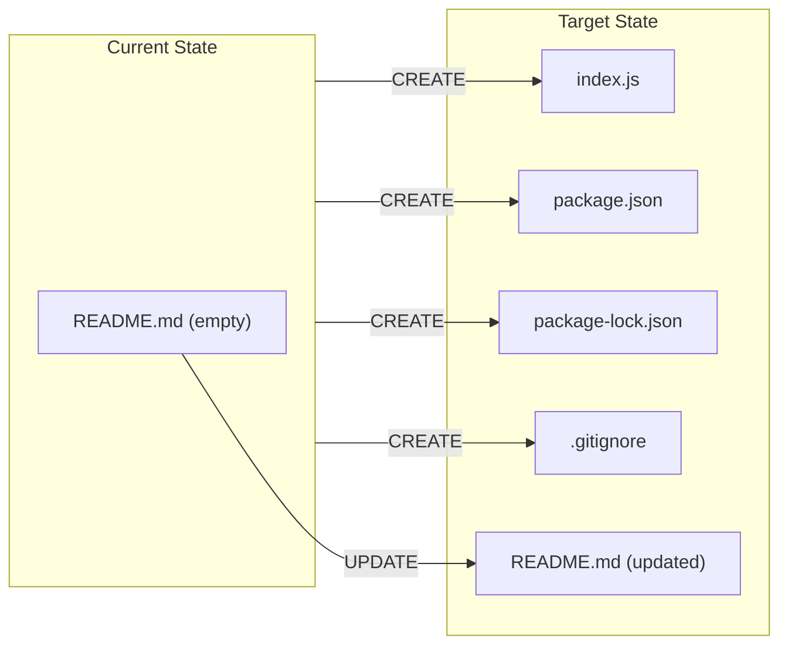

# Technical Specification

# 0. Agent Action Plan

## 0.1 Intent Clarification

### 0.1.1 Core Refactoring Objective

Based on the prompt, the Blitzy platform understands that the refactoring objective is to transform an empty repository scaffold — currently containing only a blank `README.md` — into a fully functional Express.js 5.2.1 tutorial web server that exposes two HTTP GET endpoints returning plain-text greetings.

The user's original request states:

> *"this is a tutorial of node js server hosting one endpoint that returns the response 'Hello world'. Could you add expressjs into the project and add another endpoint that return the response of 'Good evening'?"*

This request defines two atomic deliverables:

- **Framework Integration** — Introduce Express.js into a bare Node.js project as the HTTP server framework, including project initialization via `package.json`, dependency installation, and entry point creation
- **API Endpoint Extension** — Implement two discrete GET endpoints (`/` returning `"Hello world"` and `/evening` returning `"Good evening"`) within a single `index.js` server file

**Refactoring type:** Code structure — transforming an empty repository into a structured Node.js Express.js project with proper dependency management, server configuration, version control exclusions, and comprehensive documentation.

**Target repository:** Same repository — all changes are applied in-place to the existing repository containing only the blank `README.md`.

**Implicit requirements surfaced by analysis:**

- Maintain tutorial-appropriate simplicity with a flat, single-file architecture
- Use CommonJS module system (`require()` / `module.exports`) for beginner accessibility
- Provide environment-variable-based port configuration (`process.env.PORT || 3000`) as a production-ready pattern
- Include a `.gitignore` file with standard Node.js exclusion patterns to ensure clean version control
- Generate a `package-lock.json` lockfile (version 3) for deterministic dependency installation
- Rewrite the blank `README.md` with comprehensive installation, usage, and API reference documentation

### 0.1.2 Technical Interpretation

This refactoring translates to the following technical transformation strategy:

The project transitions from a **zero-state repository** (a single empty `README.md`) to a **complete Express.js tutorial server** through four file creation operations and one file update operation. The transformation involves:

- **Dependency Layer:** Initialize a Node.js project manifest (`package.json`) declaring `express@^5.2.1` as the sole production dependency, with engine constraints enforcing Node.js ≥18.0.0 and npm ≥8.0.0
- **Application Layer:** Create `index.js` as the single entry point (approximately 79 lines) containing Express application initialization, port configuration, two route handlers, and server binding
- **Infrastructure Layer:** Create `.gitignore` with standard Node.js patterns excluding `node_modules/`, `.env`, logs, and OS artifacts
- **Lock Layer:** Generate `package-lock.json` (lockfile version 3) via `npm install` to lock the entire transitive dependency tree of 65 packages
- **Documentation Layer:** Replace the blank `README.md` with a comprehensive project guide covering prerequisites, installation instructions, usage guide, and API reference



The architecture deliberately follows a **single entry point** design pattern where all server logic resides in `index.js`, using **direct Express routing** with inline `app.get()` handlers. This approach prioritizes educational clarity over enterprise-scale separation of concerns.

## 0.2 Source Analysis

### 0.2.1 Comprehensive Source File Discovery

The repository was inspected using `get_source_folder_contents` at the root level, revealing a minimal starting state. The following search patterns were applied to identify all files requiring transformation:

- **Root-level files:** `*.*` — discovered `README.md` as the sole file
- **Legacy code patterns:** `**/*_old*.*`, `**/*legacy*`, `**/*deprecated*` — no matches (empty repository)
- **Configuration files:** `*.json`, `*.config.*`, `*.yaml` — no matches
- **Source directories:** `src/`, `lib/`, `app/` — no directories exist
- **Dependency directories:** `node_modules/` — does not exist (pre-install state)

**Discovery Result:** The repository contains exactly **one file** that serves as the transformation starting point.

| File Path | Size | Status | Transformation Required |
|-----------|------|--------|------------------------|
| `README.md` | 0 bytes (empty) | Exists | UPDATE — complete rewrite with project documentation |

### 0.2.2 Current Structure Mapping

```
Current:
/
└── README.md (empty — 0 bytes of meaningful content)
```

The repository is in a **default GitLab scaffold state** with no application code, no dependency manifests, no configuration files, and no source directories. The `README.md` exists solely to satisfy standard repository scaffolding expectations without providing any descriptive or procedural content.

**Key observations from source analysis:**

- No `package.json` exists — Node.js project initialization is required from scratch
- No `index.js` or any JavaScript files exist — the entire server implementation must be created
- No `.gitignore` exists — version control exclusion patterns must be established
- No `node_modules/` directory exists — dependency installation has not been performed
- No subdirectories of any kind exist — the project structure is completely flat at the root level

### 0.2.3 Complete Source File Inventory

| # | File | Exists | Content | Role in Transformation |
|---|------|--------|---------|----------------------|
| 1 | `README.md` | Yes | Empty (0 bytes) | Sole existing file; to be rewritten with comprehensive documentation |

**Total source files identified:** 1

No additional files were discovered through any search pattern. The repository is confirmed empty beyond the single `README.md` scaffold. All other required files (`index.js`, `package.json`, `.gitignore`, `package-lock.json`) must be created as new artifacts.

## 0.3 Scope Boundaries

### 0.3.1 Exhaustively In Scope

**Source transformations:**
- `index.js` — Create Express.js server entry point with two GET route handlers, port configuration, and server binding
- `package.json` — Create Node.js project manifest with Express.js dependency declaration, engine constraints, and start script

**Dependency management:**
- `package.json` — Declare `express@^5.2.1` as the sole production dependency
- `package-lock.json` — Auto-generate lockfile (version 3) via `npm install` to lock all 65 transitive packages

**Configuration updates:**
- `.gitignore` — Create standard Node.js version control exclusion patterns (`node_modules/`, `.env`, logs, OS artifacts, proactive patterns for `coverage/` and `dist/`)

**Documentation updates:**
- `README.md` — Complete rewrite from empty scaffold to comprehensive project guide with installation instructions, usage guide, and API reference for both endpoints

**Import and module setup:**
- `index.js` — Establish CommonJS `require('express')` import pattern
- `package.json` — No `"type": "module"` field (CommonJS default behavior)

### 0.3.2 Explicitly Out of Scope

The following items are excluded from the current project scope, as documented in the technical specifications and consistent with the tutorial nature of the project:

| Excluded Item | Rationale |
|---------------|-----------|
| Database integration | Not requested by user |
| Authentication / Authorization | Tutorial project — not required |
| Testing framework setup (Jest, Mocha) | Not specified in requirements |
| TypeScript configuration | User requested JavaScript implementation |
| Docker / Containerization | Not specified in requirements |
| CI/CD pipeline setup | Not specified in requirements |
| Environment variable files (`.env`) | Hardcoded `PORT` fallback sufficient for tutorial |
| Middleware libraries (`helmet`, `cors`, `rate-limiting`) | Tutorial simplicity — not requested |
| Error handling middleware | Basic implementation only; not requested |
| Logging framework (`morgan`, `winston`) | Not required for tutorial |
| Multiple route files or directory-based routing | Single file appropriate for tutorial scope |
| API versioning | Not requested |
| JSON response formatting | User specified plain-text responses |
| ES Modules (`import`/`export`) | CommonJS chosen for beginner accessibility |
| Development dependencies (`devDependencies`) | Not specified; zero dev dependencies per design |
| Frontend / UI layer | No HTML/CSS; endpoints return plain-text strings only |
| Process manager (PM2, `nodemon`) | Not specified in requirements |
| Health check endpoint | Not requested for tutorial scope |

## 0.4 Target Design

### 0.4.1 Refactored Structure Planning

The target architecture is a flat, five-file project structure with no subdirectories, deliberately designed for tutorial-level simplicity and educational clarity. Every file required for standalone operation is listed below explicitly.

```
Target:
/
├── .gitignore          # Version control exclusion patterns (17 lines)
├── index.js            # Express.js server entry point (79 lines)
├── package.json        # Node.js project manifest (17 lines)
├── package-lock.json   # Dependency lock file (830 lines, lockfile v3)
└── README.md           # Comprehensive project documentation (175 lines)
```

**Structural design decisions:**

- **Flat architecture** — No subdirectories (`src/`, `routes/`, `controllers/`) are introduced. All server logic resides in a single `index.js` file to prioritize beginner readability
- **Single entry point** — `index.js` contains Express initialization, port configuration, route registration, and server binding in a sequential, well-commented flow
- **Minimal dependency surface** — Only `express@^5.2.1` is declared; no development dependencies, no middleware libraries, no testing frameworks
- **Lockfile determinism** — `package-lock.json` (version 3) locks the exact resolved versions of all 65 transitive packages for reproducible installs across environments

### 0.4.2 Web Search Research Conducted

Research was conducted on Express.js 5.x setup patterns and best practices for 2025 to inform the target design:

- **Express.js 5.x routing architecture** — Express 5 uses `path-to-regexp@8.x` for ReDoS-safe route pattern matching, natively supports promise-based middleware error handling, and removes deprecated v3/v4 API methods
- **CommonJS vs. ES Modules** — For this tutorial, CommonJS (`require()`/`module.exports`) is used per the project constraint, consistent with the standard beginner-friendly approach in Node.js
- **Single-file tutorial convention** — Express.js beginner tutorials commonly use a single-file structure with inline route handlers to minimize abstraction overhead and cognitive load for learners
- **Environment-variable port configuration** — The `process.env.PORT || 3000` pattern is a universally adopted Node.js convention for configurable server port binding, as confirmed by multiple authoritative Express.js guides

### 0.4.3 Design Pattern Applications

The following design patterns are applied in the target architecture:

| Design Pattern | Implementation | Rationale |
|---------------|----------------|-----------|
| Single Entry Point | All server code in `index.js` | Simplicity and readability for tutorial learners |
| Direct Express Routing | `app.get()` handlers defined inline | Tutorial-appropriate; avoids unnecessary abstraction layers |
| Environment Variable Configuration | `PORT` from `process.env` with fallback to `3000` | Introduces production-ready configuration patterns to beginners |
| CommonJS Modules | `const express = require('express')` | Standard Node.js module system for maximum beginner accessibility |
| Plain-Text Responses | `res.send()` with string arguments | Directly fulfills the user's requirement for plain-text output |
| Deterministic Dependency Locking | `package-lock.json` lockfile v3 | Ensures identical installs across all environments |

### 0.4.4 User Interface Design

This project has no user interface layer. Both endpoints return plain-text string responses (`"Hello world"` and `"Good evening"`) via `res.send()`. No HTML, CSS, templates, or frontend assets are involved. The system is accessed exclusively through HTTP clients such as web browsers, `curl`, or Postman.

## 0.5 Transformation Mapping

### 0.5.1 File-by-File Transformation Plan

The following table provides an exhaustive mapping of every target file to its source, transformation mode, and key changes. Every file in the target structure is accounted for.

| Target File | Transformation | Source File | Key Changes |
|------------|---------------|-------------|-------------|
| `index.js` | CREATE | — (no source) | Create Express.js server entry point: import Express via `require('express')`, initialize app with `express()`, configure port via `process.env.PORT \|\| 3000`, register `GET /` handler returning `"Hello world"`, register `GET /evening` handler returning `"Good evening"`, bind server with `app.listen(PORT)` |
| `package.json` | CREATE | — (no source) | Create Node.js project manifest: set name to `express-tutorial-server`, version `1.0.0`, description, ISC license, main entry `index.js`, `start` script as `node index.js`, declare `express@^5.2.1` dependency, set `engines` with `node >=18.0.0` and `npm >=8.0.0` |
| `package-lock.json` | CREATE | — (auto-generated) | Auto-generated by `npm install`; lockfile version 3 locking 65 transitive packages to exact resolved versions |
| `.gitignore` | CREATE | — (no source) | Create Node.js-standard exclusion patterns: `node_modules/`, `.env`, `*.log`, `.DS_Store`, `coverage/`, `dist/`, and other standard OS/IDE artifacts |
| `README.md` | UPDATE | `README.md` | Complete rewrite from empty scaffold to comprehensive documentation: project title, description, prerequisites (Node.js ≥18.0.0, npm ≥8.0.0), installation instructions (`npm install`), usage guide (`npm start`), API reference for `GET /` and `GET /evening` endpoints with expected responses |

### 0.5.2 Cross-File Dependencies

Import and configuration dependencies between files:

- **`index.js` → `package.json`**: The `require('express')` call in `index.js` resolves through `node_modules/express/`, which is installed based on the dependency declared in `package.json`
- **`package.json` → `index.js`**: The `"start": "node index.js"` script references the entry point file by name
- **`package.json` → `package-lock.json`**: Running `npm install` reads `package.json` dependencies and generates or updates the lockfile
- **`README.md` → `index.js`**: Documentation references the server's endpoints, port configuration, and startup behavior defined in `index.js`
- **`README.md` → `package.json`**: Documentation references `npm install` and `npm start` commands defined in the manifest
- **`.gitignore` → `node_modules/`**: Excludes the installed dependency directory from version control

Import statement mapping:

```
index.js:
  const express = require('express');  // Resolves to node_modules/express/
```

No other import statements exist in the project. The single-file architecture eliminates cross-module import complexity entirely.

### 0.5.3 Wildcard Patterns

Due to the flat, five-file architecture, wildcard patterns are minimal:

- `*.js` — Matches `index.js` (the only JavaScript file in the project root)
- `*.json` — Matches `package.json` and `package-lock.json`
- `*.md` — Matches `README.md`
- `.*` — Matches `.gitignore`

No deeply nested directory patterns (e.g., `src/**/*.js`) are applicable because the project uses a flat structure with no subdirectories.

### 0.5.4 One-Phase Execution

The entire transformation is executed by Blitzy in **one single phase**. All five file operations (4 CREATE + 1 UPDATE) are performed together in a single pass:

- Create `package.json` with Express.js dependency declaration
- Create `index.js` with the complete server implementation
- Create `.gitignore` with Node.js exclusion patterns
- Generate `package-lock.json` via dependency installation
- Update `README.md` with comprehensive project documentation

No multi-phase splitting, no incremental rollouts, and no staged migrations are required or planned.

## 0.6 Dependency Inventory

### 0.6.1 Key Private and Public Packages

The project declares a single production dependency with no private packages. All package details are verified against the npm registry and the technical specification.

| Registry | Package Name | Version | Purpose |
|----------|-------------|---------|---------|
| npm (public) | `express` | `^5.2.1` (resolved: `5.2.1`) | Core HTTP web application framework — provides routing (`app.get()`), response dispatch (`res.send()`), and server binding (`app.listen()`) |

**Key transitive dependencies** (auto-resolved by `express@5.2.1`, locked in `package-lock.json`):

| Registry | Package Name | Version | Purpose |
|----------|-------------|---------|---------|
| npm (public) | `body-parser` | `2.2.2` | HTTP request body parsing (present but unused by this tutorial) |
| npm (public) | `router` | `2.2.0` | HTTP routing engine used internally by Express |
| npm (public) | `path-to-regexp` | `8.3.0` | ReDoS-safe route pattern matching for Express 5.x |
| npm (public) | `qs` | `6.14.1` | Query string parsing |
| npm (public) | `finalhandler` | `2.1.1` | Final HTTP request handler (serves 404 for unmatched routes) |
| npm (public) | `debug` | `4.4.3` | Debug logging utility |
| npm (public) | `etag` | `1.8.1` | ETag generation for HTTP caching |
| npm (public) | `fresh` | `2.0.0` | HTTP cache freshness validation |
| npm (public) | `on-finished` | `2.4.1` | Request/response lifecycle detection |
| npm (public) | `parseurl` | `1.3.3` | URL parsing |

**Development dependencies:** None — zero `devDependencies` are declared, consistent with the project's tutorial scope and Constraint C-002.

**License compliance:** All 65 packages in the transitive tree use permissive open-source licenses (MIT: 61, ISC: 3, BSD-3-Clause: 1), fully compatible with the project's ISC license.

### 0.6.2 Dependency Updates

**Import Refactoring:**

Since this is a greenfield project (empty repository → new files), there are no existing imports to refactor. The single import statement is established fresh in `index.js`:

```javascript
const express = require('express');
```

No other files in the project contain import statements. The single-file architecture means no inter-module import chains exist.

**External Reference Updates:**

| File | Reference Type | Details |
|------|---------------|---------|
| `package.json` | Dependency declaration | `"express": "^5.2.1"` in `dependencies` object |
| `package.json` | Engine constraint | `"node": ">=18.0.0"`, `"npm": ">=8.0.0"` in `engines` object |
| `package.json` | Start script | `"start": "node index.js"` in `scripts` object |
| `package-lock.json` | Lockfile | Auto-generated; locks all 65 resolved packages to exact versions |
| `README.md` | Documentation reference | References `npm install` command and Express.js dependency |
| `.gitignore` | Exclusion pattern | `node_modules/` directory exclusion prevents dependency tracking |

**Runtime Requirements:**

| Requirement | Minimum Version | Validated Version | Enforcement Mechanism |
|------------|----------------|-------------------|----------------------|
| Node.js | ≥18.0.0 | v20.20.1 | `package.json` `engines.node` field |
| npm | ≥8.0.0 | v11.1.0 | `package.json` `engines.npm` field |

## 0.7 Refactoring Rules

### 0.7.1 Refactoring-Specific Rules

The following rules govern the transformation of the empty repository into the Express.js tutorial server:

- **Preserve the existing `README.md` file path** — The file must be updated in-place (UPDATE operation), not deleted and recreated, to maintain Git history continuity
- **Maintain tutorial-appropriate simplicity** — All server logic must reside in a single `index.js` file; do not introduce directory structures, router modules, or controller patterns
- **Use CommonJS module system exclusively** — All module imports must use `require()` syntax; do not use ES Module `import`/`export` syntax or set `"type": "module"` in `package.json`
- **Express.js 5.x only** — Use Express.js 5.2.1 specifically; do not use Express.js 4.x patterns or deprecated APIs (e.g., `app.del()`, `app.param(fn)`)
- **Exact response strings** — The `GET /` endpoint must return exactly `"Hello world"` (not `"Hello World"` or any variant); the `GET /evening` endpoint must return exactly `"Good evening"` (case-sensitive)
- **Single production dependency** — Only `express` may appear in the `dependencies` object of `package.json`; no additional libraries, middleware, or utilities
- **Zero development dependencies** — The `devDependencies` field must not exist in `package.json`
- **Deterministic lockfile** — `package-lock.json` must be generated as lockfile version 3 and committed alongside `package.json`

### 0.7.2 Special Instructions and Constraints

- **Port configuration pattern** — The server must use `const PORT = process.env.PORT || 3000` for configurable port binding; do not hardcode a fixed port
- **Start script convention** — The `package.json` must define `"start": "node index.js"` as the sole npm script; do not add `dev`, `test`, or other scripts
- **Engine constraints** — The `package.json` must include `"engines": { "node": ">=18.0.0", "npm": ">=8.0.0" }` to enforce minimum runtime versions
- **License** — The project must use the ISC license, declared in `package.json`
- **Well-commented code** — The `index.js` file should include educational comments explaining each section (import, initialization, port configuration, route handlers, server binding) for tutorial learners
- **Standard `.gitignore` patterns** — Must include `node_modules/`, `.env`, `*.log`, `.DS_Store`, and proactive patterns for future tooling (`coverage/`, `dist/`)
- **Comprehensive README** — The `README.md` must cover: project title and description, prerequisites, installation instructions (`npm install`), usage guide (`npm start`), and API reference for both endpoints

### 0.7.3 User-Provided Rules

The user did not specify any additional custom rules or implementation constraints beyond the functional requirements captured in the original request. No specific coding style guides, linting configurations, or architectural preferences were provided.

All implementation rules are derived from the technical analysis of the user's intent and industry best practices for Express.js tutorial projects.

## 0.8 References

### 0.8.1 Codebase Files and Folders Searched

The following repository locations were inspected during the analysis phase to derive conclusions for this Agent Action Plan:

| # | Path | Type | Tool Used | Finding |
|---|------|------|-----------|---------|
| 1 | `/` (root) | Folder | `get_source_folder_contents` | Repository contains only `README.md`; no subdirectories, no application code, no configuration files |
| 2 | `README.md` | File | `read_file` | Empty file (0 bytes of meaningful content); default repository scaffold |
| 3 | `.blitzyignore` | File | `bash` (find) | Not found — no ignore patterns defined |

### 0.8.2 Technical Specification Sections Retrieved

The following tech spec sections were consulted to inform the Agent Action Plan:

| Section | Heading | Key Information Extracted |
|---------|---------|--------------------------|
| 1.1 | Executive Summary | Project overview, core problem statement, user request, stakeholder groups |
| 1.2 | System Overview | Starting state (empty README.md), target state (5 files), technology stack (Node.js ≥18.0.0, Express.js 5.2.1), success criteria |
| 1.3 | Scope | In-scope deliverables (4 file operations), out-of-scope exclusions (database, auth, testing, Docker, CI/CD), future phase considerations |
| 2.1 | Feature Catalog | Six features: F-001 through F-006 covering framework integration, endpoints, port configuration, documentation, and version control |
| 2.2 | Functional Requirements | Detailed requirements for each feature with acceptance criteria and validation rules |
| 3.1 | Programming Languages | JavaScript (Node.js), CommonJS module system, ES6+ syntax, language exclusions |
| 3.2 | Frameworks & Libraries | Express.js 5.2.1 selection rationale, capabilities used, excluded middleware libraries, compatibility requirements |
| 3.3 | Open Source Dependencies | Express.js sole dependency, 65 transitive packages, license distribution, security posture |
| 4.1 | High-Level System Workflow | Three-phase lifecycle (setup, startup, runtime), system boundary definitions |
| 5.2 | Component Details | `index.js` responsibilities, `package.json` structure, `.gitignore` patterns, `README.md` content, component interaction diagrams |

### 0.8.3 Web Searches Conducted

| # | Query | Purpose | Key Findings |
|---|-------|---------|-------------|
| 1 | "Express.js 5 tutorial setup best practices 2025" | Validate target architecture decisions and confirm current best practices for Express.js 5.x projects | Confirmed single-file tutorial convention, CommonJS appropriateness for beginners, `process.env.PORT` pattern, flat structure for tutorial projects, and Express 5.x native promise support |

### 0.8.4 Attachments and External Metadata

- **User attachments:** None — no files, images, or documents were attached to this project
- **Figma URLs:** None — no design files were referenced or provided
- **Environment files:** None — no environment setup files were provided in `/tmp/environments_files/`
- **Environment variables:** None specified
- **Secrets:** None specified
- **Implementation rules:** None specified by the user

