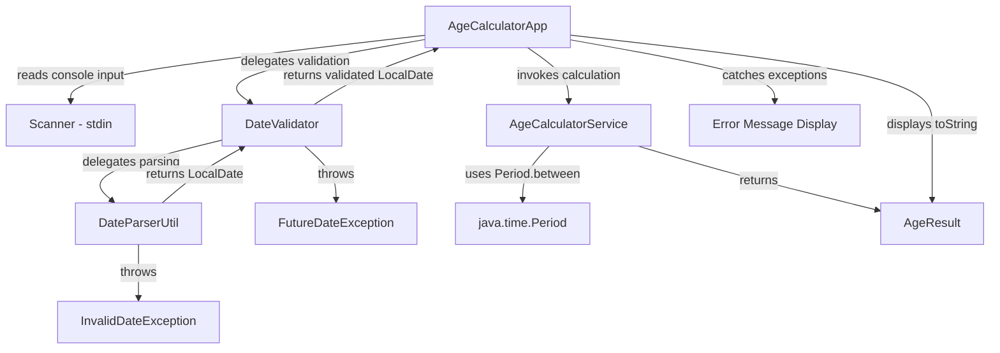

# Technical Specification

# 0. Agent Action Plan

## 0.1 Intent Clarification

### 0.1.1 Core Feature Objective

Based on the prompt, the Blitzy platform understands that the new feature requirement is to **develop a Java console application that calculates a user's exact age based on their Date of Birth (DOB)**. The application is a greenfield implementation within the `05march_1-age` repository, which currently contains only a scaffold `README.md` file.

The specific feature requirements are:

- **DOB Input Acceptance**: The application must accept a Date of Birth from the user via console input in the `DD/MM/YYYY` format
- **System Date Retrieval**: The application must automatically fetch the current system date as the reference point for age calculation
- **Precise Age Computation**: The application must calculate the exact age decomposed into three components — years, months, and days
- **Formatted Output Display**: The result must be displayed in the exact format: `Your age is X years, Y months, and Z days.`
- **Input Validation — Future Date Rejection**: The application must reject any DOB that is a future date and display a meaningful error message
- **Input Validation — Invalid Date Handling**: The application must detect and reject logically invalid dates (e.g., `31/02/2020`, `32/01/2000`) with descriptive error messages
- **Leap Year Correctness**: The calculation must correctly handle leap year edge cases, including persons born on February 29
- **Universal Year Support**: The application must work correctly for users born in any valid year

**Implicit requirements detected:**

- The application requires a `main` method entry point for console execution
- A `Scanner` or equivalent console input mechanism is needed for user interaction
- Custom exception classes should be created for distinct validation failure types (future date vs. invalid format)
- The output format implies that zero-value components should still be displayed (e.g., `0 months`)
- The application should gracefully handle non-date text input (e.g., alphabetic characters, empty strings)

### 0.1.2 Special Instructions and Constraints

The user has specified explicit technical constraints that govern the implementation approach:

- **Mandatory Java API Usage**: The implementation must use the following `java.time` package classes:
  - `java.time.LocalDate` — for representing dates without timezone context
  - `java.time.Period` — for computing the difference between two dates in years, months, and days
  - `java.time.format.DateTimeFormatter` — for parsing the `DD/MM/YYYY` input format
- **Object-Oriented Programming Principles**: The codebase must follow OOP design patterns including encapsulation, separation of concerns, single responsibility, and proper class hierarchy
- **Exception Handling**: All error scenarios must be handled using `try-catch` blocks with proper exception propagation and user-friendly error messages
- **Clean and Readable Code**: The implementation must follow clean coding standards with meaningful naming, proper indentation, and well-structured code organization

**Architectural constraints derived from user instructions:**

- This is a **console-based Java application**, not a web service or API endpoint — the tech spec's references to Flask/Python API architecture represent a broader system context, while this feature specifically requires a standalone Java CLI application
- No external libraries beyond the Java Standard Library are required for the core application logic
- Maven will serve as the build tool for project structure, compilation, and test execution
- JUnit Jupiter will be used for implementing the test cases specified in the requirements

### 0.1.3 Technical Interpretation

These feature requirements translate to the following technical implementation strategy:

- To **accept DOB input in DD/MM/YYYY format**, we will create a main application class (`AgeCalculatorApp.java`) that uses `java.util.Scanner` for console input and `DateTimeFormatter.ofPattern("dd/MM/yyyy")` for parsing
- To **calculate the exact age**, we will create a service class (`AgeCalculatorService.java`) that uses `Period.between(dob, LocalDate.now())` to compute the precise difference in years, months, and days
- To **encapsulate the result**, we will create a model class (`AgeResult.java`) that holds `years`, `months`, and `days` fields with a formatted `toString()` method producing the required output format
- To **validate user input against future dates**, we will create a validator class (`DateValidator.java`) that checks `dob.isAfter(LocalDate.now())` and throws a custom `FutureDateException`
- To **handle invalid dates**, we will leverage `DateTimeFormatter` with `ResolverStyle.STRICT` to catch logically impossible dates (e.g., February 30), wrapping parse failures in a custom `InvalidDateException`
- To **handle leap years correctly**, we will rely on `java.time.LocalDate`'s built-in Gregorian calendar arithmetic, which natively handles leap year boundaries
- To **implement OOP principles**, we will decompose the application into distinct packages: `model`, `service`, `validator`, `util`, and `exception`
- To **cover test cases**, we will create JUnit Jupiter test classes mirroring the source structure, covering standard calculations, leap year scenarios, boundary conditions, and error paths


## 0.2 Repository Scope Discovery

### 0.2.1 Comprehensive File Analysis

**Current Repository State**

The repository `05march_1-age` is a greenfield project containing only a single file:

| File | Status | Content |
|------|--------|---------|
| `README.md` | UNCHANGED | Single heading: `# 05march_1-age` |

There are no existing source files, build configurations, dependency manifests, CI/CD definitions, test files, or documentation to modify. All files for this feature will be **newly created**.

**Existing Files Requiring Modification**

| File Path | Modification Type | Purpose |
|-----------|------------------|---------|
| `README.md` | MODIFY | Replace scaffold heading with comprehensive project documentation including build instructions, usage guide, and feature description |

**New Source Files to Create**

| File Path | Purpose |
|-----------|---------|
| `pom.xml` | Maven project descriptor defining project coordinates, Java 21 compilation, JUnit Jupiter dependency, and build plugins |
| `src/main/java/com/agecalculator/AgeCalculatorApp.java` | Main entry point class containing the `main` method, console I/O loop, and top-level exception handling |
| `src/main/java/com/agecalculator/model/AgeResult.java` | Immutable model class encapsulating computed age (years, months, days) with formatted output |
| `src/main/java/com/agecalculator/service/AgeCalculatorService.java` | Core business logic class implementing age computation using `Period.between()` |
| `src/main/java/com/agecalculator/validator/DateValidator.java` | Input validation class enforcing date format, logical validity, and temporal constraints |
| `src/main/java/com/agecalculator/util/DateParserUtil.java` | Utility class for parsing date strings into `LocalDate` objects with strict resolution |
| `src/main/java/com/agecalculator/exception/InvalidDateException.java` | Custom checked exception for malformed or logically invalid date inputs |
| `src/main/java/com/agecalculator/exception/FutureDateException.java` | Custom checked exception for DOB values that occur after the current system date |

**New Test Files to Create**

| File Path | Purpose |
|-----------|---------|
| `src/test/java/com/agecalculator/service/AgeCalculatorServiceTest.java` | Unit tests for age computation covering standard dates, leap years, same-day births, boundary conditions |
| `src/test/java/com/agecalculator/validator/DateValidatorTest.java` | Unit tests for validation logic covering future dates, invalid formats, impossible dates, edge cases |
| `src/test/java/com/agecalculator/util/DateParserUtilTest.java` | Unit tests for date parsing covering valid formats, malformed strings, strict resolution |
| `src/test/java/com/agecalculator/model/AgeResultTest.java` | Unit tests for model formatting and field accessors |

**Integration Point Discovery**

Since this is a greenfield console application, integration points are internal to the application itself:

- **Entry Point → Service**: `AgeCalculatorApp.main()` invokes `AgeCalculatorService.calculateAge()` after obtaining validated input
- **Entry Point → Validator**: `AgeCalculatorApp.main()` delegates input validation to `DateValidator.validate()` before passing to the service
- **Validator → Parser**: `DateValidator.validate()` calls `DateParserUtil.parse()` to convert raw string input into `LocalDate`
- **Service → Model**: `AgeCalculatorService.calculateAge()` returns an `AgeResult` instance encapsulating the computed values
- **Exception Flow**: `InvalidDateException` and `FutureDateException` propagate from validator/parser layers to the main class, which catches and displays user-friendly error messages

### 0.2.2 Web Search Research Conducted

The following research was conducted to inform implementation decisions:

- **JUnit Jupiter Latest Stable Version**: Confirmed that JUnit 5.14.x is the latest stable JUnit 5 series. JUnit 6.0.x (released September 30, 2025) is also available but requires Java 17 baseline. For this project, JUnit Jupiter 5.11.4 provides mature, well-tested support for JDK 21.
- **Maven Compiler Plugin Configuration for Java 21**: Confirmed that `maven-compiler-plugin` version 3.13.0+ supports the `<release>21</release>` configuration. The latest version is 3.15.0. The `<release>` element is the recommended approach over separate `<source>` and `<target>` elements.
- **`java.time` API Best Practices**: The `java.time.Period` class computes ISO-chronology-based differences. Using `ResolverStyle.STRICT` with `DateTimeFormatter` prevents acceptance of invalid dates like February 30. `LocalDate` natively handles leap year calculations via the proleptic Gregorian calendar.

### 0.2.3 New File Requirements

**New Source Files Summary**

- `src/main/java/com/agecalculator/AgeCalculatorApp.java` — Main entry point providing console-based interaction, input prompt loop, and top-level try-catch error handling
- `src/main/java/com/agecalculator/model/AgeResult.java` — Data transfer object holding `int years`, `int months`, `int days` with a `toString()` method producing the required output format
- `src/main/java/com/agecalculator/service/AgeCalculatorService.java` — Stateless service class containing `calculateAge(LocalDate dob)` method that uses `Period.between()` for computation
- `src/main/java/com/agecalculator/validator/DateValidator.java` — Validation orchestrator that enforces format correctness, logical validity, and temporal constraints on DOB input
- `src/main/java/com/agecalculator/util/DateParserUtil.java` — Utility providing `parse(String dateStr)` method using `DateTimeFormatter` with `ResolverStyle.STRICT` and `dd/MM/uuuu` pattern
- `src/main/java/com/agecalculator/exception/InvalidDateException.java` — Custom exception extending `Exception` for invalid date format or logically impossible dates
- `src/main/java/com/agecalculator/exception/FutureDateException.java` — Custom exception extending `Exception` for DOB values in the future

**New Test Files Summary**

- `src/test/java/com/agecalculator/service/AgeCalculatorServiceTest.java` — Comprehensive unit tests for age computation accuracy across all scenarios
- `src/test/java/com/agecalculator/validator/DateValidatorTest.java` — Validation logic tests for boundary conditions and error paths
- `src/test/java/com/agecalculator/util/DateParserUtilTest.java` — Parser tests for format compliance and strict date resolution
- `src/test/java/com/agecalculator/model/AgeResultTest.java` — Model object tests for field values and formatted string output

**New Configuration Files**

- `pom.xml` — Maven project object model defining project metadata, Java 21 compilation target, JUnit Jupiter test dependency, and build plugin configuration


## 0.3 Dependency Inventory

### 0.3.1 Private and Public Packages

Since this is a greenfield project with no existing dependency manifests, all dependencies are newly introduced. The application relies primarily on the Java Standard Library for core logic, with Maven plugins for build orchestration and JUnit Jupiter for testing.

**Runtime Dependencies**

| Registry | Package Name | Version | Purpose |
|----------|-------------|---------|---------|
| JDK | `java.time.LocalDate` | 21.0.10 (bundled with OpenJDK 21) | Core date representation for DOB and current date |
| JDK | `java.time.Period` | 21.0.10 (bundled with OpenJDK 21) | Age computation as years/months/days difference |
| JDK | `java.time.format.DateTimeFormatter` | 21.0.10 (bundled with OpenJDK 21) | Parsing DD/MM/YYYY input strings into LocalDate objects |
| JDK | `java.util.Scanner` | 21.0.10 (bundled with OpenJDK 21) | Console input reading for user interaction |

**Test Dependencies**

| Registry | Package Name | Version | Purpose |
|----------|-------------|---------|---------|
| Maven Central | `org.junit.jupiter:junit-jupiter` | 5.11.4 | JUnit Jupiter aggregator — test engine, API, and parameterized support |
| Maven Central | `org.junit.jupiter:junit-jupiter-api` | 5.11.4 | Test annotations (`@Test`, `@DisplayName`, `@ParameterizedTest`) and assertions |
| Maven Central | `org.junit.jupiter:junit-jupiter-params` | 5.11.4 | Parameterized test support (`@CsvSource`, `@ValueSource`, `@MethodSource`) |

**Build Plugins**

| Registry | Plugin Name | Version | Purpose |
|----------|------------|---------|---------|
| Maven Central | `org.apache.maven.plugins:maven-compiler-plugin` | 3.13.0 | Java 21 source compilation with `<release>21</release>` configuration |
| Maven Central | `org.apache.maven.plugins:maven-surefire-plugin` | 3.5.2 | Test execution during `mvn test` phase with JUnit Jupiter platform discovery |
| Maven Central | `org.apache.maven.plugins:maven-jar-plugin` | 3.4.2 | JAR packaging with main class manifest entry for executable distribution |

### 0.3.2 Dependency Updates

Since the repository contains no existing dependency manifests, this section documents the creation of the new `pom.xml` rather than modifications to existing files.

**Import Structure for New Source Files**

All source files will use the following import patterns:

- `com.agecalculator.model.*` — Model class imports across service and main classes
- `com.agecalculator.service.*` — Service class imports in the main entry point
- `com.agecalculator.validator.*` — Validator class imports in the main entry point
- `com.agecalculator.util.*` — Utility class imports in the validator
- `com.agecalculator.exception.*` — Custom exception imports across validator, service, and main classes

**Import Transformation Rules for Source Files**

| File Pattern | Required Imports |
|-------------|-----------------|
| `src/main/java/com/agecalculator/AgeCalculatorApp.java` | `java.util.Scanner`, `com.agecalculator.service.AgeCalculatorService`, `com.agecalculator.validator.DateValidator`, `com.agecalculator.model.AgeResult`, `com.agecalculator.exception.*` |
| `src/main/java/com/agecalculator/service/AgeCalculatorService.java` | `java.time.LocalDate`, `java.time.Period`, `com.agecalculator.model.AgeResult` |
| `src/main/java/com/agecalculator/validator/DateValidator.java` | `java.time.LocalDate`, `com.agecalculator.util.DateParserUtil`, `com.agecalculator.exception.FutureDateException`, `com.agecalculator.exception.InvalidDateException` |
| `src/main/java/com/agecalculator/util/DateParserUtil.java` | `java.time.LocalDate`, `java.time.format.DateTimeFormatter`, `java.time.format.ResolverStyle`, `com.agecalculator.exception.InvalidDateException` |
| `src/test/java/com/agecalculator/**/*Test.java` | `org.junit.jupiter.api.Test`, `org.junit.jupiter.api.DisplayName`, `org.junit.jupiter.params.ParameterizedTest`, `static org.junit.jupiter.api.Assertions.*` |

**External Reference — `pom.xml` Creation**

The `pom.xml` must be created at the project root with the following structure:

```xml
<project>
  <modelVersion>4.0.0</modelVersion>
  <groupId>com.agecalculator</groupId>
  <artifactId>age-calculator</artifactId>
  <version>1.0.0</version>
  <!-- Java 21, JUnit 5.11.4, plugins -->
</project>
```


## 0.4 Integration Analysis

### 0.4.1 Existing Code Touchpoints

Since this is a greenfield repository with only a `README.md` scaffold file, there are no existing code touchpoints requiring modification. All integration is between newly created components.

**Single Existing File Modification**

| File | Action | Details |
|------|--------|---------|
| `README.md` | MODIFY | Replace the scaffold heading `# 05march_1-age` with comprehensive project documentation including: project title, description, prerequisites, build instructions, usage guide, example output, and test execution instructions |

### 0.4.2 Internal Component Integration Map

The following diagram illustrates how the newly created components integrate with each other:



**Direct Integration Points**

- **`AgeCalculatorApp.java` → `DateValidator.java`**: The main class passes the raw user input string to the validator for format and temporal validation. Integration occurs via `DateValidator.validate(String dateStr)` which returns a validated `LocalDate`.
- **`AgeCalculatorApp.java` → `AgeCalculatorService.java`**: After validation succeeds, the main class invokes `AgeCalculatorService.calculateAge(LocalDate dob)` to compute the age.
- **`AgeCalculatorApp.java` → `AgeResult.java`**: The service returns an `AgeResult` instance whose `toString()` method is called to produce the formatted output string.
- **`DateValidator.java` → `DateParserUtil.java`**: The validator delegates raw string-to-date conversion to `DateParserUtil.parse(String dateStr)`, which applies strict date resolution.
- **`DateValidator.java` → Exception Classes**: The validator throws `InvalidDateException` when `DateParserUtil` fails to parse, and `FutureDateException` when the parsed date is after `LocalDate.now()`.
- **`AgeCalculatorService.java` → `AgeResult.java`**: The service constructs an `AgeResult` from the `Period` object returned by `Period.between(dob, LocalDate.now())`.

### 0.4.3 Dependency Injection and Wiring

This application uses a simple direct-instantiation pattern consistent with a console application scope. No IoC container or dependency injection framework is needed.

- **`AgeCalculatorApp.main()`**: Instantiates `DateValidator` and `AgeCalculatorService` directly, then orchestrates the input-validate-compute-display flow within a `try-catch` block.
- **`DateValidator` constructor**: Instantiates `DateParserUtil` internally or uses static utility methods.
- **`AgeCalculatorService`**: Stateless class with no constructor dependencies — uses JDK `java.time` API directly.

### 0.4.4 Database and Schema Updates

Not applicable. This is a stateless console application with no persistence layer. All computation occurs in memory using transient inputs from the console, consistent with the user's specification for a standalone age calculator.


## 0.5 Technical Implementation

### 0.5.1 File-by-File Execution Plan

Every file listed below MUST be created or modified as part of this feature implementation.

**Group 1 — Build Configuration and Project Setup**

| Action | File Path | Implementation Details |
|--------|-----------|----------------------|
| CREATE | `pom.xml` | Define Maven project with `groupId=com.agecalculator`, `artifactId=age-calculator`, Java 21 release target, JUnit Jupiter 5.11.4 test dependency, maven-compiler-plugin 3.13.0, maven-surefire-plugin 3.5.2, and maven-jar-plugin 3.4.2 with main class manifest entry |

**Group 2 — Core Feature Files**

| Action | File Path | Implementation Details |
|--------|-----------|----------------------|
| CREATE | `src/main/java/com/agecalculator/AgeCalculatorApp.java` | Main class with `public static void main(String[] args)` — initializes Scanner for `System.in`, prompts user for DOB, delegates to `DateValidator` and `AgeCalculatorService`, catches custom exceptions, displays formatted result or error messages |
| CREATE | `src/main/java/com/agecalculator/model/AgeResult.java` | Immutable model with `private final int years, months, days` — constructor accepting three int parameters, getter methods, and `toString()` returning `"Your age is X years, Y months, and Z days."` |
| CREATE | `src/main/java/com/agecalculator/service/AgeCalculatorService.java` | Service class with `public AgeResult calculateAge(LocalDate dob)` — computes `Period.between(dob, LocalDate.now())`, extracts years/months/days, returns new `AgeResult` |

**Group 3 — Validation and Parsing Infrastructure**

| Action | File Path | Implementation Details |
|--------|-----------|----------------------|
| CREATE | `src/main/java/com/agecalculator/validator/DateValidator.java` | Validator class with `public LocalDate validate(String dateStr)` — invokes `DateParserUtil.parse()`, checks `dob.isAfter(LocalDate.now())`, throws `FutureDateException` if future, returns validated `LocalDate` |
| CREATE | `src/main/java/com/agecalculator/util/DateParserUtil.java` | Utility class with `public static LocalDate parse(String dateStr)` — creates `DateTimeFormatter.ofPattern("dd/MM/uuuu").withResolverStyle(ResolverStyle.STRICT)`, parses input, catches `DateTimeParseException`, wraps in `InvalidDateException` |

**Group 4 — Custom Exception Classes**

| Action | File Path | Implementation Details |
|--------|-----------|----------------------|
| CREATE | `src/main/java/com/agecalculator/exception/InvalidDateException.java` | Custom exception extending `Exception` with constructor accepting message string and optional cause; used for format errors and impossible dates |
| CREATE | `src/main/java/com/agecalculator/exception/FutureDateException.java` | Custom exception extending `Exception` with constructor accepting message string; used when DOB is after the current system date |

**Group 5 — Test Suite**

| Action | File Path | Implementation Details |
|--------|-----------|----------------------|
| CREATE | `src/test/java/com/agecalculator/service/AgeCalculatorServiceTest.java` | Unit tests: standard age calculation, exact birthday (0 years 0 months 0 days), leap year born Feb 29, age spanning century boundary, newborn (yesterday's date), very old person (year 1900) |
| CREATE | `src/test/java/com/agecalculator/validator/DateValidatorTest.java` | Unit tests: valid date passes, future date throws `FutureDateException`, today's date is valid (age 0), invalid format throws `InvalidDateException`, impossible date (31/02/2020) throws exception |
| CREATE | `src/test/java/com/agecalculator/util/DateParserUtilTest.java` | Unit tests: valid DD/MM/YYYY parses correctly, invalid format (YYYY-MM-DD) throws exception, empty string throws exception, null input throws exception, February 29 on leap year succeeds, February 29 on non-leap year throws exception |
| CREATE | `src/test/java/com/agecalculator/model/AgeResultTest.java` | Unit tests: getter methods return correct values, `toString()` format matches `"Your age is X years, Y months, and Z days."`, zero-value components display correctly |

**Group 6 — Documentation**

| Action | File Path | Implementation Details |
|--------|-----------|----------------------|
| MODIFY | `README.md` | Replace scaffold content with: project title "Age Calculator", description, prerequisites (Java 21, Maven 3.8+), build instructions (`mvn clean package`), run instructions (`java -jar target/age-calculator-1.0.0.jar`), example input/output, test execution (`mvn test`), and project structure overview |

### 0.5.2 Implementation Approach per File

**Phase A — Establish Foundation**

The implementation begins by creating the Maven project structure (`pom.xml`) and the exception classes (`InvalidDateException.java`, `FutureDateException.java`). These have no internal dependencies and form the base layer upon which all other components build.

**Phase B — Build Core Logic**

Next, the model class (`AgeResult.java`), parser utility (`DateParserUtil.java`), and calculator service (`AgeCalculatorService.java`) are created. The parser implements strict date resolution using `ResolverStyle.STRICT` with the `"dd/MM/uuuu"` pattern (note: `uuuu` is required for strict mode instead of `yyyy`). The service uses `Period.between()` for accurate age computation.

**Phase C — Assemble Validation Layer**

The validator (`DateValidator.java`) is created to orchestrate parsing and temporal validation. It delegates to `DateParserUtil` for string-to-date conversion, then verifies the parsed date is not in the future.

**Phase D — Wire Entry Point**

The main class (`AgeCalculatorApp.java`) is created to tie all components together. It manages the console I/O loop, invokes validation and computation, and handles all exceptions with user-friendly messages.

**Phase E — Verify with Tests**

The complete test suite is implemented covering all specified test scenarios. Tests use JUnit Jupiter assertions (`assertEquals`, `assertThrows`, `assertDoesNotThrow`) and parameterized tests (`@ParameterizedTest` with `@CsvSource`) for efficient coverage of date variation scenarios.

**Phase F — Document**

The `README.md` is updated with comprehensive project documentation.

### 0.5.3 User Interface Design

This application uses a **text-based console interface** as specified by the user. The interaction model is:

- **Prompt**: `Enter your Date of Birth (DD/MM/YYYY): `
- **Success Output**: `Your age is X years, Y months, and Z days.`
- **Error Output (future date)**: `Error: Date of birth cannot be a future date.`
- **Error Output (invalid format)**: `Error: Invalid date format. Please use DD/MM/YYYY format.`
- **Error Output (impossible date)**: `Error: Invalid date. Please enter a valid calendar date.`

No graphical user interface, web interface, or API endpoint is required. The console interface must be clean, intuitive, and provide immediate feedback for both valid and invalid inputs.


## 0.6 Scope Boundaries

### 0.6.1 Exhaustively In Scope

**All Feature Source Files**

- `src/main/java/com/agecalculator/AgeCalculatorApp.java`
- `src/main/java/com/agecalculator/model/AgeResult.java`
- `src/main/java/com/agecalculator/service/AgeCalculatorService.java`
- `src/main/java/com/agecalculator/validator/DateValidator.java`
- `src/main/java/com/agecalculator/util/DateParserUtil.java`
- `src/main/java/com/agecalculator/exception/InvalidDateException.java`
- `src/main/java/com/agecalculator/exception/FutureDateException.java`

**All Feature Test Files**

- `src/test/java/com/agecalculator/service/AgeCalculatorServiceTest.java`
- `src/test/java/com/agecalculator/validator/DateValidatorTest.java`
- `src/test/java/com/agecalculator/util/DateParserUtilTest.java`
- `src/test/java/com/agecalculator/model/AgeResultTest.java`

**Build and Configuration Files**

- `pom.xml` — Maven project descriptor with Java 21 compilation, JUnit Jupiter 5.11.4, and all build plugins

**Documentation Files**

- `README.md` — Comprehensive project documentation with build, run, and test instructions

**Complete File Inventory**

| # | File Path | Action | Category |
|---|-----------|--------|----------|
| 1 | `pom.xml` | CREATE | Build Configuration |
| 2 | `src/main/java/com/agecalculator/AgeCalculatorApp.java` | CREATE | Entry Point |
| 3 | `src/main/java/com/agecalculator/model/AgeResult.java` | CREATE | Model |
| 4 | `src/main/java/com/agecalculator/service/AgeCalculatorService.java` | CREATE | Service |
| 5 | `src/main/java/com/agecalculator/validator/DateValidator.java` | CREATE | Validation |
| 6 | `src/main/java/com/agecalculator/util/DateParserUtil.java` | CREATE | Utility |
| 7 | `src/main/java/com/agecalculator/exception/InvalidDateException.java` | CREATE | Exception |
| 8 | `src/main/java/com/agecalculator/exception/FutureDateException.java` | CREATE | Exception |
| 9 | `src/test/java/com/agecalculator/service/AgeCalculatorServiceTest.java` | CREATE | Test |
| 10 | `src/test/java/com/agecalculator/validator/DateValidatorTest.java` | CREATE | Test |
| 11 | `src/test/java/com/agecalculator/util/DateParserUtilTest.java` | CREATE | Test |
| 12 | `src/test/java/com/agecalculator/model/AgeResultTest.java` | CREATE | Test |
| 13 | `README.md` | MODIFY | Documentation |

**Total: 12 new files + 1 modified file = 13 files in scope**

### 0.6.2 Explicitly Out of Scope

- **Web API or REST endpoints** — The user specified a console application; no HTTP server, Flask/Spring endpoints, or API gateway integration is required
- **Database or persistence layer** — No data storage, MongoDB integration, or migration scripts are needed; the application is stateless
- **Batch processing** — The tech spec references batch DOB processing (F-005), but the user's requirements are for single interactive DOB calculation only
- **Age verification/eligibility checking** — The tech spec references age threshold verification (F-002), but the user's requirements specify only age calculation and display
- **Multi-format date input** — The user explicitly specified `DD/MM/YYYY` as the sole input format; ISO 8601, US format, or other regional formats are not required
- **Audit logging** — The tech spec references audit logging (F-007), but this is not part of the user's console application requirements
- **Authentication or authorization** — No Auth0, JWT, or security middleware is needed for a local console application
- **Containerization or cloud deployment** — No Docker, AWS ECS, Terraform, or CI/CD pipeline configuration is required
- **Non-Gregorian calendar systems** — Only Gregorian calendar dates are supported, consistent with `java.time.LocalDate`
- **GUI or graphical interface** — No Swing, JavaFX, or web-based UI is in scope
- **Performance optimization beyond functional requirements** — No caching, connection pooling, or response time budgets apply to a console application
- **Refactoring of existing code** — The repository contains no existing code beyond the `README.md` scaffold


## 0.7 Rules for Feature Addition

### 0.7.1 Mandatory Java API Usage

The user has explicitly mandated the use of specific `java.time` classes. All date-related operations must be implemented using these classes exclusively:

- **`java.time.LocalDate`** — Must be used for all date representation. No usage of legacy `java.util.Date`, `java.util.Calendar`, or `java.sql.Date` is permitted.
- **`java.time.Period`** — Must be used for computing the age difference. Manual arithmetic for year/month/day decomposition is not permitted when `Period.between()` provides the correct result.
- **`java.time.format.DateTimeFormatter`** — Must be used for parsing the input string. No usage of `SimpleDateFormat` or manual string splitting/regex parsing is permitted.

### 0.7.2 Object-Oriented Programming Principles

The codebase must adhere to OOP design principles as specified by the user:

- **Encapsulation**: All class fields must be `private` with access provided through getter methods. The `AgeResult` model must be immutable (all fields `final`).
- **Single Responsibility Principle**: Each class must have one clearly defined responsibility — `AgeCalculatorApp` for I/O orchestration, `AgeCalculatorService` for computation, `DateValidator` for validation, `DateParserUtil` for parsing, and each exception class for a specific error type.
- **Separation of Concerns**: Business logic (service layer) must be completely decoupled from I/O handling (main class) and validation logic (validator layer). No `System.out.println` calls should exist outside the main application class.
- **Proper Class Hierarchy**: Custom exceptions must extend `Exception` (checked exceptions) to enforce caller handling via try-catch, aligning with the user's exception handling requirement.

### 0.7.3 Exception Handling Requirements

The user explicitly requires `try-catch` exception handling:

- All user-facing error scenarios must be caught and translated into meaningful error messages at the `AgeCalculatorApp` level
- `InvalidDateException` must be thrown for any date that cannot be parsed or is logically impossible (e.g., month 13, day 32, February 30)
- `FutureDateException` must be thrown when the parsed DOB is strictly after `LocalDate.now()`
- `DateTimeParseException` from the JDK must be caught internally by `DateParserUtil` and re-thrown as `InvalidDateException` to maintain a clean exception API
- `NullPointerException` and other unchecked exceptions from null or empty input must be handled gracefully with appropriate error messages

### 0.7.4 Input Validation Rules

The following validation rules are derived from the user's requirements:

- **Format Compliance**: Input must match the `DD/MM/YYYY` pattern exactly — two-digit day, two-digit month, four-digit year separated by forward slashes
- **Strict Date Resolution**: The parser must use `ResolverStyle.STRICT` to reject dates like `31/02/2020` (February never has 31 days) and `29/02/2023` (2023 is not a leap year)
- **Temporal Constraint**: The parsed date must not be after the current system date (`LocalDate.now()`)
- **Leap Year Handling**: February 29 must be accepted only for valid leap years (divisible by 4, except centuries unless divisible by 400) — this is handled natively by `LocalDate` with strict resolution

### 0.7.5 Output Format Compliance

The display format is explicitly specified and must be followed exactly:

- **Exact format**: `Your age is X years, Y months, and Z days.`
- The sentence must end with a period
- All three components (years, months, days) must always be displayed, including when values are zero
- The word "and" must precede the days component
- Commas must separate the years and months components

### 0.7.6 Code Quality Standards

- Method and variable names must use `camelCase` convention
- Class names must use `PascalCase` convention
- Package names must use `lowercase` convention
- All public methods must have clear, descriptive names reflecting their purpose
- Constants must use `UPPER_SNAKE_CASE` convention
- No unused imports or dead code permitted
- All test methods must include descriptive `@DisplayName` annotations


## 0.8 References

### 0.8.1 Repository Files and Folders Searched

The following files and folders were inspected during the analysis phase to derive conclusions for this Agent Action Plan:

| Path | Type | Tool Used | Findings |
|------|------|-----------|----------|
| `` (repository root) | Folder | `get_source_folder_contents` | Contains only `README.md` (status: UNCHANGED). No source code, build files, or configuration present. Confirmed greenfield project. |
| `README.md` | File | `read_file` | Single line content: `# 05march_1-age`. Scaffold file requiring replacement with project documentation. |
| `/tmp/environments_files/` | Directory | `bash (ls -la)` | No environment files found. No user-provided configuration or secret files present. |
| Filesystem-wide search | N/A | `bash (find / -name ".blitzyignore")` | No `.blitzyignore` files found anywhere in the filesystem. No file exclusion patterns apply. |

### 0.8.2 Technical Specification Sections Retrieved

The following sections from the existing technical specification were retrieved to understand the broader system context and align the Agent Action Plan:

| Section | Key Insights |
|---------|-------------|
| 1.1 Executive Summary | The Age System is a greenfield project within the Blitzy organization for age-related computation and verification |
| 1.2 System Overview | System capabilities include Age Calculation Engine, DOB Validation, and Error Handling with performance criteria of <50ms response time |
| 1.3 Scope | In-scope features: age calculation, verification, validation, multi-format input, batch calculation, error handling, audit logging. Out-of-scope: identity verification, UI/frontend, non-Gregorian calendars |
| 2.1 Feature Catalog | Seven features (F-001 through F-007) across calculation, verification, validation, and supporting categories |
| 2.2 Functional Requirements | Detailed acceptance criteria and validation rules for all features including boundary condition handling |
| 3.1 Technology Stack Overview | Describes Python 3.13 / Flask 3.1.3 / MongoDB 8.0 / AWS architecture — differs from user's Java requirements |
| 3.2 Programming Languages | Primary language documented as Python 3.13.12 — overridden by user's explicit Java specification |
| 3.3 Frameworks & Libraries | Flask, python-dateutil, PyMongo, Auth0 — not applicable to the Java console application |
| 3.4 Open Source Dependencies | Python ecosystem dependencies — replaced by Java/Maven dependencies in this plan |
| 5.1 High-Level Architecture | API-only backend microservice with eight-layer security pipeline — simplified to console application per user requirements |
| 6.1 Core Services Architecture | Detailed service components and communication patterns — adapted to direct method invocation for console app |
| 6.6 Testing Strategy | Python/pytest-based testing strategy — adapted to JUnit Jupiter for Java implementation |

### 0.8.3 Web Searches Conducted

| Search Query | Purpose | Key Finding |
|-------------|---------|-------------|
| `JUnit 5 latest stable version 2025` | Identify appropriate testing framework version | JUnit 5.14.x is the latest stable JUnit 5 series; JUnit 6.0.3 also available. Selected JUnit Jupiter 5.11.4 for broad maturity and compatibility with Java 21. |
| `Maven compiler plugin Java 21 configuration` | Determine correct Maven build plugin configuration | `maven-compiler-plugin` 3.15.0 is the latest version; `<release>21</release>` is the recommended configuration for Java 21 projects. Selected version 3.13.0 for stability. |

### 0.8.4 Attachments and External Resources

- **User Attachments**: No attachments were provided for this project (0 environments attached)
- **Figma Designs**: No Figma URLs or design assets were referenced or provided
- **Environment Variables**: No environment variable names were specified by the user
- **Secrets**: No secret names were specified by the user
- **Setup Instructions**: No user-provided setup instructions were specified

### 0.8.5 Technology Version Reconciliation

The following table reconciles the tech spec's documented technology stack with the actual implementation technology required by the user's specifications:

| Aspect | Tech Spec (Auto-Generated) | User Requirement (Actual) | Resolution |
|--------|---------------------------|--------------------------|------------|
| Primary Language | Python 3.13 | Java 21 | **User requirement takes precedence** — Java 21 (OpenJDK 21.0.10) |
| Build Tool | pip / requirements.txt | Maven | **User requirement takes precedence** — Maven 3.8.7 |
| Test Framework | pytest | JUnit Jupiter | **User requirement takes precedence** — JUnit Jupiter 5.11.4 |
| Application Type | Flask API Microservice | Console Application | **User requirement takes precedence** — Standalone CLI |
| Date Library | python-dateutil 2.9.0 | java.time (JDK built-in) | **User requirement takes precedence** — java.time.LocalDate, Period, DateTimeFormatter |
| Database | MongoDB 8.0 | None | **User requirement takes precedence** — Stateless console app |
| Deployment | AWS ECS/Fargate + Docker | Local execution | **User requirement takes precedence** — `java -jar` execution |


